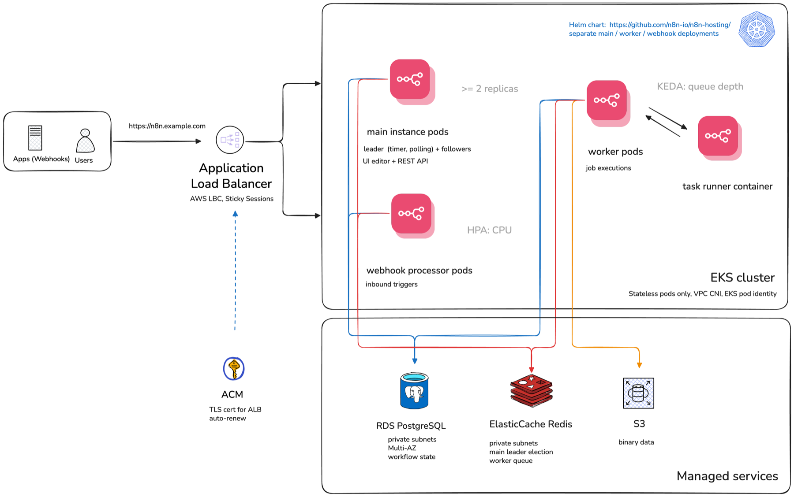

# terraform-aws-n8n

Terraform module for deploying [n8n](https://n8n.io) on AWS.

Deploys the production-grade multi-main setup: multiple n8n main instances, dedicated worker pods, external PostgreSQL (RDS), Redis (ElastiCache), and S3 for shared file storage. An **n8n Enterprise license is required**.

The module expects a pre-existing VPC. If your parent domain is hosted in Route 53, pass `route53_zone_id` and the module issues the ACM certificate and creates the DNS alias record itself. A single `terraform apply` brings up n8n end to end with no manual DNS steps. If your DNS is elsewhere, pass a pre-validated `certificate_arn` instead.

> **Pre-release module**
>
> The `terraform-aws-n8n` module is in pre-release. Expect breaking changes at any time before the first stable release.

## Architecture



Users and inbound webhooks hit an Application Load Balancer (managed by the AWS Load Balancer Controller) that fronts the EKS cluster. Inside the cluster the n8n Helm chart runs three separate deployments: main instance pods (leader election, UI/editor, REST API), webhook processor pods for inbound triggers, and worker pods that run job executions and scale on Redis queue depth via KEDA. State lives in managed services outside the cluster: RDS PostgreSQL for workflow state, ElastiCache Redis for leader election and the worker queue, and S3 for binary data. ACM issues the TLS certificate for the ALB. The cluster
also ships the EBS CSI driver and a default encrypted `gp3` StorageClass, so
PersistentVolumeClaims from workloads deployed beside n8n bind out of the box
(n8n itself needs no volumes).

AWS permissions for pods (the Load Balancer Controller, Cluster Autoscaler, EBS CSI driver, and n8n's own S3 access) are granted entirely through EKS Pod Identity, not IRSA. See [docs/pod-identity.md](docs/pod-identity.md) for the associations this module creates and how to extend the pattern for your own workloads.

In this multi-main topology, `n8n_license_detach_floating_on_shutdown`
defaults to `false`, overriding n8n's own upstream default, so a rolling
restart of the main pods cannot crash-loop the fleet by zeroing the shared
floating license cert. See
[docs/troubleshooting.md](docs/troubleshooting.md#multi-main-crash-loops-after-a-rolling-restart-helm-stuck-in-pending-rollback)
for the failure mode this avoids and how to recover if you hit it anyway.

## Prerequisites

### General

- An **n8n Enterprise license key** (`n8n_license_key`): the module does not provision a community-edition deployment.
- **Terraform CLI `>= 1.11`**, with the `aws`, `kubernetes`, and `helm` providers configured by the caller. The module declares `required_providers` but does not configure them (see [`examples/small/providers.tf`](./examples/small/providers.tf)).
- Read [Stability & versioning](#stability--versioning) before pinning a module version, and [Compatibility](#compatibility) for the provider/chart majors this module ships against.

### Networking

- A **pre-existing VPC** (`vpc_id`), its `vpc_cidr_block`, and public + private subnet IDs (`public_subnets`, `private_subnets`) tagged for EKS/ALB. VPC creation is intentionally out of scope (see [Out of scope](#out-of-scope)). The examples provision one via `terraform-aws-modules/vpc/aws` if you need a reference.

### DNS & TLS

Set exactly one of:

- `route53_zone_id`: the module issues and validates the ACM certificate and, when `create_ingress = true`, manages the Route 53 alias. With caller-owned ingress, the caller also owns its DNS record.
- `certificate_arn`: a pre-validated certificate for any other DNS provider. See [`examples/cloudflare/`](./examples/cloudflare/) and [`examples/godaddy/`](./examples/godaddy/) for the pattern of issuing the cert outside the module and passing the ARN in.

### Secrets

- `n8n_license_key`: pass as a Terraform variable (e.g. from a secrets manager or `TF_VAR_n8n_license_key`), never hardcoded in `.tfvars` committed to version control.
- The module generates `n8n_encryption_key` and (when `create_database = true`) the RDS `db_password`, and returns both as sensitive outputs. **Back these up immediately after the first apply**: there is no re-issue path, and losing the encryption key makes existing credentials/workflow secrets unrecoverable. See [Out of scope](#out-of-scope).

### Compute

- Pick a starting node size and count from the [Examples](#examples) table (`small`, `medium`, or `large`), then tune `node_instance_type`, `node_min`, and `node_max` from there. `node_min` is a steady-state floor you pay for 24/7; `node_max` is a hard ceiling enforced by the Cluster Autoscaler.

### Logging & metrics (optional)

- `n8n_metrics_enabled` exposes a Prometheus-scrapeable endpoint (see [Prometheus metrics](#prometheus-metrics)). The module does not bundle Prometheus, Grafana, or a log shipper; see [Out of scope](#out-of-scope).
- Enterprise [log streaming](#log-streaming-enterprise) is available separately from the metrics endpoint.

## Usage

```hcl
module "n8n" {
  source  = "n8n-io/n8n/aws"
  version = "~> 0.3.0"

  aws_region      = "us-east-1"
  cluster_name    = "n8n-cluster"
  n8n_domain      = "n8n.example.com"
  n8n_license_key = var.n8n_license_key

  # Pre-existing VPC — bring your own.
  vpc_id          = module.vpc.vpc_id
  private_subnets = module.vpc.private_subnets
  public_subnets  = module.vpc.public_subnets
  vpc_cidr_block  = module.vpc.vpc_cidr_block

  # EKS node group autoscaling bounds (defaults shown). Driven by Cluster
  # Autoscaler — see note below; you pay for `node_min` nodes 24/7.
  node_min = 3
  node_max = 6

  # DNS — set exactly one:
  # 1. Parent domain in Route53 → module handles ACM + alias record.
  route53_zone_id = "Z0123456789ABCDEFGHIJ"
  # 2. DNS elsewhere → bring your own pre-validated cert.
  # certificate_arn = aws_acm_certificate_validation.n8n.certificate_arn
}
```

The module declares `required_providers` but does **not** configure them. Callers must configure `aws`, `kubernetes`, and `helm` providers. `kubernetes` and `helm` are configured against the cluster this module creates — see [`examples/small/providers.tf`](./examples/small/providers.tf) for the standard wiring.

`node_min` and `node_max` are the EKS node group's autoscaling bounds. `node_min` is your steady-state floor — you pay for those nodes 24/7 even when idle. `node_max` is a hard ceiling: if peak workload needs more nodes than allowed, pods stay `Pending`. Defaults fit the `small` example only; see the Examples table for production sizing.

For a full end-to-end example including the VPC, see [`examples/small/`](./examples/small/) (Route 53), [`examples/cloudflare/`](./examples/cloudflare/), or [`examples/godaddy/`](./examples/godaddy/). If `terraform apply` fails on a `helm_release` (most often due to a Helm 4 cache layout issue or a webhook race on first install), see [`docs/troubleshooting.md`](./docs/troubleshooting.md).

## Support

This module is open source software, maintained by the n8n Solutions team independently of n8n's enterprise products. While the n8n Support team provides dedicated support for the enterprise offerings, this module isn't included.

**Bug reports and feature requests:** open a [GitHub issue](https://github.com/n8n-io/terraform-aws-n8n/issues). We triage on a best-effort basis; there is no SLA.

**Security issues:** see [`SECURITY.md`](./SECURITY.md) for the disclosure process. **Do not** open public issues for security findings.

**General n8n questions** (not specific to this module): use the [n8n community forum](https://community.n8n.io/).

## Stability & versioning

This module is pre-1.0. We use minor versions (0.1, 0.2, …) as the
breaking-change boundary and patches (0.1.0, 0.1.1, …) for additive or
bug-fix changes.

| Across | What may change |
| ------ | --------------- |
| `0.MINOR.PATCH` → `0.MINOR.PATCH+1` | Bug fixes, new optional inputs, new outputs, new resources whose absence wouldn't affect existing callers. No removed or renamed inputs/outputs. No changed defaults that move infra. No changed resource addresses. |
| `0.MINOR` → `0.MINOR+1` | Anything else, including removed inputs, renamed inputs, default changes that force resource replacement, refactored resource addresses, and bumped provider version floors. Each such change is called out in [`CHANGELOG.md`](./CHANGELOG.md) with an upgrade note. |

Pin with `version = "~> 0.3.0"` to auto-receive 0.3.x patches without
accidentally crossing a 0.3 → 0.4 boundary. Note the three-component
constraint: `~> 0.3.0` resolves to `>= 0.3.0, < 0.4.0`, whereas the
two-component `~> 0.3` would resolve to `>= 0.3, < 1.0` and let you cross
minor boundaries unintentionally. To upgrade across minor lines, retype
the constraint (e.g. `version = "~> 0.4.0"`) and read the release notes.

This contract goes away at 1.0.0 in favor of standard SemVer.

### Compatibility

This module ships against specific provider majors. Notably:

- **AWS provider:** `~> 6.0`. Upgrading from a v0.1.x deployment (which
  pinned `aws ~> 5.0`) requires a one-time `terraform plan -refresh-only`
  followed by `terraform apply -refresh-only` to settle AWS provider 6.0's
  per-resource `region` attribute into state before applying other changes.
  Callers who must stay on AWS provider 5.x should pin this module to `~> 0.1.0`.
- **Helm provider:** `~> 3.0`. The 3.x release is a Plugin Framework
  rewrite; `helm_release` drift detection is stricter, so the first
  `terraform plan` after upgrading from v0.1.x may show in-place diffs on
  existing releases. Callers who must stay on Helm provider 2.x should pin
  this module to `~> 0.1.0`.
- **Kubernetes provider:** `~> 2.0`.
- **Terraform CLI:** `>= 1.11`.
- **n8n Helm chart:** default `1.10.0`. Other chart versions can be
  selected via `n8n_chart_version`.
- **n8n application image:** defaults to the chart's `docker.n8n.io/n8nio/n8n` repository on the floating `stable` tag; production deployments should pin a  specific version via `n8n_image_tag` (e.g. `"1.2.3"`) to avoid crossing major-version boundaries on an unplanned pod reschedule. `n8n_image_repository` points the release at a custom image (see [Custom n8n images](#custom-n8n-images)).
- **EKS:** validated on Kubernetes `1.35`.
- **PostgreSQL:** validated on RDS `18.4`.

See [docs/upgrading-n8n.md](docs/upgrading-n8n.md) for the procedure to safely bump `n8n_chart_version`/`n8n_image_tag` on an existing deployment, and [docs/helm-chart-coverage.md](docs/helm-chart-coverage.md) for which n8n Helm chart values this module exposes versus leaves untouched.

## Out of scope

v0.3.0 intentionally does not cover the following. Each item is
documented here so that issues filed against them can be triaged
quickly; several are candidates for future minor releases (see
[`ROADMAP.md`](./ROADMAP.md)).

- **VPC creation.** The module requires a pre-existing VPC with both
  public and private subnets tagged for EKS/ALB. The examples
  provision one with `terraform-aws-modules/vpc/aws`, but that VPC is
  *not* managed by this module. Rationale: VPCs are
  organization-shaped, not service-shaped.

- **Multi-region / cross-region deployments.** One module instance =
  one region = one EKS cluster = one n8n deployment. Cross-region
  replication of the database or S3 binary storage is the caller's
  problem. Rationale: pre-1.0 surface area; AWS provider 6.x's
  per-resource `region` argument is the natural foundation for this
  in a future minor.

- **GovCloud, AWS China, and Outposts.** The module uses generic AWS
  APIs that *probably* work in these partitions, but it has not been
  validated. Endpoint differences (e.g. EKS Pod Identity GA dates per
  region) may break things.

- **Air-gapped deployments.** `n8n_image_repository` moves the n8n
  application image to a registry you control, but everything else
  still comes from public registries: the n8n chart itself from
  `ghcr.io/n8n-io`, the task runner sidecar image, and the KEDA /
  Cluster Autoscaler / AWS Load Balancer Controller / metrics-server
  charts and images from their respective upstreams.
  `n8n_image_pull_secrets` carries registry credentials for the n8n
  image and nothing else. Mirroring the whole set into a registry you
  control is possible, but the module exposes no inputs for pointing
  the charts and controller images at the mirror.

- **Backup/DR automation beyond RDS snapshots.** The module enables
  RDS automated backups (defaulting to RDS's own defaults). It does
  *not* automate restore drills, cross-region snapshot copy, S3
  versioning policy, or n8n encryption-key escrow. The
  `n8n_encryption_key` output is emitted exactly once at apply time;
  backing it up is the operator's job and is the single most
  important thing they will forget.

- **Bundled observability.** The module installs KEDA (for worker
  autoscaling) and metrics-server (for HPA on mains/webhooks) because
  they are load-bearing for the autoscaling story. It does *not*
  install Prometheus, Grafana, Loki, OpenSearch, Datadog Agent, or
  any log shipper. `n8n_metrics_enabled` exposes the metrics
  endpoint; scrape configuration is the caller's monitoring stack.
  Rationale: observability stacks are deeply opinionated per-org;
  bundling one is more harmful than helpful.

## Customer-managed infrastructure

Every layer this module can provision can also be pointed at infrastructure
you already run, instead of being created fresh: the pattern enterprises
with an existing platform team most often need. Each layer follows the same
shape: a `create_<x>` (or `install_<x>`) boolean, default `true`, plus one or
more reference inputs that are required only when it's `false`. Nothing is
inferred from "did you set the reference variable": Terraform's `count`
can't depend on an apply-time value, so every layer is gated by an explicit
boolean, cross-validated at plan time against its reference inputs.

| Layer | Toggle | Reference inputs |
|---|---|---|
| VPC + subnets | always customer-managed | `vpc_id`, `private_subnets`, `public_subnets` |
| ACM certificate | optional | `certificate_arn` |
| Route 53 record | optional | `route53_zone_id` |
| RDS PostgreSQL | `create_database` | `db_host`, `db_password` (or `db_password_secret_ref`) |
| EKS cluster + node group | `create_eks` | `existing_eks_cluster_name`, `existing_eks_cluster_prerequisites_confirmed` |
| ElastiCache Redis | `create_elasticache` | `redis_host`, `redis_port`, `redis_auth_token` / `redis_auth_token_secret_ref`, `redis_transit_encryption_enabled` |
| S3 bucket | `create_s3_bucket` | `existing_s3_bucket_name` |
| RDS KMS key | `create_db_kms_key` | `db_kms_key_arn`, plus `db_logs_kms_key_enabled` + `db_logs_kms_key_arn` to put the postgresql log group on it too |
| S3 KMS key | `create_s3_kms_key` | `s3_kms_key_arn` |
| EBS CSI driver | `create_ebs_csi` | none: assumes the existing cluster already runs its own |
| Cluster controllers (LBC, Cluster Autoscaler, metrics-server, KEDA) | `install_lbc` / `install_cluster_autoscaler` / `install_metrics_server` / `install_keda` | none: assumes the existing cluster already runs equivalents |
| Pod Identity agent | automatic with `create_eks` | none: the module skips managing the addon itself when `create_eks = false` and assumes it's already installed on the existing cluster |
| External worker fleet | outputs only | `redis_endpoint`, `redis_auth_token`, `rds_endpoint`, `db_password`, `s3_bucket_name`, `n8n_encryption_key` |

A few things worth knowing before combining these:

- On the EKS layer, `existing_eks_cluster_prerequisites_confirmed` is a
  plan-time attestation, not a rubber stamp: it covers four things the
  module cannot verify on a cluster it doesn't own (schedulable node
  capacity, Cluster Autoscaler auto-discovery tags, API-server
  reachability, and naming/identity collisions with what the module
  installs). Read its full description in the Inputs table before setting
  it to `true`.
- The cluster-controller toggles skip the Helm install only; disabling one
  assumes an equivalent is already running on the cluster you point the
  module at (see the variable descriptions for what each controller
  backs: HPA reads on metrics-server, the KEDA `ScaledObject` the n8n
  chart always renders, etc.).
- The external-worker-fleet row is outputs-only: this module makes the
  backing-plane coordinates available so an externally managed worker
  fleet (e.g. an ECS service) can connect to the same queue and
  persistence, but it does not itself provision or scale that fleet.
- The two KMS rows are the newest additions and the clearest illustration of
  why the boolean is not redundant with the ARN beside it. A caller wiring
  `db_kms_key_arn = aws_kms_key.mine.arn` from a key created in the same
  configuration hands the module a value that is unknown until apply, so
  gating on whether that ARN is null would fail the plan outright. The
  boolean is a literal the caller writes, which leaves the ARN free to be
  computed. See [Bring your own KMS key for RDS](#bring-your-own-kms-key-for-rds)
  for the full walkthrough, including the CloudWatch Logs key-policy
  statement the log group needs.
- See [Customer-managed Redis](#customer-managed-redis) below for the
  AUTH/TLS specifics on that layer, and [Customer-managed Ingress](#customer-managed-ingress-two-alb-split)
  for the related but distinct `create_ingress` toggle, which governs the
  ALB/Ingress the module manages rather than a backing data store.
- Runnable reference configs: [`examples/customer-managed-redis`](./examples/customer-managed-redis/),
  [`examples/customer-managed-s3`](./examples/customer-managed-s3/), and
  [`examples/customer-managed-cluster`](./examples/customer-managed-cluster/)
  (see the Examples section below), for the Redis, S3, and EKS rows above, or
  [`examples/customer-managed-everything`](./examples/customer-managed-everything/)
  for every layer at once, including a direct `modules/controllers`
  invocation for the cluster-controller row.
- Contributing a new customer-managed layer, or reviewing a PR that adds
  one? See [`docs/customer-managed-infrastructure.md`](docs/customer-managed-infrastructure.md)
  for the `create_<x>` / reference-variable / validation convention every
  layer above follows.

Adopting already-existing, non-Terraform-managed resources via
`terraform import` is intentionally out of scope: import is brittle at the
scale this module operates across, and `terraform plan -generate-config-out`
is error-prone over the many resources it owns. Bring infrastructure under
Terraform management in your own configuration first, then reference it here
with the toggles above.

## Examples

Ten runnable examples ship with the module: three sizing tiers (`small`, `medium`, `large`) on Route 53, two DNS-variant examples (`cloudflare`, `godaddy`) at `small` sizing, one topology-variant example (`split-ingress`) at `small` sizing, and four customer-managed-infrastructure examples (`customer-managed-redis`, `customer-managed-s3`, `customer-managed-cluster`, `customer-managed-everything`) at `small` sizing. Sizing decisions for `medium` and `large` are derived from internal load testing.

| Dimension | [small](./examples/small/) (default) | [medium](./examples/medium/) | [large](./examples/large/) |
| --- | --- | --- | --- |
| Target scale | Dev / small team | ~5–15M exec/day | ~50–60+M exec/day |
| Avg req/s | ~10–30 | ~60–175 | ~350–960 |
| Node type | t3.xlarge (4 vCPU, 16 GB) | m6i.2xlarge (8 vCPU, 32 GB) | m7i.4xlarge (16 vCPU, 64 GB) |
| Nodes desired / min / max | 3 / 3 / 6 | 5 / 5 / 15 | 10 / 10 / 50 |
| Total vCPU (desired) | 12 | 40 | 160 |
| Private subnets | 2× /24 (254 IPs each) | 2× /24 | 2× /20 (4,094 IPs each) |
| VPC CNI tuning | default | default | `WARM_ENI_TARGET=0` |
| Database | RDS db.t3.small (2 vCPU, 2 GB) | RDS db.m6g.2xlarge (8 vCPU, 32 GB) | Aurora PostgreSQL I/O-Optimized |
| DB instances | 1 writer (Multi-AZ standby) | 1 writer (Multi-AZ standby) | 1 writer + 1 reader |
| DB storage | 50 GB gp2 | 200 GB gp3 | Aurora auto-scales to 128 TB |
| DB IOPS ceiling | 150 baseline / 3,000 burst | 3,000 baseline (gp3) | None — I/O-Optimized |
| PgBouncer | No | No | Yes — 2 replicas |
| Redis | cache.t3.medium | cache.r6g.large | cache.r6g.large |
| Redis nodes | 1 (no failover) | 1 (no failover) | 1 (no failover) |
| Webhook pods min / max | 2 / 50 | 5 / 50 | 30 / 80 |
| Worker pods min / max | 1 / 10 | 5 / 40 | 20 / 160 |
| Worker concurrency | 10 | 20 | 40 |
| Execution concurrency limit | 100 | 200 | 2,000 |
| Webhook memory limit | 1 Gi | 2 Gi | 4 Gi |
| Webhook memory request | 512 Mi | 512 Mi | 1 Gi |
| Pruning retention | 10k records / 14 days | 500k records / 7 days | 5M records / 24h |
| Est. cost / month (on-demand) | ~$440 | ~$2,000 | ~$21,000+ |
| Est. cost / month (1-yr reserved) | ~$285 | ~$1,300 | ~$13,600 |

The DNS-variant examples (`cloudflare`, `godaddy`) are sizing-equivalent to `small` — they only swap the DNS provider for cert validation and the alias record.

[`split-ingress`](./examples/split-ingress/) is also sizing-equivalent to `small`. It swaps the *topology* rather than the DNS provider: `create_ingress = false`, an internet-facing ALB serving only the webhook path prefixes (optionally behind a WAF), and an internal ALB serving the editor UI and REST API. It is the runnable version of the pattern described in the next section.

[`customer-managed-redis`](./examples/customer-managed-redis/), [`customer-managed-s3`](./examples/customer-managed-s3/), [`customer-managed-cluster`](./examples/customer-managed-cluster/), and [`customer-managed-everything`](./examples/customer-managed-everything/) are also sizing-equivalent to `small`. The first three each provision a plain-Terraform stand-in for one piece of infrastructure a customer would already have (a Redis replication group with AUTH and TLS on, an S3 bucket with its own security configuration, or a full EKS cluster and node group) and point the module at it with `create_elasticache = false` / `create_s3_bucket = false` / `create_eks = false`, each doubling as a reference config for the matching row of the "Customer-managed infrastructure" section above. `customer-managed-everything` combines all three stand-ins plus a direct `modules/controllers` invocation, so every layer the module can create (cluster, database, cache, storage, and every cluster controller) is customer-managed at once. `customer-managed-redis` and `customer-managed-s3` are fully `terraform test`-covered under mocked providers; `customer-managed-cluster` and `customer-managed-everything` only have partial coverage (variable-validation assertions, not a full successful-plan assertion), a mocking limitation documented in each example's own `tests/defaults.tftest.hcl` and README.

## Customer-managed Ingress (two-ALB split)

> A complete, runnable version of everything in this section, including the
> certificate, both alias records and a WAF hook, is at
> [`examples/split-ingress/`](./examples/split-ingress/).

By default the module creates a single internet-facing ALB Ingress that routes
`/webhook` to the webhook processors and `/` to the mains. Some deployments need
to split that: a public, internet-facing ALB for `/webhook` so external systems
can deliver triggers, and a separate **internal** ALB for the editor UI and REST
API, reachable only over VPN or a peered network, optionally behind a WAF.

Set `create_ingress = false` and the module steps out of routing entirely. It
still creates everything the Ingresses point at, and it also stops managing the
Route 53 alias A-record and the `data.aws_lb` lookup behind it, so your own DNS
records are no longer reverted on the next `terraform plan`. The ACM certificate
is still issued when `route53_zone_id` is set, and remains usable by your own
Ingresses.

Route to the Services the module exposes as outputs:

| Output | Value | Serves |
| --- | --- | --- |
| `n8n_service_name` | `n8n-main` | Editor UI, REST API |
| `n8n_webhook_service_name` | `n8n-webhook-processor` | Webhooks, forms, waiting resumptions, MCP |
| `n8n_webhook_path_prefixes` | see below | The prefixes that must reach the processors |
| `n8n_service_port` | `5678` | Both |

### Route every webhook prefix, not just `/webhook`

The module runs the chart with `disableProductionWebhooksOnMainProcess = true`,
which disables **five** endpoint families on the main pods, not one. Each
returns 404 if it reaches `n8n-main`:

| Prefix | Breaks if misrouted |
| --- | --- |
| `/webhook` | Production webhook triggers |
| `/webhook-waiting` | Wait-node resumption, Slack and Telegram human-in-the-loop callbacks |
| `/form` | Form Trigger nodes |
| `/form-waiting` | Multi-page and waiting forms |
| `/mcp` | MCP server triggers |

`n8n_webhook_path_prefixes` returns this list so your Ingress stays in step with
the module as n8n adds endpoints. Iterate over it rather than hardcoding, and
declare the prefixes **before** any catch-all `/` rule.

```hcl
module "n8n" {
  source = "n8n-io/n8n/aws"

  create_ingress = false

  # Two ALBs need two hostnames: a DNS name can alias only one load balancer.
  # Setting route53_zone_id plus n8n_additional_domains makes the module issue
  # and validate one certificate covering both, consumed below through the
  # certificate_arn output. n8n_webhook_url makes n8n hand out webhook URLs on
  # the public host rather than the internal one.
  route53_zone_id        = var.route53_zone_id
  n8n_additional_domains = [var.webhook_domain]
  n8n_webhook_url        = "https://${var.webhook_domain}"

  # ... remaining inputs
}

# Public ALB: webhooks only, on its own hostname.
resource "kubernetes_ingress_v1" "webhook" {
  metadata {
    name      = "n8n-webhook-public"
    namespace = module.n8n.namespace

    annotations = merge(
      {
        "alb.ingress.kubernetes.io/scheme"      = "internet-facing"
        "alb.ingress.kubernetes.io/target-type" = "ip"

        # The module-issued, already-validated certificate. It covers
        # webhook_domain because that name is in n8n_additional_domains.
        "alb.ingress.kubernetes.io/certificate-arn" = module.n8n.certificate_arn
      },
      # Omit the key entirely when there is no WAF: a null annotation value
      # fails the plan.
      var.waf_acl_arn == null ? {} : {
        "alb.ingress.kubernetes.io/wafv2-acl-arn" = var.waf_acl_arn
      },
    )
  }

  spec {
    ingress_class_name = "alb"
    rule {
      host = var.webhook_domain
      http {
        dynamic "path" {
          for_each = module.n8n.n8n_webhook_path_prefixes

          content {
            path      = path.value
            path_type = "Prefix"
            backend {
              service {
                name = module.n8n.n8n_webhook_service_name
                port { number = module.n8n.n8n_service_port }
              }
            }
          }
        }
      }
    }
  }

  # The namespace output alone orders this after the namespace, but not after
  # the Helm release that creates the Services the ALB registers targets for.
  depends_on = [module.n8n]
}

# Internal ALB: admin UI, VPN-only. Define a second kubernetes_ingress_v1
# with scheme = "internal", on its own hostname (var.n8n_domain), routing "/"
# to module.n8n.n8n_service_name on the same port.
#
# Give that one the webhook prefixes too, ahead of its "/" rule. Otherwise
# the catch-all sends /webhook to the main pods, which serve none of it, and
# the request falls through to the editor's SPA handler and returns 200 with
# an HTML body: an in-VPC caller reads that as success while nothing ran.
```

## Customizing the module-managed Ingress

Before reaching for `create_ingress = false`, check whether the narrower inputs
cover you. They keep the module's single-apply DNS wiring intact:

- **`ingress_scheme`**: `internet-facing` (default) or `internal`. Use this
  when the whole deployment should be private rather than split in two.
- **`alb_inbound_cidrs`** and **`alb_inbound_prefix_list_ids`**: restrict which
  sources reach the ALB, while it stays public and keeps its public DNS name.
  Both default to `[]`, which leaves the ALB open to the internet, as it has
  always been. Set either one and the AWS Load Balancer Controller narrows the
  security group it manages for the ALB:

  ```hcl
  # Reachable only from the corporate egress ranges.
  alb_inbound_cidrs = ["203.0.113.0/24", "198.51.100.7/32"]

  # Or keep the ranges in a managed prefix list, edited in one place and shared
  # with other load balancers and security groups.
  alb_inbound_prefix_list_ids = [aws_ec2_managed_prefix_list.corp_egress.id]
  ```

  Setting both is a union, not an intersection. The restriction covers every
  listen port, so port 80 (the HTTPS redirect) is filtered too.

  **This also blocks inbound webhooks.** The module-managed ALB serves the
  webhook path prefixes alongside the editor UI, and a source restriction
  applies to the whole load balancer rather than per path. Slack, Stripe,
  GitHub, and Telegram senders outside the allow-list stop reaching n8n, and
  they see a connection timeout rather than an error you will find in the n8n
  logs. Reach for these inputs when nothing external calls in, or when every
  sender is on a known range. To lock down the editor while keeping webhooks
  public, run two load balancers instead: that is what
  [`examples/split-ingress/`](./examples/split-ingress/) is for.
- **`alb_ssl_policy`**: the TLS negotiation policy for the HTTPS listener,
  pinned to `ELBSecurityPolicy-TLS13-1-2-2021-06` by default. Set it to any
  AWS-published `ELBSecurityPolicy-*` name to match a compliance baseline.
- **`ingress_annotations`**: a `map(string)` merged over the module's defaults
  (last write wins). This is the escape hatch for any AWS Load Balancer
  Controller feature the module has no opinion on, so you never need a fork to
  set one annotation:

  ```hcl
  ingress_annotations = {
    "alb.ingress.kubernetes.io/wafv2-acl-arn"            = aws_wafv2_web_acl.n8n.arn
    "alb.ingress.kubernetes.io/load-balancer-attributes" = "access_logs.s3.enabled=true,access_logs.s3.bucket=my-alb-logs"
  }
  ```

Eight caveats:

- Overriding `alb.ingress.kubernetes.io/target-group-attributes` drops the
  session stickiness that pins a browser to one main pod for 3 hours. Without
  it, WebSocket connections break as the ALB round-robins. Re-include
  `stickiness.enabled=true` if you set that key.
- Set the scheme through `ingress_scheme` and the TLS policy through
  `alb_ssl_policy`, not through `ingress_annotations`. Doing both raises a
  plan-time warning, because the annotation silently wins and the failure mode
  is an admin UI that is public when you meant it to be internal, or a TLS
  floor that never took effect.
- `alb_inbound_cidrs` narrows a public ALB; it is not the same as
  `ingress_scheme = "internal"`. The ALB stays in the public subnets with a
  public DNS name, and the allow-list is the only thing keeping other sources
  out. Choose `internal` when the deployment should not be on the public
  internet at all, and use the two together for defence in depth.
- Both source restrictions are ignored by the controller when
  `ingress_annotations` sets `alb.ingress.kubernetes.io/security-groups`,
  because you then own the ALB's security group and the controller stops
  managing its rules. Nothing in the plan reveals this, so the module warns.
  Put the restriction in your own security group rules instead.
- `alb_inbound_cidrs` is IPv4 only, matching the ALB the module builds: it
  leaves the controller's default `ipv4` address type in place, so an IPv6 rule
  could never match a client. A dualstack ALB also needs a VPC and subnets
  carrying IPv6 CIDRs, which this module does not create. If you run one, set
  the allow-list on the annotation through `ingress_annotations` instead.
- An `IngressClassParams` setting `spec.inboundCIDRs` or `spec.prefixListsIDs`
  replaces the annotation rather than merging with it, but it cannot override
  these inputs. The controller only loads an IngressClass and its params for an
  Ingress it classifies through `spec.ingressClassName`, and the module-managed
  Ingress also carries the legacy `kubernetes.io/ingress.class` annotation, which
  the controller matches first. Verified live against LBC v3.5.0. The immunity is
  incidental rather than designed, so it is worth knowing about: caller-owned
  Ingresses that set only `spec.ingressClassName`, including both of the ones in
  [`examples/split-ingress/`](./examples/split-ingress/), do not have it. See
  [`docs/troubleshooting.md`](./docs/troubleshooting.md#an-inbound-cidr-restriction-applies-cleanly-but-the-alb-still-answers-everyone)
  for the `kubectl` commands, and for the two preconditions that make the
  override possible at all, neither of which the LBC chart sets up by default.
- Prefix lists are heavier than they look. A security group rule referencing a
  managed prefix list counts against the rules-per-security-group quota
  (default 60) by the list's max-entries weight rather than as one rule, once
  per listen port, and the module's ALB listens on 80 and 443, so everything
  counts twice. A list too heavy to fit, and most AWS-managed lists are (the
  CloudFront origin-facing list weighs 55, needing 110 rules of the default
  60 by itself), takes the ALB offline for every source instead of failing the apply:
  the controller revokes the old rules, hits
  `RulesPerSecurityGroupLimitExceeded` authorizing the new ones, and leaves
  the security group with no ingress rules, so everything times out, webhooks
  included, while `terraform apply` reports success. Verified live against LBC
  v3.5.0. Keep `2 x (combined list weight + CIDR count)` at or under the
  quota, or raise quota `L-0EA8095F` first. See the
  [troubleshooting entry](./docs/troubleshooting.md#a-prefix-list-restriction-takes-the-alb-offline-for-every-source).
- Locking yourself out is recovered with `terraform apply`, not from the
  console. The controller owns the security group it created for the ALB and
  reverts hand-edits to it on the next reconcile.

Setting `alb.ingress.kubernetes.io/inbound-cidrs` directly through
`ingress_annotations` was the only way to restrict the ALB before these inputs
existed, and it still works: `ingress_annotations` remains the last write. If
you are migrating, delete the annotation in the same change, or the stale value
keeps winning. The module raises a plan-time warning when both are set.

## Redis high availability

Redis backs two things n8n cannot run without in queue mode: the Bull queue
that distributes executions across workers, and the leader election that
coordinates the multi-main pods. By default the module provisions it as a
**single-node `aws_elasticache_cluster`**: cheapest, and a single point of
failure for both. A node failure or AZ event stalls executions and leader
election until ElastiCache replaces the node.

Set `redis_high_availability_enabled = true` to provision an
**`aws_elasticache_replication_group`** instead: one primary and one replica,
`automatic_failover_enabled` so ElastiCache promotes the replica on its own,
and `multi_az_enabled` so the replica lands in a second AZ rather than sharing
the primary's fate. Both nodes use `redis_node_type`, so **the Redis line of
the bill roughly doubles**.

The replication group also sets `at_rest_encryption_enabled`, which the
single-node cluster resource has no equivalent for. It is free on the
AWS-managed key and is set in the same release that introduces the resource on
purpose: the argument is ForceNew, so switching it on later would replace the
cache for everyone already running HA. Encryption **in transit** is a separate
concern and is not covered by this variable.

```hcl
module "n8n" {
  # ...
  redis_high_availability_enabled = true
  redis_node_type                 = "cache.r6g.large"
}
```

### What this actually buys you, measured

The honest version, from a forced failover on a live cluster
(`aws elasticache test-failover`) rather than from the AWS marketing page:

| | Single node (default) | HA replication group |
|---|---|---|
| Queued executions after a node loss | **Gone** | **Survive** on the promoted replica |
| Time to a working queue | However long AWS takes to build a new node | ~20s promotion, pods back within a minute |
| n8n pods during the event | Restart | **Restart** |

The row that matters is the first one. HA does **not** make the failover
invisible to n8n: every main, worker and webhook pod exits and restarts while
it happens. n8n's `RedisClientService` calls `process.exit` once Redis has been
unreachable for `QUEUE_BULL_REDIS_TIMEOUT_THRESHOLD` (10s by default) and logs
`Unable to connect to Redis after trying to connect for 10s / Exiting process
due to Redis connection error`. Raising that threshold to 30s was tried here
and only moved the exit later, which is why the module leaves it alone by
default. See
[Surviving a Redis failover without restarting](#surviving-a-redis-failover-without-restarting)
for why 30s failed and what does work.

That restart is a fail-fast by design, not a crash-loop: Kubernetes brings each
pod straight back, and the observed end-to-end recovery was under a minute with
the queue contents intact. So buy this for **durability of the queue**, and
plan for a brief pod-fleet restart, not for uninterrupted execution.

`QUEUE_BULL_REDIS_RECONNECT_ON_FAILOVER` (on by default since **n8n 2.10.0**)
covers the narrower case where the connection survives and the demoted primary
answers writes with `READONLY`. It did not prevent the restarts observed here,
because the client hit connect timeouts rather than `READONLY`.

### Surviving a Redis failover without restarting

`n8n_redis_timeout_threshold` sets `QUEUE_BULL_REDIS_TIMEOUT_THRESHOLD`, the
budget n8n spends trying to reach Redis before calling `process.exit`. It
defaults to `null`, leaving the chart's 10000 in place, which is what every
existing deployment already runs.

Raising it is the only lever this module has, and **the budget is much coarser
than the number suggests**. n8n does not set ioredis's `connectTimeout`, so it
stays at its 10s default, and a connect to a demoted primary hangs for that full
10s before failing. Each failed attempt therefore spends about 11.1s (1s retry
interval plus the 10s hang), and the threshold is effectively quantized:

| You set | Real budget | Reconnect attempts before exit |
|---|---|---|
| `10000` (default) | 11.1s | 1 |
| `30000` | 33.2s | 3 |
| `60000` | 66.4s | 6 |

Measured against a reproduction of the failure (two Redis instances and a
`/etc/hosts` flip standing in for the endpoint repointing, with n8n's exact
client options and a verbatim copy of its retry strategy):

| Endpoint stale for | Client recovered at | `10000` | `30000` | `60000` |
|---|---|---|---|---|
| 15s | 33.4s | exits 21.2s | survives | survives |
| 25s | 44.5s | exits 21.4s | **exits 43.4s** | survives |

The second row is the live failure, reproduced: a 30s threshold fires **1.1
seconds before** the connection would have come back. That is the whole reason
raising it to 30s looked like it did nothing.

```hcl
module "n8n" {
  # ...
  redis_high_availability_enabled = true
  n8n_redis_timeout_threshold     = 60000
}
```

#### Confirmed on a live cluster

A forced failover against a real ElastiCache replication group, with
`n8n_redis_timeout_threshold = 60000`: **no container terminated**, and every
pod logged `Recovered Redis connection` rather than exiting. n8n's own counter
shows the quantum predicted above, measured rather than inferred:

```text
Lost Redis connection. Trying to reconnect in 1s... (18.1s/60s)
Lost Redis connection. Trying to reconnect in 1s... (29.1s/60s)
Lost Redis connection. Trying to reconnect in 1s... (40.1s/60s)
Recovered Redis connection
```

Those gaps are 11.1s and 11.0s. A 30s threshold would have exited at the 40.1s
sample, about 11 seconds before recovery.

**The real endpoint stayed stale for 48 seconds**, roughly double the worst case
modelled above, measured by resolving the primary endpoint once a second from
inside the cluster. CoreDNS caching plus the endpoint's own TTL stretches the
window well past the promotion itself.

Two things worth knowing before you set it:

- **It is a trade, not a free win.** The threshold is also what makes a pod
  fail fast against a genuinely dead Redis. At 60s a real outage goes 60s
  before Kubernetes restarts anything. For a queue worker that is usually
  fine, since restarting does not help when Redis is gone either way.
- **60000 is a recommendation, not a guarantee.** It cleared a 48 second window
  with about 20 seconds of headroom, from a single observed failover. A slower
  repoint would eat that margin. If you need certainty rather than a good
  default, force a failover in your own account and read the counter.

The underlying issue belongs upstream: n8n leaves `connectTimeout` at 10s and
offers no way to change it, which is what makes the budget coarse. Lowering it
to 2s pulled recovery from 8.4s after the endpoint repointed down to 1.4s in the
same reproduction.

### Switching topologies replaces Redis

The two topologies are **different Terraform resource types**, so a `moved`
block cannot bridge them. Flipping the toggle on a default deployment destroys
the cache and creates the replacement, and **everything queued or in flight at
that moment is lost**. This is a maintenance-window operation:

1. Stop new work reaching n8n (pause the schedule triggers, or take the
   webhook path out of the load balancer).
2. Let the workers drain. `bull:jobs:wait` and `bull:jobs:active` at zero is
   the signal, and they are the same two keys the KEDA triggers watch.
3. `terraform apply`. Expect one destroy and one create on the Redis tier, and
   an in-place update to the Helm release as it repoints at the new host.
4. Resume traffic.

The replication group deliberately carries a **different identifier** from the
single-node cluster (`<cluster_name>-redis-rg` rather than
`<cluster_name>-redis`). ElastiCache shares one identifier namespace between
cache clusters and replication groups and rejects a second resource reusing the
name:

```text
InvalidParameterValue: Cannot have a cluster and replication group with
same identifier. Please use a different identifier.
```

The two resources are independent, so Terraform is free to create the new one
while the old one still exists. With a shared name the apply would destroy the
old cache and then fail to create the replacement, leaving the deployment with
no queue backend and needing a second apply to recover. The distinct suffix
makes enabling and disabling each a single apply.

The suffix reads `-redis-rg` (replication group) rather than `-redis-ha`
because the resource is not exclusive to high availability.
`redis_transit_encryption_enabled` selects it too, for an unrelated reason. See
[Redis in-transit encryption and AUTH](#redis-in-transit-encryption-and-auth)
for the full matrix.

That sharing is also the one case where enabling high availability does **not**
replace anything. A deployment already running with
`redis_transit_encryption_enabled = true` is on a replication group, so
Terraform plans the change as an in-place modification, raising the node count
through ElastiCache's `IncreaseReplicaCount` API rather than rebuilding. The
provider converges that change in stages, so one apply does not enable automatic
failover. Follow [Adding high availability to an encrypted group](#adding-high-availability-to-an-encrypted-group)
for the measured sequence, and still drain first.

## Redis in-transit encryption and AUTH

By default the module secures its ElastiCache queue backend by **network
boundary**: Redis sits in private subnets behind a security group that admits
only VPC traffic, with no TLS and no credentials. That is a defensible posture
inside a trusted VPC and it is the module's accepted as-built behaviour, but it
leaves two things open. Queue payloads (workflow execution data) cross the VPC
in cleartext, and anything that reaches the network boundary reaches Redis
unauthenticated.

Set `redis_transit_encryption_enabled = true` to close both. The module then
enables TLS in transit, generates an AUTH token, publishes it as a Kubernetes
secret, and wires `QUEUE_BULL_REDIS_TLS` plus `QUEUE_BULL_REDIS_PASSWORD` onto
every n8n container. Retrieve the token with:

```bash
terraform output -raw redis_auth_token
```

The generated token respects ElastiCache's constraints: 16 to 128 characters,
with `! & # $ ^ < > -` the only permitted non-alphanumerics. A broader special
set is rejected by AWS at create time.

### It uses the same replication group high availability does

`auth_token` is not available on `aws_elasticache_cluster`. AWS exposes it only
on `aws_elasticache_replication_group`, and only when transit encryption is
already enabled. A third variable, `redis_kms_encryption_enabled`, lands on
the same resource for the same reason: `kms_key_id` is also
replication-group-only. So all three of `redis_high_availability_enabled`,
`redis_transit_encryption_enabled` and `redis_kms_encryption_enabled` select
the replication group, each for an unrelated reason, and **any one alone is
enough to move off the default cluster resource**:

| `redis_high_availability_enabled` | `redis_transit_encryption_enabled` | `redis_kms_encryption_enabled` | Resource | Nodes | Failover | TLS + AUTH | KMS key |
| --- | --- | --- | --- | --- | --- | --- | --- |
| `false` | `false` | `false` | `aws_elasticache_cluster` | 1 | no | no | none |
| `true` | `false` | `false` | `aws_elasticache_replication_group` | 2, Multi-AZ | yes | no | ElastiCache-managed |
| `false` | `true` | `false` | `aws_elasticache_replication_group` | 1 | no | yes | ElastiCache-managed |
| `false` | `false` | `true` | `aws_elasticache_replication_group` | 1 | no | no | customer-managed |
| `true` | `true` | `false` | `aws_elasticache_replication_group` | 2, Multi-AZ | yes | yes | ElastiCache-managed |
| `true` | `false` | `true` | `aws_elasticache_replication_group` | 2, Multi-AZ | yes | no | customer-managed |
| `false` | `true` | `true` | `aws_elasticache_replication_group` | 1 | no | yes | customer-managed |
| `true` | `true` | `true` | `aws_elasticache_replication_group` | 2, Multi-AZ | yes | yes | customer-managed |

The three are independent. Encryption does not buy you a replica, so enabling
it alone leaves the cache single-node and the bill unchanged; availability
does not buy you a credential, so enabling that alone leaves the endpoint
plaintext; a customer-managed key does not buy you either, so enabling that
alone changes nothing about node count, failover, or transit encryption.
`redis_kms_encryption_enabled` defaults to `false` to avoid replacing an
existing standalone cache and dropping its queue. That default
`aws_elasticache_cluster` is **not encrypted at rest**: Redis OSS at-rest
encryption is available only on replication groups. Any HA- or TLS-selected
replication group is encrypted with the ElastiCache-managed key; enabling the
CMK toggle selects the same resource and replaces that key with the module CMK.

Because all three land on **one** resource with one identifier
(`<cluster_name>-redis-rg`), turning any later one on *plans* as a
modification of the replication group you already have rather than a
replacement, as long as at least one of the three was already true. Turning
on the first of the three is what forces the initial replacement, whichever
one that is.

### Adding high availability to an encrypted group

This direction is in place, but it takes more than one plan-and-apply cycle. The
AWS provider handles the replica count before automatic failover: the first
apply calls ElastiCache's `IncreaseReplicaCount` API, waits for the replica, and
returns with automatic failover still disabled. A fresh plan then proposes the
remaining automatic-failover change.

Use this sequence:

1. Drain the queue, set `redis_high_availability_enabled = true`, and apply.
   Expect one in-place replication-group update that raises the node count from
   one to two. It does not replace Redis.
2. Wait until the replication group is `available`, then plan and apply again.
   With the default `redis_apply_immediately = false`, AWS records
   `AutomaticFailoverStatus = "enabled"` in `PendingModifiedValues` and activates
   it in the next maintenance window. To activate it now, set
   `redis_apply_immediately = true` for this apply.
3. Wait for AWS to report automatic failover as `enabled`, then run one final
   plan. Remove `redis_apply_immediately = true` if you used it; the final plan
   should be empty.

This sequence was verified on a live encrypted replication group. The replica
landed in a second availability zone without replacing the group. A forced
failover then promoted it in 22 seconds. Authenticated Redis probes recovered
after approximately 26 to 31 seconds, `/healthz` stayed available, and every
n8n pod kept the same UID and zero restart count with
`n8n_redis_timeout_threshold = 60000`.

**Adding encryption to a plaintext replication group** works, but not in one
apply, and not with `redis_transit_encryption_enabled` alone. See the next
section.

### Adding TLS to an existing replication group

Setting `redis_transit_encryption_enabled = true` on a deployment that already
runs `redis_high_availability_enabled = true` plans as a clean in-place modify
and then **fails at apply**. AWS refuses a direct plaintext-to-encrypted
transition:

```text
InvalidParameterCombination: Direct transition from transit-encryption-disabled
to transit-encryption-enabled is not allowed. Update the cluster to
transit-encryption-mode preferred prior to enabling transit encryption.
```

That is not a dead end. `preferred` is a mode in which the endpoint accepts TLS
**and** plaintext at the same time, which is exactly what a migration needs, and
`redis_transit_encryption_mode` plus `redis_apply_immediately` exist to drive
it. The sequence below was run end to end against a live ElastiCache
replication group with a client holding a connection open throughout, and **no
step interrupted service**.

#### Step 1 of 3: accept TLS alongside plaintext

```hcl
redis_high_availability_enabled  = true
redis_transit_encryption_enabled = true
redis_transit_encryption_mode    = "preferred"   # <- the migration lever
redis_apply_immediately          = true          # <- AWS rejects the change without it
```

Took **17 minutes 27 seconds**. Throughout, a plaintext connection opened before
the change and held open answered every `PING`, and new plaintext connections
kept succeeding: 1198 consecutive replies on the held-open connection and 1192
on fresh ones, with zero errors. TLS starts working the moment the change lands.

Terraform rolls the n8n pods onto TLS in the same apply. Pods that have not
rolled yet keep working, because plaintext is still accepted.

No AUTH token is created in this step. AWS will not accept one in `preferred`
mode, so the module does not generate it, publish the Secret, or set
`passwordFromEnv` on the KEDA triggers until the mode is `required`.

> [!WARNING]
> While the mode is `preferred`, Redis is reachable **unencrypted and
> unauthenticated** by anything in the VPC. A `check` block warns on every apply
> for as long as you stay there. Do not park here.

#### Step 2 of 3: close plaintext and introduce the token

```hcl
redis_transit_encryption_mode = "required"
redis_apply_immediately       = true
```

One apply, **8 minutes 18 seconds**. Terraform issues this as two API calls: the
mode change first, then the AUTH token behind it. That ordering is what makes it
work at all, since AWS rejects a token supplied in the same call as the move to
`required`, with the same message it uses in `preferred`:

```text
InvalidParameterValue: The AUTH token modification is only supported when
encryption-in-transit is enabled.
```

Plaintext stops being accepted partway through: measured at **131 seconds**
after the change was issued, the held-open plaintext connection was closed by
the server and new plaintext connections began timing out. Nothing was using
plaintext by then, because step 1 already moved the pods to TLS.

The endpoint hostname also changes shape here, from
`<group>.<id>.ng.0001.<region>.cache.amazonaws.com` to
`master.<group>.<id>.<region>.cache.amazonaws.com`. Both resolve during the
migration; the old name is retired when this step completes. Terraform picks up
the new one and rewrites the Helm values in the same apply, so nothing needs
doing by hand.

#### Step 3 of 3: actually require the token

**This step is not optional.** The token in step 2 is introduced with
ElastiCache's `ROTATE` strategy, which by design keeps the *previous* credential
valid so clients that have not restarted are not locked out. For a group that
had no token, the previous credential is *no credential at all*, so after step 2
the endpoint still answers unauthenticated connections:

```console
$ redis-cli -h master.<group>.<id>.<region>.cache.amazonaws.com --tls ping
PONG          # <- with no token supplied
```

Rotate once more to close it:

```bash
terraform apply -replace='module.n8n.random_password.redis_auth_token[0]'
```

Seconds, not minutes. Afterwards an unauthenticated connection is refused, and
**both** the old and the new token still work, so the pod roll this triggers has
no lockout window:

```console
$ redis-cli -h ... --tls ping
NOAUTH Authentication required.
```

#### None of this applies to a new deployment

Creating Redis with `redis_transit_encryption_enabled = true` from the start
gives you TLS and a required token in a single apply, because the group is
created encrypted rather than modified into it. `redis_transit_encryption_mode`
defaults to `required` and `redis_apply_immediately` to `false`, so a first-time
caller never touches either.

#### Or replace the group instead

If a maintenance window is cheaper than three applies:

```bash
terraform apply -replace='module.n8n.aws_elasticache_replication_group.n8n[0]'
```

That destroys the group and builds an encrypted one in one step, and every
queued job goes with it. Drain workers first.

> [!WARNING]
> **Enabling this on a default deployment replaces Redis.** The cluster and the
> replication group are different resource types, so flipping the flag destroys
> one and creates the other, dropping every job queued at that moment. Drain
> workers and use a maintenance window.
>
> Upgrading the module *without* touching this variable replaces nothing. A
> `moved` block absorbs the `count` added to the cluster resource, and existing
> deployments plan `No changes.`

### `create_elasticache = false` is not compatible

The module cannot put TLS or a token on a Redis it does not manage, so this
combination is rejected at plan time rather than applied. Terminate TLS on your
own endpoint and leave this variable at its default. See
[Customer-managed Redis](#customer-managed-redis).

### Worker autoscaling

Queue-depth autoscaling keeps working with the flag on. Both worker triggers
gain `enableTLS` and a reference to the AUTH token, so KEDA reads queue depth
over the same encrypted, authenticated connection the workers use.

TLS is the half that has to land. Without it KEDA opens a plaintext connection
to a TLS-only endpoint and hangs on `connection to redis failed: i/o timeout`
before authentication is ever attempted. Nothing crashes: the HPA simply
reports `<unknown>` and workers freeze at their current replica count, so
credentials alone would read as no fix at all.

The token is not written into the ScaledObject. The trigger carries
`passwordFromEnv: QUEUE_BULL_REDIS_PASSWORD`, which names an environment
variable rather than a value, and KEDA resolves it against the worker pod's
first container, following the `secretKeyRef` the chart already sets there.
Nothing sensitive lands in a manifest, and no `TriggerAuthentication` resource
is needed.

This depends on KEDA being allowed to read Secrets outside its own namespace,
which its chart permits by default. If you install KEDA yourself with
`KEDA_RESTRICT_SECRET_ACCESS=true`, or set
`permissions.operator.restrict.secret` or
`permissions.metricServer.restrict.secret` to `true`, the token cannot be
resolved and queue-depth scaling will stall.

## Customer-managed Redis

`create_elasticache = false` is the Redis-tier counterpart to
`create_database = false`. The module then creates **no** ElastiCache cluster,
replication group, subnet group, or security group, and wires both n8n and the
KEDA queue-depth triggers at the endpoint you supply:

```hcl
module "n8n" {
  # ...
  create_elasticache = false
  redis_host         = aws_elasticache_replication_group.shared.primary_endpoint_address
  redis_port         = 6379 # the default
  redis_auth_token   = var.shared_redis_auth_token # optional, omit if unauthenticated
}
```

This is the hook the cross-region HA/DR design depends on: both regions point
at one shared, replication-capable Redis rather than each running its own.

Two constraints worth knowing before you reach for it:

- **The endpoint must be reachable from the EKS node subnets** on `redis_port`.
  The module creates no security group on this path, so the rules that let the
  nodes in are yours to write.
- **AUTH and TLS are both optional, matching what your Redis actually
  requires.** Set `redis_auth_token` (or `redis_auth_token_secret_ref` to
  point at a Secret you manage instead) if the endpoint requires a password,
  and `redis_transit_encryption_enabled = true` if it's TLS-only. Leave both
  unset for a plaintext, unauthenticated endpoint. Neither is provisioned or
  rotated by the module on this path; that's on the caller.

Point `redis_host` at a **primary endpoint** rather than a node address when
the Redis you supply is itself a replication group, so the name follows the
primary across a failover.

Getting the toggle and the inputs out of step is the easy mistake here, and it
fails quietly rather than loudly: `create_elasticache` defaults to `true`, so
setting `redis_host` alone gets you a module-managed ElastiCache and n8n queued
onto *that*, while the Redis you supplied sits idle. Both exist, the apply
succeeds, and the executions land somewhere you are not watching. The module
raises a `check` warning for that case, and for its inverse (tuning
`redis_node_type` or `redis_high_availability_enabled` while
`create_elasticache = false`, where neither reaches anything).

### Two deployments on one Redis need `redis_key_prefix`

Pointing two n8n deployments at the same `redis_host` without namespacing them
does not partition cleanly, and the way it fails is confusing. Both n8n's
scaling-mode command channel and Bull's job queue keys are unprefixed by
default, so the two deployments publish to and consume from the same
`n8n:n8n.commands` channel. Activating a workflow on one produces `webhook not
registered` on the other, because it is acting on a sibling deployment's
activation message.

Set `redis_key_prefix` to a value unique per deployment:

```hcl
module "n8n_tenant_a" {
  # ...
  create_elasticache = false
  redis_host         = aws_elasticache_replication_group.shared.primary_endpoint_address
  redis_key_prefix   = "tenant-a"
}
```

One input covers both prefixes n8n has: `N8N_REDIS_KEY_PREFIX` (the command
channel, n8n's default `n8n`) and `QUEUE_BULL_PREFIX` (the job queue, n8n's
default `bull`). The module keeps them in sync, and moves the KEDA worker
trigger's `listName` to match, so queue-depth autoscaling still reads the right
list. Left at its default `null`, nothing is emitted and n8n's own defaults
apply, which is exactly today's behavior.

**Changing this on a live deployment abandons whatever is already queued under
the old prefix.** Drain the queue first, the same as a Redis topology change.

Note that `redis_key_prefix` does not partition the *database*: two deployments
sharing one customer-managed Postgres (`create_database = false`) still share
one n8n instance's data, since the database name is fixed at `n8n_enterprise`
and there is no `db_name` input. See `db_host`'s description.

## Bring your own KMS key for RDS

By default the module mints and manages its own Customer Managed Key for the
RDS instance's storage, Performance Insights data and postgresql log group. To
encrypt with a key you already own instead, for example one a central security
team controls because Terraform modules are not permitted to create keys:

```hcl
create_db_kms_key = false
db_kms_key_arn    = "arn:aws:kms:eu-west-1:123456789012:key/1a2b3c4d-..."
```

Both are required together. The boolean is what stops the module creating a
key; the ARN alone is ignored, and a plan-time `check` says so. The split
exists so the ARN can be a computed value: the module gates a `count` on the
boolean and never on the ARN, so wiring in a key created by the same
configuration (`aws_kms_key.mine.arn`) plans fine. The same pairing applies to
S3 via `create_s3_kms_key` / `s3_kms_key_arn`.

The module describes the key while planning, which needs `kms:DescribeKey`.
That is not a new requirement: AWS already requires `kms:DescribeKey` and
`kms:CreateGrant` of anyone creating an encrypted RDS instance. A key that is
missing, disabled, pending deletion, asymmetric, sign-only, or in another
region therefore fails the plan rather than the apply.

### The postgresql log group needs a key policy statement

RDS reaches the key through a grant and needs nothing added to its policy.
CloudWatch Logs does not: it rejects a key outright
(`InvalidParameterException` on `CreateLogGroup`) unless the policy names the
regional Logs service principal. No AWS provider data source exposes a key
policy, so the module cannot verify yours has it and does not assume so. Left
alone, the log group falls back to CloudWatch's AWS-managed key, still
encrypted at rest but not with your CMK, and a `check` states that on every
plan.

To put the log group on your key too, add this statement to the key policy:

```json
{
  "Sid": "AllowCloudWatchLogsEncrypt",
  "Effect": "Allow",
  "Principal": { "Service": "logs.<region>.amazonaws.com" },
  "Action": [
    "kms:Encrypt",
    "kms:Decrypt",
    "kms:ReEncrypt*",
    "kms:GenerateDataKey*",
    "kms:DescribeKey"
  ],
  "Resource": "*",
  "Condition": {
    "ArnLike": {
      "kms:EncryptionContext:aws:logs:arn": "arn:aws:logs:<region>:<account-id>:log-group:/aws/rds/instance/n8n-postgres-<cluster_name>/postgresql"
    }
  }
}
```

The `ArnLike` condition scopes the grant to this one log group, so the key
cannot be used to read any other log group's data. It is the same statement the
module writes onto its own CMK. Then set:

```hcl
db_logs_kms_key_enabled = true
db_logs_kms_key_arn     = "arn:aws:kms:eu-west-1:123456789012:key/1a2b3c4d-..."
```

Point it at the same ARN as `db_kms_key_arn`, or at a different key your
organization has already blessed for CloudWatch Logs. Setting the ARN without
the toggle changes nothing, and the toggle is rejected at plan time while
`create_db_kms_key` is still `true`, since the module's own CMK already carries
the statement.

## KMS key after `terraform destroy`

The module-managed DB, EKS, S3, and optional Redis keys use
`deletion_window_in_days = 7` (the AWS minimum), so Terraform schedules them
for deletion 7 days out rather than removing them immediately. A key in
`PendingDeletion` cannot decrypt data: access stops as soon as deletion is
scheduled, while permanent loss occurs when the seven-day window completes.
Two operational consequences:

- **Cost:** ~$1/month prorated, ~$0.23 per destroy cycle. Negligible but
  non-zero.
- **Repeat applies inside the window:** every module KMS alias uses `name_prefix`
  (not a fixed `name`), so apply → destroy → apply works cleanly within the
  7-day window — each apply gets a fresh alias suffix. If you need to recover
  a scheduled-for-deletion key, run `aws kms cancel-key-deletion --key-id
  <key-id>`, then `aws kms enable-key --key-id <key-id>`, and import it back
  into state. Use the matching address: `aws_kms_key.db[0]`,
  `aws_kms_key.eks[0]`, `aws_kms_key.s3[0]`, or `aws_kms_key.redis[0]`.

Do not change `s3_kms_encryption_enabled` from `true` to `false` while retained
objects still use `aws_kms_key.s3`: changing the bucket default affects only
new writes, but Terraform also schedules the old key for deletion immediately.
Re-encrypt every retained object under SSE-S3 or another retained key before
disabling the module CMK.

## Custom n8n images

`n8n_image_repository` points the Helm release at an image you build, instead
of the chart's `docker.n8n.io/n8nio/n8n`. Typical reasons: an internal base
image, extra system dependencies your workflows shell out to, or
**community packages** baked in. That last one is the motivating case: n8n
installs community packages onto the pod's filesystem, which is ephemeral in
EKS, so the only way to keep UI-installed nodes working across reschedules is
`n8n_reinstall_missing_packages = true`, an npm install on every pod boot. A
package with a large dependency tree makes every rollout CPU and memory heavy
([#52](https://github.com/n8n-io/terraform-aws-n8n/issues/52)).

Deploying a custom image is the easy half:

```hcl
module "n8n" {
  # ...other inputs...

  n8n_image_repository = "123456789012.dkr.ecr.eu-west-1.amazonaws.com/n8n"
  n8n_image_tag        = "2.27.4-mypackages"

  # The chart derives the task runner sidecar's tag from the app image's tag,
  # and no n8nio/runners:2.27.4-mypackages exists. Pin the n8n version the
  # custom image is built from, or main and worker pods land in
  # ImagePullBackOff.
  n8n_task_runner_image_tag = "2.27.4"

  # Not needed any more: the packages are in the image.
  n8n_reinstall_missing_packages = false
}
```

Three things to know about the inputs:

- **Repository and tag are separate inputs.** The chart renders
  `{{ .Values.image.repository }}:{{ .Values.image.tag }}`, so a tag or digest
  inlined into `n8n_image_repository` is rejected at plan time. Setting the
  repository without a tag is accepted but warns: the chart then appends its
  own `stable`, which most private registries do not publish.
- **`n8n_task_runner_image_tag` is usually required alongside a custom tag.**
  Task runners are enabled by default (`n8n_task_runners_enabled = true`) and
  the sidecar image is `n8nio/runners`, tagged from `image.tag` unless
  overridden. Only skip the override when your tag happens to be a published
  n8n version. A plan-time warning fires when it looks like you forgot.
- **Pull access comes from the node group by default.** With
  `n8n_image_pull_secrets` empty, the image has to be pullable by the node
  group's IAM role, which covers a public registry and any ECR repository in
  this account (the module already attaches
  `AmazonEC2ContainerRegistryReadOnly`). For a private registry that issues
  static credentials, put the name of a `kubernetes.io/dockerconfigjson`
  secret in `n8n_image_pull_secrets`. For **cross-account ECR**, do neither:
  an ECR authorization token expires after 12 hours, so a pull secret holding
  one is stale long before the next apply. Add the node group role to the
  source registry's repository policy instead, using the
  `node_group_role_arn` output as the principal.

  The pinned chart renders `imagePullSecrets` nowhere, so
  `n8n_image_pull_secrets` reaches the pods the only way left: the module
  creates the n8n ServiceAccount itself with the secrets attached, and passes
  `serviceAccount.create = false`. The chart documents that arrangement. Two
  consequences worth knowing before you set it. The module's account is named
  `n8n-enterprise-pull` rather than the chart's `n8n-enterprise`, so that
  enabling this on a running deployment creates a new account alongside the
  one Helm still owns instead of colliding with it; the S3 Pod Identity
  association follows whichever name is in play. Changing the association's
  service account replaces it, so pods running under the old name briefly
  cannot refresh their S3 credentials until the same apply's rollout
  repoints them, which it does within minutes and cached credentials
  outlive. And the secrets are yours to create and
  rotate: the module takes names, not credentials, so nothing lands in
  Terraform state that a `terraform show` would leak.

Keep the custom image's n8n version in step with what you would otherwise pin
via `n8n_image_tag`: it is now your responsibility to rebuild for n8n upgrades
and security patches.

### Getting baked-in nodes to actually load

Putting the packages in the image is not enough, and the natural instinct is
wrong: **a plain `npm install` into the image's `node_modules` does not load.**
n8n dropped that in 1.0 ("n8n will no longer load custom nodes from its global
`node_modules` directory", [v10 migration
guide](https://docs.n8n.io/changelog/v10-migration-guide/)), and the loader
confirms it: `packages/cli/src/load-nodes-and-credentials.ts` scans only
`n8n-nodes-base`, `@n8n/n8n-nodes-langchain`, and the custom directories at
startup. Community packages are loaded separately, per row in the
`installed_packages` table, from `~/.n8n/nodes/node_modules`.

`n8n_custom_extensions_path` is the supported route. It sets
`N8N_CUSTOM_EXTENSIONS` on all three pod types, pointing n8n at a directory your
image populated:

```dockerfile
FROM docker.n8n.io/n8nio/n8n:2.27.4
USER root
RUN mkdir -p /opt/n8n-nodes && cd /opt/n8n-nodes && \
    npm install --omit=dev n8n-nodes-example@1.4.0
USER node
```

```hcl
  n8n_image_repository       = "123456789012.dkr.ecr.eu-west-1.amazonaws.com/n8n"
  n8n_image_tag              = "2.27.4-mypackages"
  n8n_task_runner_image_tag  = "2.27.4"
  n8n_custom_extensions_path = "/opt/n8n-nodes"
```

The path must sit **outside `/home/node/.n8n`**, and the module rejects anything
under it at plan time. The chart mounts a volume there on the *main* deployment
only (`emptyDir`, since the module leaves `persistence.enabled` at the chart
default), so an image that baked nodes into `~/.n8n/custom` or `~/.n8n/nodes`
would have them hidden on mains while workers and webhook processors still see
them: workflows that execute fine but cannot be opened in the editor. That also
rules out the alternative of baking into `~/.n8n/nodes/node_modules` to satisfy
existing `installed_packages` rows.

#### Mounting the nodes instead of baking them

Rebuilding an image for every package change is not always the trade you want.
`n8n_extra_volumes` and `n8n_extra_volume_mounts` put the same directory in
front of n8n from a ConfigMap, a Secret, or a ReadWriteMany claim, and the
plan-time warning about an empty extensions path recognises a mount that covers
the path just as it recognises a custom image:

```hcl
  n8n_custom_extensions_path = "/opt/n8n-nodes"

  n8n_extra_volumes = [
    {
      name                    = "custom-nodes"
      persistent_volume_claim = { claim_name = "n8n-nodes-efs", read_only = true }
    },
  ]

  n8n_extra_volume_mounts = [
    { name = "custom-nodes", mount_path = "/opt/n8n-nodes" },
  ]
```

The volumes land on main, worker and webhook-processor pods alike, on the n8n
container only. Everything above about the `CUSTOM.*` rename and the
`/home/node/.n8n` shadowing applies here too: the loader does not care where
the files came from.

Which route to pick comes down to how the nodes are built. A ConfigMap caps out
at 1 MiB and holds no `node_modules` tree of any size, so it suits a handful of
hand-written `.node.js` files and nothing more. A ReadWriteMany claim (EFS on
EKS) takes a full install and can be updated without a rollout, at the cost of
running a filesystem and having no record in Terraform of what is on it. A
custom image is the only one of the three where the exact node set is pinned to
an image tag and rolls out with the usual deployment semantics, which is why it
stays the recommended route for anything long-lived.

`persistence` is deliberately not exposed. Turning it on swaps the main pods'
`emptyDir` at `/home/node/.n8n` for a PVC, and that solves nothing here: the
claim is `ReadWriteOnce`, which cannot serve the two main replicas this module
runs (`multiMain.replicas = 2`, plus an HPA above that), and it never reaches
workers or webhook processors at all, so nodes stored there would load on some
pod types and not others. Use `n8n_extra_volumes` for storage that has to be
shared.

Two limits worth knowing before you commit to this:

- **Node types are renamed.** The custom directory loader registers everything
  under the package name `CUSTOM` (`postProcessLoaders` builds every type as
  `${packageName}.${type}`, and `CustomDirectoryLoader.packageName` is the
  literal `CUSTOM`). A node that was `n8n-nodes-example.myNode` when installed
  from npm becomes `CUSTOM.myNode`, so **existing workflows built on the
  UI-installed copy will not resolve**. There is no alias or remap facility in
  n8n to bridge the two names, so migrating an instance that already has
  community packages in use means rewriting node types.

  Precisely what a stale workflow does, since the failure is deferred and
  therefore easy to miss:

  - Node lookup is keyed on the package name (`loaders[packageName]` in
    `getNode`), so `n8n-nodes-example.myNode` asks for a loader that no longer
    exists and raises `Unrecognized node type: n8n-nodes-example.myNode`.
  - The workflow still opens and saves. `Workflow`'s constructor deliberately
    skips unknown types rather than throwing, so nothing fails at load; the
    editor just shows `"'<type>' is an unknown node type"`. The error arrives
    only when that node executes.
  - The `installed_packages` rows live in Postgres, not on the pod, so they
    survive the switch to a baked image. At startup `checkForMissingPackages`
    compares them against the loaded types, the `CUSTOM.*` names do not match,
    and the old package is flagged `failedLoading` in the Community Nodes
    screen even though the same nodes are present under `CUSTOM.*`.
  - **Do not pair this with `n8n_reinstall_missing_packages = true`.** Those
    same rows make every pod npm-install the packages again at boot, which is
    the rollout cost baking them in was meant to remove, and you end up with
    both copies loaded under different names. Leave it at its `false` default
    when you bake.
- **One directory only.** n8n accepts a `;`-separated list, but every custom
  directory is registered under the same `CUSTOM` key and each overwrites the
  last, so all but the final directory are silently dropped. The module exposes
  a single path and rejects a semicolon rather than let you lose nodes to it.
  Install everything into one directory.

After applying, verify it worked with
[`tests/scripts/verify-custom-image.sh`](tests/scripts/README.md#custom-image-verification).
Baked nodes that fail to load do not make the deployment unhealthy, so nothing
else surfaces the problem: the script checks that n8n actually loaded them, that
it loaded them on workers as well as mains, and reports the `CUSTOM.*` names it
found.

If the goal is a reproducible node inventory rather than avoiding boot-time
installs, n8n's own `N8N_COMMUNITY_PACKAGES_MANAGED_BY_ENV` +
`N8N_COMMUNITY_PACKAGES` reconciles a declared package list on every startup and
locks the UI read-only. It keeps real package names, still installs at boot, and
is settable today through `n8n_extra_env`.

This was run end to end on a throwaway EKS deployment of `examples/small`
(chart `1.10.0`, n8n `2.33.1`), building the image above with a real community
package and applying the four inputs together. What that confirmed:

- The baked node loads. n8n's own generated type list on the main pod contained
  `CUSTOM.textManipulation`, and `N8N_CUSTOM_EXTENSIONS` was present on the
  main, worker and webhook-processor pods.
- The rename is real, not theoretical. `n8n-nodes-text-manipulation` registered
  as `CUSTOM.textManipulation`, exactly as the loader source predicts.
- `/home/node/.n8n` really is shadowed, and only on mains. A marker file baked
  into the image at that path was missing on the main pods and present on
  workers and webhook processors, while a marker at `/opt/n8n-nodes` in the same
  image was visible everywhere.
- A same-account ECR repository needs no `imagePullSecrets`: the node group
  role's `AmazonEC2ContainerRegistryReadOnly` is enough.
- A path set with no custom image really is silent. Pods stayed `Running` with
  no restarts, loaded zero `CUSTOM.*` types, and logged nothing about the
  missing directory, which is why the module warns about it at plan time.
- The node runs, not just loads. A workflow using the baked node executed
  successfully through both a manual run and a production webhook, and the
  worker pod logged picking the job up, so main and workers resolve the same
  custom type.

If a custom image is more than you want to maintain, `n8n_community_packages_registry`
points community-package installs at a private npm mirror instead
(`N8N_COMMUNITY_PACKAGES_REGISTRY`), which helps when egress to
`registry.npmjs.org` is blocked or packages are vendored internally. It still
installs at boot, so it does not solve the rollout cost either. **Check your
license entitlement first:** n8n throws `FeatureNotLicensedError` for any
registry other than `registry.npmjs.org` unless the instance is entitled to
`COMMUNITY_NODES_CUSTOM_REGISTRY`, so on an instance without it this input
breaks community-package installs rather than redirecting them. That the value
is honoured at all was confirmed live by A/B: with the input pointed at an
unreachable host the install failed with `Failed to execute npm registry
request`, and with the input removed the same package installed from the
default registry. A mirror
requiring authentication also needs `N8N_COMMUNITY_PACKAGES_AUTH_TOKEN`, which
the module does not manage; pass it through `n8n_extra_env`, noting that those
values are stored in plaintext in the Helm release and Terraform state.

## Execution data in S3 (Enterprise)

The module always stores n8n's **binary** data in S3. From **n8n 2.27** the
**execution** data itself can be offloaded to the same bucket instead of
PostgreSQL. Execution-data writes are usually the dominant write load on the
n8n database at volume, so this is the main lever for relieving RDS pressure in
the queue-mode topology this module deploys:

```hcl
module "n8n" {
  # ...other inputs...

  n8n_execution_data_storage_mode = "s3"   # default: "database"
  n8n_image_tag                   = "2.27.4"
}
```

The module sets `N8N_EXECUTION_DATA_STORAGE_MODE=s3` on the Helm release's
`config.extraEnv`, so it lands on **every** n8n container (main, worker, and
webhook processor), which is what the
[n8n external storage docs](https://docs.n8n.io/deploy/host-n8n/configure-n8n/scaling/use-external-storage)
require in queue mode. Nothing else has to be wired up: the bucket, the IAM
policy, the Pod Identity role, and the `N8N_EXTERNAL_STORAGE_S3_*` connection
already exist for binary data and are reused as-is.

All ten examples expose this as a passthrough variable, each left at
`"database"` so they still run unchanged. Volume rises with the tier, but
headroom falls with it: every example on a module-managed database at `small`
sizing (`small`, `cloudflare`, `godaddy`, `split-ingress`,
`customer-managed-redis`, `customer-managed-s3`, `customer-managed-cluster`)
runs `db.t3.small` on 50 GB of gp2 with a 150 IOPS baseline, where sustained
execution-data writes burn burst credits and fill the volume, while `large`
runs Aurora I/O-Optimized with no IOPS ceiling. So the smallest deployments are
the ones that feel execution-data growth soonest, and reaching for `"s3"` there
is often cheaper than resizing the database. The two examples that set
`create_database = false` (`large` and `customer-managed-everything`) put that
headroom question on whatever database you supply.

- **Requires n8n >= 2.27.** Pin `n8n_image_tag` accordingly. The chart default
  is the floating `stable` tag, so leaving it unpinned means the version each
  pod gets is whatever is latest when it starts.
- **Requires an Enterprise license** carrying the `feat:executionDataS3`
  entitlement (the module already requires `n8n_license_key`). Note that this is
  a **different** entitlement from the `feat:binaryDataS3` one that the module's
  always-on binary data offload uses, so a license that already puts binary data
  in S3 does not necessarily cover execution data. Check before flipping the
  mode, from any running main pod:

  ```bash
  kubectl -n n8n exec deploy/n8n-main -c n8n-main -- n8n license:info | grep -o 'feat:executionDataS3":[a-z]*'
  ```

  n8n **refuses to start** in `s3` mode without the entitlement, so a license
  gap here takes every pod down, not just the feature. Verified against an
  unlicensed instance, which crash-loops on:

  ```text
  S3 execution data storage requires a valid license. Either set
  `N8N_EXECUTION_DATA_STORAGE_MODE` to something else, or upgrade to a license
  that supports this feature.
  ```

  The Helm release runs with `atomic = true` and `wait = true`, so that fails
  the apply and rolls the release back rather than degrading quietly.
  Entitlements are not visible at plan time, so no `check` block can catch this
  ahead of the apply.

  In practice you are unlikely to see that specific message first. This module
  puts **binary** data in S3 unconditionally, and that gate is checked earlier,
  so an unlicensed deployment fails on `S3 binary data storage requires a valid
  license` before execution data is ever reached. Either way the symptom is the
  same: pods do not start.

  One caveat worth knowing before you try to reproduce that: **clearing
  `n8n_license_key` does not de-license a running deployment.** n8n caches the
  activation result in the database (`settings.license.cert`) and loads it at
  startup, so blanking the input applies cleanly, leaves every pod licensed, and
  keeps writing execution data to S3. The startup gate is therefore reached on a
  deployment with no cached cert, not on one you de-key after the fact.
- **No backfill.** Only new executions are written to S3, under
  `workflows/{workflowId}/executions/{executionId}/execution_data/bundle.json`.
  n8n records the destination per execution, in `execution_entity.storedAt`
  (`db` or `s3`), so switching modes is non-destructive in both directions:
  existing executions stay readable in PostgreSQL, and executions already in S3
  stay readable after switching back, as long as the bucket stays configured.
- **The payload leaves the database entirely.** In `s3` mode n8n writes no
  `execution_data` row at all, rather than a row holding a pointer, so the write
  it saves is the whole bundle. `execution_entity` still gets its row (status,
  timings, `jsonSizeBytes`), which is what the executions list reads, so the UI
  stays responsive without touching S3.
- **Pruning stays with n8n.** The executions hard-delete path removes the S3
  bundle together with the database record, driven by the same
  `n8n_pruning_max_age` / `n8n_pruning_max_count` settings.

### Durability: this weakens the backup posture of execution data

Worth deciding on deliberately, because the two stores are not equivalent:

| | Execution data in `database` | Execution data in `s3` |
| --- | --- | --- |
| Backups | RDS automated backups, `db_backup_retention_period` (default **7 days**) | **None.** The module creates no `aws_s3_bucket_versioning` and no replication |
| Point-in-time recovery | Yes, within the retention window | No |
| Survives `terraform destroy` | Only via a manual snapshot taken beforehand: the instance sets `skip_final_snapshot = true` and `delete_automated_backups = true` | **No.** `force_destroy = true` on the bucket deletes the objects |

So `s3` mode trades RDS write pressure for execution history that has no
recovery path: an accidental `terraform destroy`, or a lifecycle rule that
reaches `execution_data/` (see below), loses it outright. This was already the
posture for binary attachments; `s3` mode extends it to execution history.

If execution history matters to you, close the gap yourself on the bucket
exported as the `s3_bucket_name` output: enable versioning, add
[S3 Versioning + MFA delete](https://docs.aws.amazon.com/AmazonS3/latest/userguide/Versioning.html)
or a replication rule, or take periodic copies. Note that versioning interacts
with `force_destroy` (Terraform must delete every version to drop the bucket)
and with any lifecycle rule you add, which then needs
`noncurrent_version_expiration` to keep old versions from accumulating.

### S3 lifecycle rules on the shared bucket

The module creates **no** lifecycle configuration on its bucket. If you add one
of your own (the bucket name is exported as the `s3_bucket_name` output), read
this first, because the two data types have **opposite** requirements:

| Data type      | Object keys                                                  | Who prunes                                       |
| -------------- | ------------------------------------------------------------ | ------------------------------------------------ |
| Binary data    | `workflows/{wf}/executions/{exec}/binary_data/{fileId}`       | **S3.** n8n delegates it, so a lifecycle rule is the only thing that ever deletes these |
| Execution data | `workflows/{wf}/executions/{exec}/execution_data/bundle.json` | **n8n.** A lifecycle rule can delete bundles n8n still references |

That split is observed behaviour, not inference. On a live deployment (n8n
2.33.1, this module's defaults), deleting two executions removed their
`execution_data/bundle.json` objects straight away and left both
`binary_data/` objects sitting in the bucket. **Orphaned binary data is the
normal steady state**, not an edge case, which is what makes a lifecycle rule
worth having in the first place.

A bucket-wide expiration rule therefore does the right thing for binary data
and the wrong thing for execution data. **It cannot be narrowed to only binary
data on a shared bucket:** S3 lifecycle filters match on a literal key
**prefix** (no wildcards), both key layouts share the same
`workflows/{wf}/executions/{exec}/` prefix, and the segment that tells them
apart comes *after* the two variable IDs. n8n tags neither object, so a tag
filter is not an option either.

So, with `n8n_execution_data_storage_mode = "s3"`, pick deliberately:

- **No lifecycle rule** (safe for execution data). Binary data then accumulates
  indefinitely and its storage cost grows without bound, so budget for it or
  reclaim it with an out-of-band job that deletes only `binary_data/` keys.
- **A lifecycle rule long enough to be harmless.** Set the expiration well
  beyond the retention n8n itself enforces (`n8n_pruning_max_age`, default 336h
  / 14 days) so n8n has already hard-deleted an execution before S3 could reach
  its bundle. This is a bound on the *worst* case, not a guarantee: pruning is
  also capped by `n8n_pruning_max_count`, and anything that stalls the prune
  loop widens the window.

With the default `n8n_execution_data_storage_mode = "database"` no
`execution_data/` objects exist, and a bucket-wide lifecycle rule for binary
data is unambiguously the right thing to add.

## Prometheus metrics

Set `n8n_metrics_enabled = true` to expose n8n's built-in Prometheus endpoint.
When on, the module appends `N8N_METRICS=true` to the main pod's `extraEnv`;
n8n serves metrics on its existing HTTP listener — path **`/metrics`** on
**port `5678`** (the same port and `n8n-main` Service the chart already
publishes for the UI/API), so no additional ports or Services are needed.

The pinned n8n Helm chart version (see `n8n_chart_version`) exposes no
top-level `metrics` or `serviceMonitor` block of its own — verified via
`helm show values oci://ghcr.io/n8n-io/n8n-helm-chart/n8n --version <ver>` —
so this toggle is intentionally env-var-only. Wiring the actual scrape is
left to your monitoring stack: add Prometheus scrape annotations to the
`n8n-main` Service via your own Kubernetes resource, or create a
`ServiceMonitor` CR if you run the Prometheus Operator.

## OpenTelemetry tracing

Set `n8n_otel_enabled = true` to turn on n8n's built-in workflow and node
tracing. The module wires the `N8N_OTEL_*` environment variables onto the
Helm release's `config.extraEnv` block, which the chart applies to **every**
n8n container — main, worker, and webhook processor. This matches the
queue-mode requirement in the
[n8n OpenTelemetry docs](https://docs.n8n.io/hosting/logging-monitoring/opentelemetry/):
the env vars must be set on every instance for trace context to propagate
between them.

The **collector** (e.g. an OpenTelemetry Collector deployment, or Jaeger's
OTLP receiver) is intentionally **out of scope** for this module. Deploy
one separately — either with a sibling Terraform module, the upstream
`open-telemetry/opentelemetry-collector` Helm chart, or your existing
observability platform — then point `n8n_otel_exporter_otlp_endpoint` at
its base URL (n8n appends `/v1/traces` itself, so don't include it).

Minimal opt-in:

```hcl
module "n8n" {
  # ...other inputs...

  n8n_otel_enabled                = true
  n8n_otel_exporter_otlp_endpoint = "http://otel-collector.observability.svc.cluster.local:4318"
}
```

Individual tuning variables (`n8n_otel_exporter_otlp_headers`,
`n8n_otel_exporter_service_name`, `n8n_otel_traces_sample_rate`,
`n8n_otel_traces_include_node_spans`, `n8n_otel_traces_inject_outbound`,
`n8n_otel_traces_production_only`) all default to `null`. When an individual value is `null` the corresponding
env var is omitted entirely and n8n's own default applies — only set the
values you actually need to override.

When `n8n_otel_enabled = false` (the default), none of the `N8N_OTEL_*`
env vars are emitted and n8n's OpenTelemetry SDK is not loaded.
`n8n_otel_exporter_otlp_headers` is marked `sensitive` because it typically
carries collector authentication tokens.

## Log streaming (Enterprise)

Set `n8n_log_streaming_managed_by_env = true` to provision n8n's
[log streaming](https://docs.n8n.io/log-streaming/) destinations
declaratively from Terraform instead of the UI. The module JSON-encodes
`n8n_log_streaming_destinations` into `N8N_LOG_STREAMING_DESTINATIONS` and
sets `N8N_LOG_STREAMING_MANAGED_BY_ENV=true` on every n8n container. n8n
then reapplies the destinations on **every startup** and locks the Log
Streaming UI controls read-only — Terraform becomes the source of truth.

Requires **n8n >= 2.19.0** and an Enterprise license that includes the log
streaming entitlement (the module already requires `n8n_license_key`).

```hcl
module "n8n" {
  # ...other inputs...

  n8n_log_streaming_managed_by_env = true
  n8n_log_streaming_destinations = [
    {
      type             = "webhook"
      label            = "Audit events"
      enabled          = true
      subscribedEvents = ["n8n.audit", "n8n.workflow"]
      url              = "https://hooks.example.com/n8n"
      method           = "POST"
    },
  ]
}
```

Each destination is an object with `type` set to `webhook`, `syslog`, or
`sentry` plus the type-specific fields from the
[n8n docs](https://docs.n8n.io/log-streaming/#configure-using-environment-variables).
The variable is marked `sensitive` (webhook headers and Sentry DSNs
typically carry credentials), but the rendered value still lands in
Terraform state and the pod environment in plaintext — restrict access
accordingly. Setting `n8n_log_streaming_managed_by_env` back to `false`
keeps the last applied destinations but restores UI write access.

## External Secrets (Enterprise)

n8n's [External Secrets](https://docs.n8n.io/administer/manage-credentials/use-external-secret-stores)
feature
resolves **workflow credential** values from an external vault at runtime,
keeping them out of n8n's Postgres and out from under `N8N_ENCRYPTION_KEY`.
This is unrelated to the module's own secrets (DB password, Redis AUTH token,
encryption key, task runner token, licence key), which stay Kubernetes Secrets
regardless.

The feature is gated behind the `feat:externalSecrets` licence entitlement and
is inert without it, so `n8n_external_secrets_enabled` is an **opt-out**, not a
guard: leave it at its default `true` and no env var is emitted at all. Set it
to `false` to append `external-secrets` to `N8N_DISABLED_MODULES`, which
removes the feature and its Settings UI even under a licence that includes it.
`n8n_external_secrets_update_interval` maps to
`N8N_EXTERNAL_SECRETS_UPDATE_INTERVAL` (n8n's own default is 300 seconds).

Connecting a vault provider is a manual step in the n8n UI (Settings → External
Secrets) in every case. Terraform cannot create that connection.

What the module *can* do is make the AWS Secrets Manager provider keyless:

```hcl
module "n8n" {
  # ...other inputs...

  n8n_external_secrets_aws_enabled      = true
  n8n_external_secrets_aws_secret_names = ["prod/n8n/stripe", "prod/n8n/hubspot"]
}
```

That grants the n8n pod's existing Pod Identity role read access to exactly
those secrets, so an admin can choose `authMethod = autoDetect` in the UI
instead of pasting static IAM user keys. It does nothing for n8n's other vault
providers (Vault, Infisical, Azure Key Vault, GCP Secret Manager, 1Password),
which take their connection settings entirely inside n8n.

The allow-list is **required, non-empty, and rejects wildcards**, which is
deliberate. n8n's AWS provider calls `secretsmanager:ListSecrets` with no name,
path, or tag filter and reads every name it finds, so IAM is the only boundary
on what a vault connection can reach: an empty list or a `*` would be a silent
full-account grant rather than a convenient default. Names, not ARNs, go in
here; the module resolves each one so the random six-character ARN suffix
doesn't have to be guessed. A `check` warns if a named secret carries this
module's own `ManagedBy = terraform` tag, which usually means you have pointed
n8n at a secret the module itself manages.

## Reference

<!-- The block below is auto-generated by terraform-docs. Run `terraform-docs markdown table --output-file README.md --output-mode inject .` to refresh it. -->

<!-- BEGIN_TF_DOCS -->
## Requirements

| Name | Version |
| ---- | ------- |
| <a name="requirement_terraform"></a> [terraform](#requirement\_terraform) | >= 1.11 |
| <a name="requirement_aws"></a> [aws](#requirement\_aws) | ~> 6.0 |
| <a name="requirement_helm"></a> [helm](#requirement\_helm) | ~> 3.0 |
| <a name="requirement_kubernetes"></a> [kubernetes](#requirement\_kubernetes) | ~> 2.0 |
| <a name="requirement_random"></a> [random](#requirement\_random) | ~> 3.0 |
| <a name="requirement_time"></a> [time](#requirement\_time) | ~> 0.12 |

## Providers

| Name | Version |
| ---- | ------- |
| <a name="provider_aws"></a> [aws](#provider\_aws) | ~> 6.0 |
| <a name="provider_helm"></a> [helm](#provider\_helm) | ~> 3.0 |
| <a name="provider_kubernetes"></a> [kubernetes](#provider\_kubernetes) | ~> 2.0 |
| <a name="provider_random"></a> [random](#provider\_random) | ~> 3.0 |
| <a name="provider_time"></a> [time](#provider\_time) | ~> 0.12 |

## Modules

| Name | Source | Version |
| ---- | ------ | ------- |
| <a name="module_controllers"></a> [controllers](#module\_controllers) | ./modules/controllers | n/a |

## Resources

| Name | Type |
| ---- | ---- |
| [aws_acm_certificate.n8n](https://registry.terraform.io/providers/hashicorp/aws/latest/docs/resources/acm_certificate) | resource |
| [aws_acm_certificate_validation.n8n](https://registry.terraform.io/providers/hashicorp/aws/latest/docs/resources/acm_certificate_validation) | resource |
| [aws_cloudwatch_log_group.eks_cluster](https://registry.terraform.io/providers/hashicorp/aws/latest/docs/resources/cloudwatch_log_group) | resource |
| [aws_cloudwatch_log_group.rds_postgresql](https://registry.terraform.io/providers/hashicorp/aws/latest/docs/resources/cloudwatch_log_group) | resource |
| [aws_db_instance.n8n](https://registry.terraform.io/providers/hashicorp/aws/latest/docs/resources/db_instance) | resource |
| [aws_db_parameter_group.n8n](https://registry.terraform.io/providers/hashicorp/aws/latest/docs/resources/db_parameter_group) | resource |
| [aws_db_subnet_group.n8n](https://registry.terraform.io/providers/hashicorp/aws/latest/docs/resources/db_subnet_group) | resource |
| [aws_eks_addon.pod_identity_agent](https://registry.terraform.io/providers/hashicorp/aws/latest/docs/resources/eks_addon) | resource |
| [aws_eks_cluster.n8n](https://registry.terraform.io/providers/hashicorp/aws/latest/docs/resources/eks_cluster) | resource |
| [aws_eks_node_group.n8n](https://registry.terraform.io/providers/hashicorp/aws/latest/docs/resources/eks_node_group) | resource |
| [aws_eks_pod_identity_association.s3](https://registry.terraform.io/providers/hashicorp/aws/latest/docs/resources/eks_pod_identity_association) | resource |
| [aws_elasticache_cluster.n8n](https://registry.terraform.io/providers/hashicorp/aws/latest/docs/resources/elasticache_cluster) | resource |
| [aws_elasticache_replication_group.n8n](https://registry.terraform.io/providers/hashicorp/aws/latest/docs/resources/elasticache_replication_group) | resource |
| [aws_elasticache_subnet_group.n8n](https://registry.terraform.io/providers/hashicorp/aws/latest/docs/resources/elasticache_subnet_group) | resource |
| [aws_iam_policy.external_secrets](https://registry.terraform.io/providers/hashicorp/aws/latest/docs/resources/iam_policy) | resource |
| [aws_iam_policy.external_secrets_kms](https://registry.terraform.io/providers/hashicorp/aws/latest/docs/resources/iam_policy) | resource |
| [aws_iam_policy.s3](https://registry.terraform.io/providers/hashicorp/aws/latest/docs/resources/iam_policy) | resource |
| [aws_iam_role.cluster](https://registry.terraform.io/providers/hashicorp/aws/latest/docs/resources/iam_role) | resource |
| [aws_iam_role.nodes](https://registry.terraform.io/providers/hashicorp/aws/latest/docs/resources/iam_role) | resource |
| [aws_iam_role.rds_enhanced_monitoring](https://registry.terraform.io/providers/hashicorp/aws/latest/docs/resources/iam_role) | resource |
| [aws_iam_role.s3](https://registry.terraform.io/providers/hashicorp/aws/latest/docs/resources/iam_role) | resource |
| [aws_iam_role_policy_attachment.cluster_policy](https://registry.terraform.io/providers/hashicorp/aws/latest/docs/resources/iam_role_policy_attachment) | resource |
| [aws_iam_role_policy_attachment.external_secrets](https://registry.terraform.io/providers/hashicorp/aws/latest/docs/resources/iam_role_policy_attachment) | resource |
| [aws_iam_role_policy_attachment.external_secrets_kms](https://registry.terraform.io/providers/hashicorp/aws/latest/docs/resources/iam_role_policy_attachment) | resource |
| [aws_iam_role_policy_attachment.nodes_cni](https://registry.terraform.io/providers/hashicorp/aws/latest/docs/resources/iam_role_policy_attachment) | resource |
| [aws_iam_role_policy_attachment.nodes_ecr](https://registry.terraform.io/providers/hashicorp/aws/latest/docs/resources/iam_role_policy_attachment) | resource |
| [aws_iam_role_policy_attachment.nodes_worker](https://registry.terraform.io/providers/hashicorp/aws/latest/docs/resources/iam_role_policy_attachment) | resource |
| [aws_iam_role_policy_attachment.rds_enhanced_monitoring](https://registry.terraform.io/providers/hashicorp/aws/latest/docs/resources/iam_role_policy_attachment) | resource |
| [aws_iam_role_policy_attachment.s3](https://registry.terraform.io/providers/hashicorp/aws/latest/docs/resources/iam_role_policy_attachment) | resource |
| [aws_kms_alias.db](https://registry.terraform.io/providers/hashicorp/aws/latest/docs/resources/kms_alias) | resource |
| [aws_kms_alias.eks](https://registry.terraform.io/providers/hashicorp/aws/latest/docs/resources/kms_alias) | resource |
| [aws_kms_alias.redis](https://registry.terraform.io/providers/hashicorp/aws/latest/docs/resources/kms_alias) | resource |
| [aws_kms_alias.s3](https://registry.terraform.io/providers/hashicorp/aws/latest/docs/resources/kms_alias) | resource |
| [aws_kms_key.db](https://registry.terraform.io/providers/hashicorp/aws/latest/docs/resources/kms_key) | resource |
| [aws_kms_key.eks](https://registry.terraform.io/providers/hashicorp/aws/latest/docs/resources/kms_key) | resource |
| [aws_kms_key.redis](https://registry.terraform.io/providers/hashicorp/aws/latest/docs/resources/kms_key) | resource |
| [aws_kms_key.s3](https://registry.terraform.io/providers/hashicorp/aws/latest/docs/resources/kms_key) | resource |
| [aws_route53_record.cert_validation](https://registry.terraform.io/providers/hashicorp/aws/latest/docs/resources/route53_record) | resource |
| [aws_route53_record.n8n_alias](https://registry.terraform.io/providers/hashicorp/aws/latest/docs/resources/route53_record) | resource |
| [aws_route53_record.n8n_alias_additional](https://registry.terraform.io/providers/hashicorp/aws/latest/docs/resources/route53_record) | resource |
| [aws_s3_bucket.n8n](https://registry.terraform.io/providers/hashicorp/aws/latest/docs/resources/s3_bucket) | resource |
| [aws_s3_bucket_public_access_block.n8n](https://registry.terraform.io/providers/hashicorp/aws/latest/docs/resources/s3_bucket_public_access_block) | resource |
| [aws_s3_bucket_server_side_encryption_configuration.n8n](https://registry.terraform.io/providers/hashicorp/aws/latest/docs/resources/s3_bucket_server_side_encryption_configuration) | resource |
| [aws_security_group.rds](https://registry.terraform.io/providers/hashicorp/aws/latest/docs/resources/security_group) | resource |
| [aws_security_group.redis](https://registry.terraform.io/providers/hashicorp/aws/latest/docs/resources/security_group) | resource |
| [helm_release.n8n](https://registry.terraform.io/providers/hashicorp/helm/latest/docs/resources/release) | resource |
| [kubernetes_horizontal_pod_autoscaler_v2.n8n_webhook](https://registry.terraform.io/providers/hashicorp/kubernetes/latest/docs/resources/horizontal_pod_autoscaler_v2) | resource |
| [kubernetes_ingress_v1.n8n](https://registry.terraform.io/providers/hashicorp/kubernetes/latest/docs/resources/ingress_v1) | resource |
| [kubernetes_namespace.n8n](https://registry.terraform.io/providers/hashicorp/kubernetes/latest/docs/resources/namespace) | resource |
| [kubernetes_secret.n8n](https://registry.terraform.io/providers/hashicorp/kubernetes/latest/docs/resources/secret) | resource |
| [kubernetes_secret.n8n_db](https://registry.terraform.io/providers/hashicorp/kubernetes/latest/docs/resources/secret) | resource |
| [kubernetes_secret.n8n_redis](https://registry.terraform.io/providers/hashicorp/kubernetes/latest/docs/resources/secret) | resource |
| [kubernetes_service_account_v1.n8n](https://registry.terraform.io/providers/hashicorp/kubernetes/latest/docs/resources/service_account_v1) | resource |
| [random_id.n8n_encryption_key](https://registry.terraform.io/providers/hashicorp/random/latest/docs/resources/id) | resource |
| [random_password.db_password](https://registry.terraform.io/providers/hashicorp/random/latest/docs/resources/password) | resource |
| [random_password.redis_auth_token](https://registry.terraform.io/providers/hashicorp/random/latest/docs/resources/password) | resource |
| [random_password.task_runner_token](https://registry.terraform.io/providers/hashicorp/random/latest/docs/resources/password) | resource |
| [time_sleep.wait_for_alb_cleanup](https://registry.terraform.io/providers/hashicorp/time/latest/docs/resources/sleep) | resource |
| [aws_caller_identity.current](https://registry.terraform.io/providers/hashicorp/aws/latest/docs/data-sources/caller_identity) | data source |
| [aws_db_snapshot.restore](https://registry.terraform.io/providers/hashicorp/aws/latest/docs/data-sources/db_snapshot) | data source |
| [aws_eks_addon.existing_pod_identity_agent](https://registry.terraform.io/providers/hashicorp/aws/latest/docs/data-sources/eks_addon) | data source |
| [aws_eks_cluster.existing](https://registry.terraform.io/providers/hashicorp/aws/latest/docs/data-sources/eks_cluster) | data source |
| [aws_kms_key.db_byo](https://registry.terraform.io/providers/hashicorp/aws/latest/docs/data-sources/kms_key) | data source |
| [aws_kms_key.db_logs_byo](https://registry.terraform.io/providers/hashicorp/aws/latest/docs/data-sources/kms_key) | data source |
| [aws_lb.n8n](https://registry.terraform.io/providers/hashicorp/aws/latest/docs/data-sources/lb) | data source |
| [aws_secretsmanager_secret.external_secrets](https://registry.terraform.io/providers/hashicorp/aws/latest/docs/data-sources/secretsmanager_secret) | data source |
| [aws_secretsmanager_secrets.module_managed](https://registry.terraform.io/providers/hashicorp/aws/latest/docs/data-sources/secretsmanager_secrets) | data source |

## Inputs

| Name | Description | Type | Default | Required |
| ---- | ----------- | ---- | ------- | :------: |
| <a name="input_alb_inbound_cidrs"></a> [alb\_inbound\_cidrs](#input\_alb\_inbound\_cidrs) | IPv4 CIDR blocks allowed to reach the module-managed ALB, rendered into alb.ingress.kubernetes.io/inbound-cidrs. Empty (the default) omits the annotation, leaving the AWS Load Balancer Controller default of 0.0.0.0/0, so the ALB accepts connections from anywhere. IMPORTANT: the module-managed ALB serves the webhook path prefixes as well as the editor UI, and this restriction applies to the whole load balancer rather than per path, so it blocks inbound production webhooks from third-party senders (Slack, Stripe, GitHub, Telegram) as surely as it blocks a browser. Use it when nothing external needs to call in, or when every sender is on a known range. To lock down the editor while keeping webhooks public, run two load balancers instead: see examples/split-ingress. This narrows an internet-facing ALB; it is not the same as ingress\_scheme = "internal", which moves the ALB into private subnets and off public DNS. The restriction applies to every listen port, so port 80 (the HTTPS redirect) is filtered too. IPv4 only, matching the ALB this module builds: it leaves the controller's default ipv4 address type in place, so an IPv6 rule would never match a client. A dualstack ALB needs a VPC and subnets with IPv6 CIDRs, which the module does not create; set the whole allow-list on the annotation through ingress\_annotations if you run one. LBC ignores this annotation when alb.ingress.kubernetes.io/security-groups is set through ingress\_annotations, because the caller then owns the security group. An IngressClassParams setting spec.inboundCIDRs does replace this annotation rather than merging with it, but only for an Ingress the controller classifies through spec.ingressClassName; the module-managed Ingress also carries the legacy kubernetes.io/ingress.class annotation, which the controller matches first, so a populated IngressClassParams cannot override this input. See docs/troubleshooting.md, which has the kubectl commands and covers the caller-owned Ingresses that are exposed. LBC also reverts hand-edits to the security group it manages, so widening the range back after locking yourself out is a terraform apply, not a console fix. Ignored when create\_ingress = false. | `list(string)` | `[]` | no |
| <a name="input_alb_inbound_prefix_list_ids"></a> [alb\_inbound\_prefix\_list\_ids](#input\_alb\_inbound\_prefix\_list\_ids) | VPC managed prefix list IDs allowed to reach the module-managed ALB, rendered into alb.ingress.kubernetes.io/security-group-prefix-lists. Empty (the default) omits the annotation. Carries the same blast radius as alb\_inbound\_cidrs: the restriction covers the whole ALB, webhook paths included, so third-party webhook senders outside the lists stop reaching n8n. Preferred over alb\_inbound\_cidrs when the allowed ranges are already maintained as a prefix list, or shared across load balancers and security groups: the list is edited in one place and every reference follows, instead of re-applying this module for a range change. Combines with alb\_inbound\_cidrs, which is a union rather than an intersection. Mind the security group quota: a rule referencing a prefix list counts against the rules-per-security-group quota (default 60, quota code L-0EA8095F) by the list's max-entries weight rather than as one rule, once per listen port, and this ALB listens on 80 and 443, so everything counts twice. Keep 2 x (combined list weight + number of alb\_inbound\_cidrs entries) at or under the quota. A list too heavy to fit, and most AWS-managed lists are (the CloudFront origin-facing list weighs 55, needing 110 rules of the default 60 by itself), takes the ALB offline for every source instead of failing the apply: the controller revokes the existing rules first, then RulesPerSecurityGroupLimitExceeded stops it from authorizing the new ones, and the security group is left with no ingress rules at all, webhooks included, while terraform apply reports success. Verified live against LBC v3.5.0. Recovery is shrinking the lists (or raising the quota) and re-applying; see docs/troubleshooting.md. LBC ignores this annotation when alb.ingress.kubernetes.io/security-groups is set through ingress\_annotations. An IngressClassParams setting spec.prefixListsIDs replaces this annotation rather than merging with it, but cannot reach the module-managed Ingress, for the reason given on alb\_inbound\_cidrs; see docs/troubleshooting.md. Ignored when create\_ingress = false. | `list(string)` | `[]` | no |
| <a name="input_alb_ssl_policy"></a> [alb\_ssl\_policy](#input\_alb\_ssl\_policy) | TLS negotiation policy for the ALB HTTPS listener, wired to alb.ingress.kubernetes.io/ssl-policy. Defaults to a current, modern policy (ELBSecurityPolicy-TLS13-1-2-2021-06) so the negotiated policy is explicit and pinned in Terraform rather than left to whatever the ALB defaults to, which AWS can change without notice. Set this to any AWS-published ELB security policy name (e.g. one of the `ELBSecurityPolicy-TLS13-1-2-*` or `ELBSecurityPolicy-FS-1-2-*` families) to match a compliance baseline such as TLS 1.2 minimum or TLS 1.3-only. Ignored when create\_ingress = false, or when ingress\_annotations sets alb.ingress.kubernetes.io/ssl-policy directly (last write wins; the module warns when that happens). | `string` | `"ELBSecurityPolicy-TLS13-1-2-2021-06"` | no |
| <a name="input_aws_region"></a> [aws\_region](#input\_aws\_region) | AWS region to deploy into (e.g. us-east-1, eu-west-1, ap-southeast-1). Must match the region the AWS provider is configured for. | `string` | n/a | yes |
| <a name="input_certificate_arn"></a> [certificate\_arn](#input\_certificate\_arn) | ARN of a pre-validated ACM certificate for n8n\_domain. Use this for Cloudflare, GoDaddy, or any DNS provider other than Route53 — the respective examples (examples/cloudflare, examples/godaddy) issue the certificate and pass its ARN here. Set exactly one of certificate\_arn or route53\_zone\_id. | `string` | `null` | no |
| <a name="input_cluster_autoscaler_chart_repository"></a> [cluster\_autoscaler\_chart\_repository](#input\_cluster\_autoscaler\_chart\_repository) | Helm chart repository for the Cluster Autoscaler chart. Defaults to the public upstream (https://kubernetes.github.io/autoscaler). Point this at a private mirror for a cluster with no egress to that repository. Ignored when install\_cluster\_autoscaler = false. | `string` | `"https://kubernetes.github.io/autoscaler"` | no |
| <a name="input_cluster_autoscaler_chart_version"></a> [cluster\_autoscaler\_chart\_version](#input\_cluster\_autoscaler\_chart\_version) | Cluster Autoscaler Helm chart version. Defaults to 9.59.0. The chart version and the autoscaler's own app version move independently, so read the chart's release notes rather than assuming this tracks a Kubernetes minor. Ignored when install\_cluster\_autoscaler = false. | `string` | `"9.59.0"` | no |
| <a name="input_cluster_endpoint_private_access"></a> [cluster\_endpoint\_private\_access](#input\_cluster\_endpoint\_private\_access) | Whether the EKS API server endpoint is also reachable from inside the VPC. Defaults to false, matching the module's existing behavior. When false, in-VPC traffic (worker nodes' kubelet connections included) reaches the control plane over the public endpoint via NAT; when true, the endpoint resolves to private IPs inside the VPC and that traffic stays in the VPC. Set to true to keep kubectl working from inside the VPC/VPN while restricting or disabling public access. At least one of cluster\_endpoint\_public\_access or cluster\_endpoint\_private\_access must be true. | `bool` | `false` | no |
| <a name="input_cluster_endpoint_public_access"></a> [cluster\_endpoint\_public\_access](#input\_cluster\_endpoint\_public\_access) | Whether the EKS API server endpoint is reachable from outside the VPC. Defaults to true so kubectl works immediately after apply. Set to false (with cluster\_endpoint\_private\_access = true) to require VPN/peering/bastion access to the control plane. | `bool` | `true` | no |
| <a name="input_cluster_endpoint_public_access_cidrs"></a> [cluster\_endpoint\_public\_access\_cidrs](#input\_cluster\_endpoint\_public\_access\_cidrs) | CIDR blocks allowed to reach the EKS API server's public endpoint. Defaults to 0.0.0.0/0 (unrestricted) to preserve current behavior. Restrict to your office/VPN CIDRs to clear Checkov findings CKV\_AWS\_38/CKV\_AWS\_39 without disabling public access outright. Ignored when cluster\_endpoint\_public\_access = false. | `list(string)` | <pre>[<br/>  "0.0.0.0/0"<br/>]</pre> | no |
| <a name="input_cluster_name"></a> [cluster\_name](#input\_cluster\_name) | Name for the EKS cluster. Keep to 14 characters or fewer — the module derives an ElastiCache cluster ID of `<cluster_name>-redis`, and AWS caps ElastiCache IDs at 20 chars. | `string` | `"n8n-cluster"` | no |
| <a name="input_create_database"></a> [create\_database](#input\_create\_database) | When true (the default), the module creates and manages an Amazon RDS PostgreSQL instance. Set to false to use an external database (e.g. Amazon Aurora created by the caller) — db\_host and db\_password must then be supplied. Kept as a static boolean rather than `db_host == null` because count expressions cannot depend on values computed at apply time. | `bool` | `true` | no |
| <a name="input_create_db_kms_key"></a> [create\_db\_kms\_key](#input\_create\_db\_kms\_key) | When true (the default), the module creates and manages its own Customer Managed KMS Key for the RDS instance's storage, Performance Insights data and postgresql log group. Set to false to encrypt with a key you already own, which db\_kms\_key\_arn must then supply. A static boolean rather than inferring the same thing from db\_kms\_key\_arn being null, for the reason docs/customer-managed-infrastructure.md gives: the module gates aws\_kms\_key.db on this, a count cannot depend on a value Terraform only learns during apply, and inferring from the ARN would mean a key created in the same configuration (aws\_kms\_key.mine.arn) fails the plan outright. With this boolean the ARN is free to be computed. Ignored when db\_storage\_encrypted = false or create\_database = false, where no CMK is used at all. | `bool` | `true` | no |
| <a name="input_create_ebs_csi"></a> [create\_ebs\_csi](#input\_create\_ebs\_csi) | When true (the default), the module installs the aws-ebs-csi-driver addon and a default gp3 StorageClass (modules/controllers/storage.tf), so any PVC-using workload deployed beside n8n has working persistence out of the box. Set to false to skip both, e.g. when create\_eks = false and the existing cluster you are deploying onto already runs its own CSI driver and default StorageClass: installing a second aws-ebs-csi-driver addon on a cluster that already has one fails outright rather than degrading gracefully. Also gates the CSI driver's IAM role and its AmazonEBSCSIDriverPolicy attachment (modules/controllers/iam.tf), whose only consumer is the addon's Pod Identity association, so false leaves behind no role that nothing can assume. Independent of create\_eks; a freshly created cluster (create\_eks = true, the default) never has a CSI driver of its own, so leave this at its default in that case. check.existing\_eks\_cluster\_needs\_its\_own\_storage\_toggle warns if create\_eks = false and this is still left at its default. | `bool` | `true` | no |
| <a name="input_create_eks"></a> [create\_eks](#input\_create\_eks) | When true (the default), the module creates its own EKS cluster, node group, node IAM role, and Pod Identity Agent addon. Set to false to deploy onto an existing cluster named by existing\_eks\_cluster\_name instead, e.g. one a platform team already provisions and runs company-wide. On that path the module still creates everything it always has around n8n itself (RDS, Redis, S3, the namespace, IAM roles and Pod Identity associations for n8n and the controllers it installs), it just stops owning the cluster and node group underneath all of that. Gated with count and a moved block, same pattern as create\_database and create\_s3\_bucket. The EBS CSI driver addon and default gp3 StorageClass (modules/controllers/storage.tf) are gated separately, on their own create\_ebs\_csi input, since a shared existing cluster may already run a CSI driver while a freshly created one never does. | `bool` | `true` | no |
| <a name="input_create_elasticache"></a> [create\_elasticache](#input\_create\_elasticache) | When true (the default), the module creates and manages the ElastiCache Redis that the Bull queue and multi-main leader election run on. Set to false to point n8n at a customer-managed Redis. redis\_host must then be supplied, and the module creates no ElastiCache cluster, replication group, subnet group, or security group. Mirrors create\_database, and is the hook the cross-region HA/DR design uses to share one replication-capable Redis between regions. Kept as a static boolean rather than `redis_host == null` because count expressions cannot depend on values computed at apply time. AUTH and TLS are both supported on this path too: see redis\_auth\_token, redis\_auth\_token\_secret\_ref, and redis\_transit\_encryption\_enabled. | `bool` | `true` | no |
| <a name="input_create_ingress"></a> [create\_ingress](#input\_create\_ingress) | When true (the default), the module creates the ALB Ingress that fronts n8n: a single internet-facing ALB routing /webhook to the webhook processors and / to the mains. Set to false to supply your own, customer-managed Ingress resources instead, for example the two-ALB split where an internet-facing ALB serves /webhook and a separate internal (VPN-only) ALB serves the admin UI. When false the module also skips the Route 53 alias A-record and the ALB lookup behind it, since there is no module-owned ALB to point at; the ACM certificate is still issued when route53\_zone\_id is set. Point your own Ingresses at the module-created Services n8n\_service\_name and n8n\_webhook\_service\_name, both on port 5678. Kept as a static boolean because count expressions cannot depend on values computed at apply time. | `bool` | `true` | no |
| <a name="input_create_namespace"></a> [create\_namespace](#input\_create\_namespace) | When true (the default), the module creates the Kubernetes namespace named by var.namespace. Set to false to deploy into a namespace that already exists, e.g. one a platform team created with its own resource quotas, labels, or network policies. The module does not validate that the namespace exists; the apply fails on the first resource that references it if it does not. Kept as a static boolean rather than checking for the namespace's existence because count expressions cannot depend on values computed at apply time. | `bool` | `true` | no |
| <a name="input_create_s3_bucket"></a> [create\_s3\_bucket](#input\_create\_s3\_bucket) | When true (the default), the module creates and manages an Amazon S3 bucket for n8n binary storage (and execution data, when n8n\_execution\_data\_storage\_mode = "s3"). Set to false to use an existing bucket you manage yourself: existing\_s3\_bucket\_name must then be supplied. Kept as a static boolean rather than `existing_s3_bucket_name == null` because count expressions cannot depend on values computed at apply time. | `bool` | `true` | no |
| <a name="input_create_s3_kms_key"></a> [create\_s3\_kms\_key](#input\_create\_s3\_kms\_key) | When true (the default), the module creates and manages its own Customer Managed KMS Key for the S3 bucket it creates. Set to false to encrypt that bucket with a key you already own, which s3\_kms\_key\_arn must then supply. A static boolean rather than inferring the same thing from s3\_kms\_key\_arn being null, for the reason docs/customer-managed-infrastructure.md gives: aws\_kms\_key.s3 is gated on this, and a count cannot depend on a value Terraform only learns during apply. Ignored when s3\_kms\_encryption\_enabled = false (the bucket uses SSE-S3 and no CMK exists) or create\_s3\_bucket = false (there is no module-managed bucket to encrypt, though s3\_kms\_key\_arn still matters on that path: it is what grants the n8n pod role kms:Decrypt on your bucket's key). | `bool` | `true` | no |
| <a name="input_db_allocated_storage"></a> [db\_allocated\_storage](#input\_db\_allocated\_storage) | Allocated storage for RDS in GB | `number` | `50` | no |
| <a name="input_db_allowed_cidr_blocks"></a> [db\_allowed\_cidr\_blocks](#input\_db\_allowed\_cidr\_blocks) | Additional CIDR blocks allowed to reach the module-managed RDS instance on port 5432, appended to the VPC CIDR (which is always allowed so nodes and pods can connect). Use this for a corporate network, VPN pool, or peered VPC rather than attaching a standalone aws\_security\_group\_rule at the root, because a root-level rule is not tracked by the module's inline ingress block and gets stripped on the next plan. Duplicates, including a repeat of the VPC CIDR, are collapsed. Ignored when create\_database = false: the module creates no RDS instance to attach a security group to, so this rule would front nothing. | `list(string)` | `[]` | no |
| <a name="input_db_allowed_security_group_ids"></a> [db\_allowed\_security\_group\_ids](#input\_db\_allowed\_security\_group\_ids) | Security group IDs allowed to reach the module-managed RDS instance on port 5432, in addition to the always-allowed VPC CIDR. Preferred over db\_allowed\_cidr\_blocks for sources inside the VPC: membership follows the instances rather than their addresses, so the rule survives subnet changes and IP reuse. Use it for a bastion, a migration runner, or an app tier that already has its own group. No rule is created when the list is empty. Ignored when create\_database = false: the module creates no RDS instance to attach a security group to, so this rule would front nothing. | `list(string)` | `[]` | no |
| <a name="input_db_backup_retention_period"></a> [db\_backup\_retention\_period](#input\_db\_backup\_retention\_period) | Number of days to retain automated RDS backups. 0 disables automated backups (not recommended, and it also disables point-in-time recovery). AWS allows up to 35 days. Ignored when create\_database = false. | `number` | `7` | no |
| <a name="input_db_engine_version"></a> [db\_engine\_version](#input\_db\_engine\_version) | PostgreSQL engine version for the RDS instance. Must be a version available from `aws rds describe-db-engine-versions --engine postgres` in the target region — RDS deprecates and removes minor versions over time, and supported versions vary by region. Bump as needed without forking. | `string` | `"18.4"` | no |
| <a name="input_db_host"></a> [db\_host](#input\_db\_host) | External database host. Required when create\_database = false. Ignored otherwise. Use this to pass in an Amazon Aurora cluster endpoint or any external PostgreSQL host. The database name n8n connects to on this host is not configurable -- it is hardcoded to "n8n\_enterprise" on both the create\_database = true and = false paths (n8n.tf), so pointing this at a host that already runs an n8n deployment from this module shares the exact database and tables, not merely the RDS instance. This is the supported "migrate to a new stack, keep the same RDS instance" pattern (stop the old writer first, then cut over) confirmed live for this PR -- it is not true concurrent multi-tenant sharing of one instance across logically separate deployments, which this module does not support today. | `string` | `null` | no |
| <a name="input_db_instance_class"></a> [db\_instance\_class](#input\_db\_instance\_class) | RDS instance class (db.t3.small ~$25/month, db.t3.medium for higher load) | `string` | `"db.t3.small"` | no |
| <a name="input_db_kms_key_arn"></a> [db\_kms\_key\_arn](#input\_db\_kms\_key\_arn) | ARN of an existing KMS key to use for RDS storage encryption and Performance Insights data, instead of the module provisioning its own Customer Managed Key (aws\_kms\_key.db). Set this together with create\_db\_kms\_key = false, which is the input that actually stops the module minting its own key; supplying the ARN alone changes nothing and raises the db\_kms\_key\_arn\_requires\_module\_managed\_encrypted\_database check. Set both when a central security team owns all KMS keys and Terraform modules are not permitted to create new ones. Left at its null default with create\_db\_kms\_key = true, the module creates and manages its own CMK exactly as before, so the pair is a purely additive escape hatch with no change to current behavior. Because the module gates on the boolean and never on this value, the ARN itself may be computed, e.g. a KMS key created in the same configuration. This key is deliberately NOT used for the postgresql CloudWatch log group: CloudWatch Logs rejects a key whose policy does not grant the regional service principal (logs.<region>.amazonaws.com) kms:Encrypt, kms:Decrypt, kms:ReEncrypt*, kms:GenerateDataKey* and kms:DescribeKey, no AWS provider data source exposes a key policy, so the module cannot verify yours does, and the resulting failure lands while creating the log group before the RDS instance exists. The log group therefore falls back to CloudWatch's AWS-managed encryption, and a plan-time check says so; add that statement to your key policy and set db\_logs\_kms\_key\_arn to put the log group on your key too. RDS itself needs nothing beyond the default root statement, because it reaches the key through a grant. The module describes the key while planning, which requires kms:DescribeKey (already required of anyone creating an encrypted RDS instance, alongside kms:CreateGrant), so a key that is missing, disabled, pending deletion, asymmetric or not an encryption key fails the plan instead of the apply. The key must be in the same region this module deploys into; a key in another account is fine. Must be a KMS key ARN (arn:aws:kms:<region>:<account-id>:key/<key-id>), not an alias ARN. Ignored when db\_storage\_encrypted = false (nothing is encrypted with a CMK) or create\_database = false (no module-managed RDS instance exists to encrypt); see the db\_kms\_key\_arn\_requires\_module\_managed\_encrypted\_database check for that footgun. | `string` | `null` | no |
| <a name="input_db_logs_kms_key_arn"></a> [db\_logs\_kms\_key\_arn](#input\_db\_logs\_kms\_key\_arn) | ARN of an existing KMS key to encrypt the postgresql CloudWatch log group with, on the bring-your-own-key path only. Setting this is your assertion that the key's policy grants logs.<region>.amazonaws.com kms:Encrypt, kms:Decrypt, kms:ReEncrypt*, kms:GenerateDataKey* and kms:DescribeKey; CloudWatch Logs rejects a key without that statement (InvalidParameterException on CreateLogGroup) and no AWS provider data source exposes a key policy, so the module cannot check on your behalf. See README.md -> "Bring your own KMS key for RDS" for the exact statement. Set this to the same ARN as db\_kms\_key\_arn once that statement is in place, together with db\_logs\_kms\_key\_enabled = true, which is the input that actually opts the log group onto it; supplying the ARN alone changes nothing and raises the db\_logs\_kms\_key\_arn\_requires\_db\_logs\_kms\_key\_enabled check. Or point it at a different key your organization has already blessed for CloudWatch Logs. Left off (the default) while create\_db\_kms\_key = false, the log group is encrypted with CloudWatch's AWS-managed key instead: still encrypted at rest, just not with your CMK, and the db\_kms\_key\_arn\_does\_not\_encrypt\_postgresql\_logs check states that out loud on every plan. Ignored when create\_db\_kms\_key = true, because the module's own CMK already carries the statement and already encrypts the log group, and ignored when create\_database = false or db\_storage\_encrypted = false for the same reasons db\_kms\_key\_arn is. Subject to the same plan-time checks as db\_kms\_key\_arn: same region, key usage ENCRYPT\_DECRYPT, spec SYMMETRIC\_DEFAULT, Enabled state, and a key ARN rather than an alias ARN. | `string` | `null` | no |
| <a name="input_db_logs_kms_key_enabled"></a> [db\_logs\_kms\_key\_enabled](#input\_db\_logs\_kms\_key\_enabled) | When true, the postgresql CloudWatch log group is encrypted with db\_logs\_kms\_key\_arn, which must then be set. Only meaningful alongside create\_db\_kms\_key = false: on the module-managed key path the module's own CMK already carries the CloudWatch Logs statement and already encrypts the log group, so there is nothing to opt into. Defaults to false, which is what leaves the log group on CloudWatch's AWS-managed key on the bring-your-own-key path, still encrypted at rest but not with your CMK, and the db\_kms\_key\_arn\_does\_not\_encrypt\_postgresql\_logs check says so on every plan. A static boolean for the same reason as create\_db\_kms\_key: data.aws\_kms\_key.db\_logs\_byo is gated on it, and a count cannot depend on an ARN computed during apply. | `bool` | `false` | no |
| <a name="input_db_multi_az"></a> [db\_multi\_az](#input\_db\_multi\_az) | Deploy RDS in Multi-AZ mode for automatic failover (recommended for production) | `bool` | `true` | no |
| <a name="input_db_password"></a> [db\_password](#input\_db\_password) | Password for the external database specified by db\_host. Required when create\_database = false, unless db\_password\_secret\_ref supplies it instead; see that variable, which owns the combined validation to avoid a variable-validation dependency cycle between the two. Ignored otherwise (the module generates a random password for its managed RDS instance). | `string` | `null` | no |
| <a name="input_db_password_secret_ref"></a> [db\_password\_secret\_ref](#input\_db\_password\_secret\_ref) | Existing Kubernetes Secret carrying the external database password, instead of supplying the value through db\_password. name is the Secret's name in var.namespace; key defaults to "password", matching the chart's database.passwordSecret.key default. External-database path only (create\_database = false): aws\_db\_instance.n8n (database.tf:374) needs the password's actual value to provision the instance, and a Kubernetes Secret name cannot supply that, so setting this while create\_database = true is rejected at plan time. On the external path this gates kubernetes\_secret.n8n\_db to zero and points the chart's database.passwordSecret at your Secret instead. Setting this alongside db\_password is rejected at plan time, and so is setting neither while create\_database = false, since db\_password is otherwise required there; both checks live here rather than split across this variable and db\_password, which would form a validation dependency cycle. The module does not verify that the named Secret exists or carries this key: a typo surfaces only as a pod stuck in CreateContainerConfigError, not as a Terraform error, because reading the Secret to check would put the password back in Terraform state, which defeats the reason this input exists. | <pre>object({<br/>    name = string<br/>    key  = optional(string)<br/>  })</pre> | `null` | no |
| <a name="input_db_postgresdb_pool_size"></a> [db\_postgresdb\_pool\_size](#input\_db\_postgresdb\_pool\_size) | Number of TypeORM connection pool slots per n8n pod. Each pod holds this many persistent PostgreSQL connections. Rule of thumb: pool\_size >= worker\_concurrency / 4. With PgBouncer in transaction mode a lower value (5) is sufficient; without PgBouncer use a value matching concurrency (10-20). | `number` | `10` | no |
| <a name="input_db_postgresdb_ssl_enabled"></a> [db\_postgresdb\_ssl\_enabled](#input\_db\_postgresdb\_ssl\_enabled) | Whether n8n connects to the database over SSL. Set to true (the default) for direct connections to RDS or Aurora — they use the AWS CA which Node.js doesn't trust by default, so the connection still negotiates SSL but skips certificate verification. Set to false when n8n connects to an in-cluster connection pooler (e.g. PgBouncer) that handles SSL on its upstream leg — the pod-to-pod traffic stays inside the cluster network. | `bool` | `true` | no |
| <a name="input_db_query_logging_enabled"></a> [db\_query\_logging\_enabled](#input\_db\_query\_logging\_enabled) | Create and attach a custom RDS parameter group that logs DDL and queries slower than 1 second and enforces rds.force\_ssl = 1. Defaults to false to preserve upgrade compatibility: aws\_db\_instance.n8n ignores engine\_version drift, so an existing instance may still run an older PostgreSQL major than db\_engine\_version, and RDS rejects a parameter group from the wrong major family. Enable this for a new deployment, or only after confirming the live instance major matches db\_engine\_version. Changing the attached parameter group takes effect on reboot. Ignored when create\_database = false. | `bool` | `false` | no |
| <a name="input_db_snapshot_identifier"></a> [db\_snapshot\_identifier](#input\_db\_snapshot\_identifier) | Identifier (or ARN, which is required for a snapshot shared from another account) of an RDS snapshot to restore the module-managed database from, instead of creating an empty one. This is the missing half of n8n\_encryption\_key: that input exists so a rebuilt stack can decrypt credentials an existing database already holds, and until this input existed the only way to reach that state was to restore outside the module and point at it with create\_database = false, giving up the module's management of the subnet group, security group, CMK, log group retention, Enhanced Monitoring and Performance Insights. Restore and encryption key go together: restoring a database without also supplying the original n8n\_encryption\_key leaves every stored credential in it permanently unreadable. Four things behave differently on this path, all verified against the RestoreDBInstanceFromDBSnapshot API and the AWS provider rather than assumed. (1) This forces a replacement. snapshot\_identifier is ForceNew, so setting it on a deployment that already has a database destroys that database and restores this snapshot in its place; it is meant for a fresh stack, not as a way to reload an existing one. (2) The master password still applies: RestoreDBInstanceFromDBSnapshot takes no password parameter, but the provider issues a ModifyDBInstance immediately after the restore, so the module's generated password becomes the restored instance's master password. (3) Encryption comes from the snapshot and cannot be changed while restoring. Both db\_storage\_encrypted and the KMS key must therefore describe what the snapshot already is: an encrypted snapshot needs db\_storage\_encrypted = true and db\_kms\_key\_arn set to that snapshot's own key, and an unencrypted one needs db\_storage\_encrypted = false. Get it wrong and Terraform wants to replace the instance on every apply, because both arguments are ForceNew and neither can be satisfied in place; re-encrypt by copying the snapshot to a new key first. Plan-time checks catch all three of those combinations. (4) RDS ignores the database name when restoring a PostgreSQL snapshot, so the restored instance keeps its own, while this module hardcodes n8n\_enterprise and db\_name is ForceNew too. A snapshot whose database is named anything else therefore produces a permanent replacement diff, and nothing can check it: no data source exposes a snapshot's database name. Use a snapshot taken from a module-managed instance. Ignored when create\_database = false, where the module manages no instance to restore into. | `string` | `null` | no |
| <a name="input_db_storage_encrypted"></a> [db\_storage\_encrypted](#input\_db\_storage\_encrypted) | When true (the default), encrypt the RDS instance's storage, Performance Insights data, and the postgresql CloudWatch log group with a KMS key: a module-created Customer Managed KMS Key (aws\_kms\_key.db) unless db\_kms\_key\_arn supplies an existing one, in which case the log group also needs db\_logs\_kms\_key\_arn before it is encrypted with that key rather than with CloudWatch's AWS-managed one. Clears Checkov findings CKV\_AWS\_16, CKV\_AWS\_354, and CKV\_AWS\_158. Flipping this from false to true on an existing RDS instance forces a replacement, because AWS does not support enabling storage encryption in place, so the upgrade path is snapshot then restore into a new encrypted instance. Set to false in your tfvars to preserve current behavior on pre-existing unencrypted deployments. The module-created CMK rotates annually and uses a 7-day deletion window (AWS minimum). Ignored when create\_database = false. | `bool` | `true` | no |
| <a name="input_eks_secrets_encryption_enabled"></a> [eks\_secrets\_encryption\_enabled](#input\_eks\_secrets\_encryption\_enabled) | When true (the default), envelope-encrypt Kubernetes Secrets and the EKS control-plane CloudWatch log group with a module-created Customer Managed KMS Key (aws\_kms\_key.eks). Clears Checkov findings CKV\_AWS\_58 and CKV\_AWS\_158. The supported AWS provider associates encryption with an existing unencrypted cluster in place; disabling it again is irreversible in EKS and therefore forces cluster replacement. Set to false before the first apply to preserve current behavior on a pre-existing cluster without secrets encryption. The CMK rotates annually and uses a 7-day deletion window (AWS minimum). | `bool` | `true` | no |
| <a name="input_existing_eks_cluster_name"></a> [existing\_eks\_cluster\_name](#input\_existing\_eks\_cluster\_name) | Name of the existing EKS cluster to deploy onto. Required, and read with data.aws\_eks\_cluster, when create\_eks = false; ignored when create\_eks = true (the default), which check.existing\_eks\_cluster\_name\_requires\_create\_eks\_false warns about, since that combination applies cleanly and builds a whole new cluster beside the one you named. The cluster must be in var.vpc\_id (enforced with a hard plan-time failure) and must already have the eks-pod-identity-agent addon installed (the AWS provider itself fails the plan if it does not, reading data.aws\_eks\_addon.existing\_pod\_identity\_agent). Everything else this module cannot verify about the cluster is listed on existing\_eks\_cluster\_prerequisites\_confirmed. | `string` | `null` | no |
| <a name="input_existing_eks_cluster_prerequisites_confirmed"></a> [existing\_eks\_cluster\_prerequisites\_confirmed](#input\_existing\_eks\_cluster\_prerequisites\_confirmed) | Required to be true when create\_eks = false. An explicit attestation, not a rubber stamp: setting it to true is a claim that you have personally verified every item below, because none of them is checkable at plan time the way the cluster's Kubernetes version and VPC are. (1) Node capacity: the HPA/KEDA maxima this module computes (scaling.tf) assume the node group it creates itself; on an existing cluster running Karpenter, self-managed ASGs, Fargate, or any topology other than a plain EKS-managed node group, this module cannot see or validate schedulable capacity at all. (2) Cluster Autoscaler auto-discovery tags: aws\_eks\_node\_group.n8n normally carries k8s.io/cluster-autoscaler/<cluster>=owned and k8s.io/cluster-autoscaler/enabled=true; an existing node group has no guarantee of carrying them, and this module cannot tag infrastructure it does not own. (3) API server reachability: this module sets no endpoint\_private\_access or endpoint\_public\_access, so it cannot tell you whether the existing cluster's API is reachable from wherever `terraform apply` runs, e.g. a private-only endpoint reachable only from inside the VPC or over a VPN. (4) Naming and identity collisions: the IAM role names, kube-system ServiceAccount names, and Pod Identity associations this module creates for n8n and any install\_* controller it installs are not checked against what may already exist on a shared cluster. Storage is deliberately not on this list: create\_ebs\_csi (default true) lets you opt the EBS CSI addon and gp3 StorageClass out entirely if the existing cluster already provides its own, rather than asking you to merely attest to the risk. Ingress is also not on this list, for the opposite reason: there is currently no toggle that lets create\_ingress = true trust an already-working LBC on the existing cluster the way create\_ebs\_csi trusts an already-working CSI driver -- install\_lbc = false is hard-rejected whenever create\_ingress = true, full stop, regardless of this attestation. See docs/customer-managed-infrastructure.md's "create\_eks = false + create\_ingress = true" section. | `bool` | `false` | no |
| <a name="input_existing_s3_bucket_name"></a> [existing\_s3\_bucket\_name](#input\_existing\_s3\_bucket\_name) | Name of an existing S3 bucket for n8n to use. Required when create\_s3\_bucket = false. Ignored otherwise (the module creates its own bucket, named n8n-<cluster\_name>-<account\_suffix>). The module attaches its IAM policy and Pod Identity role to this bucket's ARN so the n8n service account can read and write it, but creates no public-access block and no server-side encryption configuration on it: how a bucket you own is secured is your decision, not the module's. One thing you do have to tell the module, though, is s3\_kms\_key\_arn, if this bucket is SSE-KMS encrypted with a Customer Managed Key. The pod role needs key permissions to read and write such a bucket at all, and the module cannot see the bucket's encryption configuration to infer them. | `string` | `null` | no |
| <a name="input_iam_permissions_boundary_arn"></a> [iam\_permissions\_boundary\_arn](#input\_iam\_permissions\_boundary\_arn) | ARN of an IAM policy to attach as the permissions boundary on every IAM role this module creates: the EKS cluster role, the EKS node role, the S3 Pod Identity role, the AWS Load Balancer Controller role, the Cluster Autoscaler role, the EBS CSI driver role, and the RDS Enhanced Monitoring role (that last one only exists when create\_database = true). Many organizations enforce an SCP or IAM policy that requires every role created in-account to carry a permissions boundary; set this to satisfy that control. Missing even one role is enough for the apply to fail in such an account, so the propagation test asserts on all seven by name rather than on a hand-kept list. Leave null (the default) and every role is created without a boundary, exactly as before this input existed. | `string` | `null` | no |
| <a name="input_ingress_annotations"></a> [ingress\_annotations](#input\_ingress\_annotations) | Extra annotations for the module-managed Ingress, merged over the module's defaults (last write wins). Use this for AWS Load Balancer Controller features the module has no opinion on: alb.ingress.kubernetes.io/wafv2-acl-arn, subnets, security-groups, load-balancer-name, group.name, access log settings. Overriding alb.ingress.kubernetes.io/target-group-attributes drops the session stickiness that keeps WebSocket connections pinned to one main pod; re-include stickiness.enabled=true if you set it. Prefer ingress\_scheme over setting alb.ingress.kubernetes.io/scheme here, alb\_ssl\_policy over setting alb.ingress.kubernetes.io/ssl-policy here, and alb\_inbound\_cidrs / alb\_inbound\_prefix\_list\_ids over setting alb.ingress.kubernetes.io/inbound-cidrs or security-group-prefix-lists here, because setting both raises a plan-time warning. Ignored when create\_ingress = false. Also the fix for a real subnet auto-discovery gap when two deployments of this module share one VPC (e.g. redis\_host / db\_host / existing\_s3\_bucket\_name pointed at another deployment's real infrastructure, per docs/customer-managed-infrastructure.md): the Load Balancer Controller's own auto-discovery treats a subnet already tagged kubernetes.io/cluster/<other-name>=shared as ineligible for THIS cluster, not shareable, even though the same subnet still carries the kubernetes.io/role/elb / role/internal-elb tags LBC's docs describe as sufficient -- confirmed live ("couldn't auto-discover subnets: ... N are tagged for other clusters"). Set alb.ingress.kubernetes.io/subnets = "<id>,<id>" here to bypass auto-discovery entirely rather than re-tagging the other deployment's already-running subnets. | `map(string)` | `{}` | no |
| <a name="input_ingress_scheme"></a> [ingress\_scheme](#input\_ingress\_scheme) | ALB scheme for the module-managed Ingress: internet-facing (the default) or internal. Use internal to keep n8n reachable only from within the VPC and any peered/VPN networks. Ignored when create\_ingress = false. An internal scheme makes the Route 53 alias record resolve to private addresses, which is the intended behavior for a private deployment. | `string` | `"internet-facing"` | no |
| <a name="input_install_cluster_autoscaler"></a> [install\_cluster\_autoscaler](#input\_install\_cluster\_autoscaler) | When true (the default), the module installs the Kubernetes Cluster Autoscaler via Helm. Set to false only when an identical install already exists in the cluster, e.g. one a platform team manages through GitOps, or when node\_desired = node\_max and the node group is meant to stay a fixed size. The IAM role, policy and Pod Identity association for the cluster-autoscaler ServiceAccount all follow the same create\_eks-aware rule as install\_lbc's (see that variable's description): created when this is true or create\_eks is true, skipped only when both are false, since an existing cluster may already carry this ServiceAccount's association from elsewhere and a second one would collide with it. With no autoscaler running at all, node\_max is not enforced automatically: nodes stay at whatever desired\_size last converged to, and the autoscaling capacity check in scaling.tf still assumes an autoscaler will eventually add nodes up to node\_max, so a caller relying on this toggle to go without one entirely should also lower the HPA/KEDA maxima to what the fixed node count can actually schedule. | `bool` | `true` | no |
| <a name="input_install_keda"></a> [install\_keda](#input\_install\_keda) | When true (the default), the module installs the KEDA operator via Helm into the keda namespace. Set to false only when an identical install already exists in the cluster, e.g. one a platform team manages through GitOps. The n8n Helm release always sets keda.enabled = true in its values (n8n.tf), which makes the chart emit a ScaledObject for the worker deployment regardless of this variable; if no KEDA operator and CRDs are registered anywhere in the cluster when that manifest applies, helm\_release.n8n fails outright with an unrecognized-kind error, not a silent misbehavior like install\_metrics\_server's failure mode. Disabling this while an external KEDA is not yet Ready can also race helm\_release.lbc; see the ordering note in modules/controllers/keda.tf. Flipping this from true to false on an already-applied stack (rather than a full terraform destroy) can hang the apply indefinitely: nothing in this toggle touches helm\_release.n8n, so its live ScaledObject is never removed, and Helm's own uninstall of the KEDA chart deletes the operator before the scaledobjects.keda.sh CRD, whose deletion then blocks forever on that still-live instance's finalizer with no operator left running to clear it. Delete the n8n-rendered ScaledObject(s) by hand before disabling this on a live cluster, or expect to break the deadlock manually (patch the ScaledObject's finalizers to empty). | `bool` | `true` | no |
| <a name="input_install_lbc"></a> [install\_lbc](#input\_install\_lbc) | When true (the default), the module installs the AWS Load Balancer Controller via Helm. Set to false only when an identical install already exists in the cluster, e.g. one a platform team manages through GitOps. The IAM role, policy and Pod Identity association this module creates for the aws-load-balancer-controller ServiceAccount in kube-system are all created whenever this is true OR create\_eks is true, and all skipped when both are false, so this toggle never strands an IAM role nothing can assume. On create\_eks = true (a freshly created cluster), nothing can already be bound to that ServiceAccount, so the association is created regardless of this toggle, which is what lets an externally-installed LBC on the new cluster still get its IAM binding. On create\_eks = false (an existing cluster), that assumption doesn't hold: the ServiceAccount may already carry an association, e.g. one from a previous invocation of this exact module against the same cluster, and EKS hard-rejects a second association for a ServiceAccount that already has one. Setting this to false on that path is read as an attestation that an association already exists there. Must stay true whenever create\_ingress = true: kubernetes\_ingress\_v1.n8n waits for LBC to provision an ALB (wait\_for\_load\_balancer = true) and that wait times out the apply if no controller is running to service it. Disabling this while an external LBC is not yet Ready can also race helm\_release.keda; see the ordering note in modules/controllers/keda.tf. | `bool` | `true` | no |
| <a name="input_install_metrics_server"></a> [install\_metrics\_server](#input\_install\_metrics\_server) | When true (the default), the module installs metrics-server via Helm. EKS does not ship it by default, and without it every CPU-based HPA target reads "cpu: <unknown>" and never scales. Set to false only when an identical install already exists in the cluster, e.g. one a platform team manages through GitOps, or the caller's own metrics pipeline already serves the metrics.k8s.io API. kubernetes\_horizontal\_pod\_autoscaler\_v2.n8n\_webhook (scaling.tf) is a CPU-resource HPA and depends on metrics-server existing somewhere; disabling this with no equivalent running leaves that HPA permanently unable to read CPU and stuck at its minimum replica count. That failure is silent: it does not fail the apply, only the autoscaling. | `bool` | `true` | no |
| <a name="input_keda_chart_repository"></a> [keda\_chart\_repository](#input\_keda\_chart\_repository) | Helm chart repository for the KEDA chart. Defaults to the public upstream (https://kedacore.github.io/charts). Point this at a private mirror for a cluster with no egress to that repository. Ignored when install\_keda = false. | `string` | `"https://kedacore.github.io/charts"` | no |
| <a name="input_keda_chart_version"></a> [keda\_chart\_version](#input\_keda\_chart\_version) | KEDA Helm chart version. Defaults to 2.20.2. KEDA ships its CRDs in this chart, and the n8n chart always emits a ScaledObject (n8n.tf sets keda.enabled = true unconditionally), so a downgrade far enough to drop the ScaledObject API version the n8n chart renders fails helm\_release.n8n outright rather than degrading. Ignored when install\_keda = false. | `string` | `"2.20.2"` | no |
| <a name="input_kubernetes_version"></a> [kubernetes\_version](#input\_kubernetes\_version) | Kubernetes version for the EKS cluster | `string` | `"1.35"` | no |
| <a name="input_lbc_chart_repository"></a> [lbc\_chart\_repository](#input\_lbc\_chart\_repository) | Helm chart repository for the AWS Load Balancer Controller chart. Defaults to the public upstream (https://aws.github.io/eks-charts). Point this at a private mirror for a cluster with no egress to that repository. Ignored when install\_lbc = false. | `string` | `"https://aws.github.io/eks-charts"` | no |
| <a name="input_lbc_chart_version"></a> [lbc\_chart\_version](#input\_lbc\_chart\_version) | AWS Load Balancer Controller Helm chart version. Defaults to 3.5.0, the version the module's documented ALB behaviour (source restrictions, IngressClassParams precedence, the failurePolicy override) was verified against on a live cluster. Ignored when install\_lbc = false. | `string` | `"3.5.0"` | no |
| <a name="input_metrics_server_chart_repository"></a> [metrics\_server\_chart\_repository](#input\_metrics\_server\_chart\_repository) | Helm chart repository for the metrics-server chart. Defaults to the public upstream (https://kubernetes-sigs.github.io/metrics-server/). Point this at a private mirror for a cluster with no egress to that repository. Ignored when install\_metrics\_server = false. | `string` | `"https://kubernetes-sigs.github.io/metrics-server/"` | no |
| <a name="input_metrics_server_chart_version"></a> [metrics\_server\_chart\_version](#input\_metrics\_server\_chart\_version) | metrics-server Helm chart version. Defaults to 3.13.1. Ignored when install\_metrics\_server = false. | `string` | `"3.13.1"` | no |
| <a name="input_n8n_additional_domains"></a> [n8n\_additional\_domains](#input\_n8n\_additional\_domains) | Extra fully-qualified hostnames n8n should answer on, beyond n8n\_domain. Added to the module-issued ACM certificate as subject alternative names and given a Route 53 validation record each. Requires the Route 53 path (route53\_zone\_id set); with a caller-supplied certificate\_arn the module cannot add names to a certificate it did not issue, and a plan-time warning says so. With create\_ingress = true each name also gets an alias A-record and an Ingress rule, so the module routes it end to end. With create\_ingress = false the certificate still covers every name and every name is still validated: consume it through the certificate\_arn output and attach it to your own Ingress resources, as examples/split-ingress does. n8n\_domain stays canonical: it is what n8n advertises as WEBHOOK\_URL and N8N\_HOST. Every name must live in the hosted zone given by route53\_zone\_id, since that is the zone all validation and alias records are written to. A name outside it fails the apply when Route 53 rejects the record as not permitted in the zone. Names in a second hosted zone need their own certificate and records, which the caller owns. Names are normalized to lowercase before use: ACM and Kubernetes both store them that way, and DNS is case-insensitive. | `list(string)` | `[]` | no |
| <a name="input_n8n_chart_repository"></a> [n8n\_chart\_repository](#input\_n8n\_chart\_repository) | Helm chart repository for the n8n chart. Defaults to the public upstream (oci://ghcr.io/n8n-io/n8n-helm-chart). Point this at a private mirror, e.g. an ECR OCI repository in this account, for a cluster with no egress to ghcr.io. The mirror must serve the exact chart version named by n8n\_chart\_version; this module does not verify that a mirrored repository actually carries it. | `string` | `"oci://ghcr.io/n8n-io/n8n-helm-chart"` | no |
| <a name="input_n8n_chart_version"></a> [n8n\_chart\_version](#input\_n8n\_chart\_version) | n8n Helm chart version to deploy. Must be an exact version, not a constraint: the Helm provider resolves this literally. | `string` | `"1.10.0"` | no |
| <a name="input_n8n_community_packages_prevent_loading"></a> [n8n\_community\_packages\_prevent\_loading](#input\_n8n\_community\_packages\_prevent\_loading) | Prevent installed community packages from being loaded at runtime. Maps to N8N\_COMMUNITY\_PACKAGES\_PREVENT\_LOADING. When true, n8n leaves the community-packages management surface in place but skips loading the package code, which is useful for locking an instance down without uninstalling. Leave false (the default) for community nodes to load and execute. n8n defaults this to false; when false the env var is omitted entirely so n8n's own default applies. | `bool` | `false` | no |
| <a name="input_n8n_community_packages_registry"></a> [n8n\_community\_packages\_registry](#input\_n8n\_community\_packages\_registry) | npm registry community packages are installed from (e.g. <https://npm.internal.example.com>). Maps to N8N\_COMMUNITY\_PACKAGES\_REGISTRY, which n8n gates behind a specific licensed feature rather than a license key alone: any value other than <https://registry.npmjs.org> makes installs throw FeatureNotLicensedError unless the instance is entitled to COMMUNITY\_NODES\_CUSTOM\_REGISTRY (`getNpmRegistry` in community-packages.service.ts). Confirm that entitlement before setting this, since an unentitled instance breaks community-package installs instead of falling back to the public registry. Point this at a private mirror to install community nodes from an internal registry instead of the public npm one, e.g. when egress to registry.npmjs.org is blocked or packages are vendored. n8n defaults to <https://registry.npmjs.org>; when this is null (the default) the env var is omitted entirely so n8n's own default applies. A mirror that requires authentication also needs N8N\_COMMUNITY\_PACKAGES\_AUTH\_TOKEN, which this module does not manage; pass it via n8n\_extra\_env, keeping in mind that n8n\_extra\_env values are stored in plaintext in the Helm release and Terraform state. Baking packages into a custom image via n8n\_image\_repository avoids registry access at pod start entirely. | `string` | `null` | no |
| <a name="input_n8n_compression_max_decompressed_size_bytes"></a> [n8n\_compression\_max\_decompressed\_size\_bytes](#input\_n8n\_compression\_max\_decompressed\_size\_bytes) | Largest decompressed payload the Compression node will produce, in bytes. Maps to N8N\_COMPRESSION\_NODE\_MAX\_DECOMPRESSED\_SIZE\_BYTES. Null (the default) omits the env var so n8n's own default applies, which is currently 2 GiB (2147483648) and which n8n has announced will drop to 256 MiB (268435456) in a future version. This is a zip-bomb limit, so the reduction is a hardening rather than a regression; set this only if workflows genuinely decompress archives larger than n8n's default allows, and set it to the value those workflows need rather than to the old default. | `number` | `null` | no |
| <a name="input_n8n_compression_max_zip_entries"></a> [n8n\_compression\_max\_zip\_entries](#input\_n8n\_compression\_max\_zip\_entries) | Largest number of entries the Compression node will extract from one archive. Maps to N8N\_COMPRESSION\_NODE\_MAX\_ZIP\_ENTRIES. Null (the default) omits the env var so n8n's own default applies, which is currently 5000 and which n8n has announced will drop to 1000 in a future version. Like n8n\_compression\_max\_decompressed\_size\_bytes this is a zip-bomb limit, so the reduction hardens rather than breaks; set it only for workflows that genuinely process archives with more entries than n8n's default allows. | `number` | `null` | no |
| <a name="input_n8n_custom_extensions_path"></a> [n8n\_custom\_extensions\_path](#input\_n8n\_custom\_extensions\_path) | Absolute path inside the n8n container that n8n scans for custom nodes at startup (e.g. "/opt/n8n-nodes"). Maps to N8N\_CUSTOM\_EXTENSIONS, and is set on every pod type (main, worker, webhook processor). This is the supported way to ship nodes baked into a custom image: since n8n 1.0 the loader no longer picks up nodes from the image's global node\_modules, so a plain npm install into the image is never seen (n8n v10 migration guide, and packages/cli/src/load-nodes-and-credentials.ts). Something has to put files at this path, so either set n8n\_image\_repository to an image that baked them in, or mount a volume that carries them with n8n\_extra\_volumes and n8n\_extra\_volume\_mounts; a path with neither behind it warns at plan time. The path must be outside /home/node/.n8n, which the chart mounts over on main pods (see the validation below). Two caveats that no Terraform input can fix. First, nodes loaded this way are registered under the package name CUSTOM, so a node whose type was n8n-nodes-example.myNode when installed from npm becomes CUSTOM.myNode, and existing workflows referencing the npm-qualified type will not resolve. Second, only one directory is exposed even though n8n accepts a semicolon-separated list, because every custom directory is registered under the same CUSTOM key and each one overwrites the last, so all but the final directory are silently dropped. Leave null (the default) to omit the env var entirely. | `string` | `null` | no |
| <a name="input_n8n_domain"></a> [n8n\_domain](#input\_n8n\_domain) | Fully-qualified domain name for n8n (e.g. n8n.example.com). Must match the CN / SAN on the certificate provided via certificate\_arn. | `string` | n/a | yes |
| <a name="input_n8n_encryption_key"></a> [n8n\_encryption\_key](#input\_n8n\_encryption\_key) | N8N\_ENCRYPTION\_KEY value. Leave null (the default) to let the module generate one with random\_id (32 bytes, rendered as 64 hex characters), matching every deployment's behavior before this input existed. THIS IS NOT A ROTATION MECHANISM. n8n's own docs describe this as the instance's master key, set once at deployment time, and state plainly that it never changes; a second, distinct key (the data encryption key, stored in the database and itself encrypted by this one) is what n8n's own key-rotation feature (N8N\_ENV\_FEAT\_ENCRYPTION\_KEY\_ROTATION, a one-way operation with no rollback) actually rotates, unrelated to this input. Setting this variable to a NEW value against a database that already holds credentials encrypted under a DIFFERENT key does not migrate or re-encrypt anything: n8n reads the new key, the stored credentials were written under the old one, and every one of them becomes permanently unreadable with no n8n-side recovery path. The only supported uses of a non-null value are (1) the first deployment against a brand-new, empty database, where there is nothing yet encrypted to mismatch, and (2) restoring the EXACT ORIGINAL key into a rebuilt stack pointed at a database that already holds credentials encrypted under that same original key: a rebuilt cluster, a cross-region standby, or any fresh terraform apply reattaching to an existing RDS instance or snapshot. Retrieve that original value beforehand with `terraform output -raw n8n_encryption_key` (or wherever it was backed up per that output's own warning); never invent a new one for an existing database. Must be exactly 64 hexadecimal characters (32 bytes) to match the shape n8n and the chart expect and what random\_id has always produced; a shorter or non-hex value is rejected at plan time rather than reaching n8n and failing less legibly there. Kept as a static input compared at plan time (`== null`) rather than left to a resource distinction, because gating `random_id.n8n_encryption_key`'s `count` on it is what lets Terraform decide at plan time whether to generate a key at all, and a `moved` block in refactoring.tf absorbs the resulting address change for every deployment that leaves this null, so upgrading onto this input is a no-op as long as the value is not set. Leave this null as well when n8n\_encryption\_key\_secret\_ref is set instead; setting both is rejected at plan time. | `string` | `null` | no |
| <a name="input_n8n_encryption_key_secret_ref"></a> [n8n\_encryption\_key\_secret\_ref](#input\_n8n\_encryption\_key\_secret\_ref) | Existing Kubernetes Secret carrying N8N\_ENCRYPTION\_KEY, instead of supplying the value through n8n\_encryption\_key. Different in shape from the other three secret-reference inputs below: the chart's secretRefs.existingSecret (n8n.tf) names a single Secret that n8n.coreSecretsEnv reads FOUR keys from, N8N\_ENCRYPTION\_KEY, N8N\_HOST, N8N\_PORT and N8N\_PROTOCOL, so setting this input points the chart at your Secret for all four, not just the encryption key, and your Secret must carry every one of them: N8N\_HOST is var.n8n\_domain, N8N\_PORT is "5678", N8N\_PROTOCOL is "http". See README.md -> "Where credentials live" for a worked ExternalSecret example with a template block supplying those three literals alongside the fetched key. key defaults to "N8N\_ENCRYPTION\_KEY" and exists only for shape parity with the other three secret-reference inputs: the chart hardcodes the key name it reads on this path, so this module rejects any other value at plan time rather than silently ignoring it. Setting this input also gates kubernetes\_secret.n8n to zero, since secretRefs.existingSecret replaces that whole Secret rather than one key inside it, which leaves the license key with nowhere to live: it otherwise rides in kubernetes\_secret.n8n too. The task runner auth token is unaffected, since it is never in a Secret at all: it reaches the chart as a literal Helm value regardless of this input. n8n\_license\_key\_secret\_ref must therefore also be set whenever this is; the module rejects the plan rather than pointing a chart value at a Secret that no longer exists. Setting this alongside n8n\_encryption\_key is rejected at plan time. The module does not verify that the referenced Secret exists or carries the required keys: a missing key surfaces only as a pod stuck in CreateContainerConfigError, not as a Terraform error. | <pre>object({<br/>    name = string<br/>    key  = optional(string)<br/>  })</pre> | `null` | no |
| <a name="input_n8n_execution_concurrency_limit"></a> [n8n\_execution\_concurrency\_limit](#input\_n8n\_execution\_concurrency\_limit) | Maximum concurrent production executions (-1 to disable) | `number` | `100` | no |
| <a name="input_n8n_execution_data_storage_mode"></a> [n8n\_execution\_data\_storage\_mode](#input\_n8n\_execution\_data\_storage\_mode) | Where n8n stores the data of each new execution. Maps to N8N\_EXECUTION\_DATA\_STORAGE\_MODE. "database" (the default) keeps execution data in PostgreSQL, matching n8n's own default, and emits no env var. "s3" offloads it to the module's S3 bucket, reusing the same bucket and N8N\_EXTERNAL\_STORAGE\_S3\_* connection that binary data mode already uses, so no extra bucket, IAM policy, or credentials are needed. Execution-data writes are usually the dominant write load on the n8n database at volume, so s3 is the main lever for relieving RDS pressure. Requires n8n >= 2.27 (pin n8n\_image\_tag accordingly) and an Enterprise license carrying the feat:executionDataS3 entitlement, which is a different entitlement from the feat:binaryDataS3 one the always-on binary data offload uses: n8n refuses to start in s3 mode without it. There is no backfill: existing executions stay readable where they were written, and only new executions go to S3, under workflows/{workflowId}/executions/{executionId}/execution\_data/bundle.json. n8n prunes those objects itself as part of the executions hard-delete path (see n8n\_pruning\_max\_age / n8n\_pruning\_max\_count), so do NOT add an S3 lifecycle rule that can reach execution\_data/ objects (see the S3 lifecycle section in the README). Note the durability trade-off: RDS gets automated backups and point-in-time recovery (db\_backup\_retention\_period, default 7 days) while the bucket has no versioning, no backups, and force\_destroy = true, so in s3 mode a terraform destroy takes execution history with it. See the durability section in the README. "filesystem" is deliberately not accepted: pod filesystems are ephemeral and unshared in this module's queue-mode topology, so execution data written there would be lost on reschedule and invisible to the other pods. See <https://docs.n8n.io/deploy/host-n8n/configure-n8n/scaling/use-external-storage>. | `string` | `"database"` | no |
| <a name="input_n8n_execution_timeout"></a> [n8n\_execution\_timeout](#input\_n8n\_execution\_timeout) | Default execution timeout in seconds (-1 to disable) | `number` | `7200` | no |
| <a name="input_n8n_execution_timeout_max"></a> [n8n\_execution\_timeout\_max](#input\_n8n\_execution\_timeout\_max) | Maximum execution timeout users can configure in seconds | `number` | `7200` | no |
| <a name="input_n8n_executions_data_save_on_error"></a> [n8n\_executions\_data\_save\_on\_error](#input\_n8n\_executions\_data\_save\_on\_error) | Whether n8n persists execution data for FAILED executions: "all" or "none".<br/>Verified against n8n source (packages/@n8n/config/src/configs/executions.config.ts:145,<br/>`saveDataOnError: 'all' | 'none' = 'all'`): there is no "first", and the n8n<br/>default when the variable is unset is "all".<br/><br/>Same duplicate-key hazard as `n8n_executions_data_save_on_success`: set it<br/>here, never through `n8n_extra_env`, which now rejects this exact name<br/>outright at plan time (see local.n8n\_managed\_env\_names). | `string` | `"all"` | no |
| <a name="input_n8n_executions_data_save_on_success"></a> [n8n\_executions\_data\_save\_on\_success](#input\_n8n\_executions\_data\_save\_on\_success) | Whether n8n persists execution data for SUCCESSFUL executions: "all" or "none".<br/>Verified against n8n source (packages/@n8n/config/src/configs/executions.config.ts:149,<br/>`saveDataOnSuccess: 'all' | 'none' = 'all'`): there is no "first" on 2.35.7, and<br/>the n8n default when the variable is unset is "all".<br/><br/>THE REASON THIS EXISTS AS A VARIABLE. The chart renders<br/>`EXECUTIONS_DATA_SAVE_ON_SUCCESS` from this values path unconditionally. If a<br/>caller ALSO sets the same key through `n8n_extra_env`, the main and worker<br/>Deployments end up with the key listed twice in one container's env list.<br/>That is not merely untidy, it silently breaks updates: the merge key for a<br/>container `env` list is `name`, so a duplicated name makes Kubernetes'<br/>strategic-merge-patch ambiguous, and a later change can land on one<br/>occurrence while leaving the other stale. Kubernetes then honours the LAST<br/>entry at container start, so the stale value wins and the pod runs a<br/>configuration nobody selected.<br/><br/>Observed on a live cluster 2026-08-24: after flipping the value to "all", the<br/>webhook-processor (which rendered the key once) correctly reported "all",<br/>while main and worker (which rendered it twice) both still reported "none"<br/>five minutes and three rollout checks later. The Helm release's own manifest<br/>said "all" in both positions; only the live Deployment objects disagreed.<br/><br/>Set the value HERE. `n8n_extra_env` now rejects every EXECUTIONS\_DATA\_SAVE\_*<br/>key the chart renders from config.data outright at plan time (see<br/>local.n8n\_managed\_env\_names), so the failure mode above can no longer be<br/>reproduced through this module. | `string` | `"all"` | no |
| <a name="input_n8n_external_secrets_aws_enabled"></a> [n8n\_external\_secrets\_aws\_enabled](#input\_n8n\_external\_secrets\_aws\_enabled) | Grants the n8n pod's existing Pod Identity role (aws\_iam\_role.s3) permission to read AWS Secrets Manager, so n8n's own External Secrets feature can use authMethod = autoDetect with no static AWS keys. Default false: no IAM policy, no attachment, no plan diff for an existing deployment. This only prepares the IAM plumbing; connecting the AWS Secrets Manager provider itself is a manual step in the n8n UI (Settings -> External Secrets), and ingested secrets are also governed by n8n\_external\_secrets\_enabled and the feat:externalSecrets licence entitlement. | `bool` | `false` | no |
| <a name="input_n8n_external_secrets_aws_secret_names"></a> [n8n\_external\_secrets\_aws\_secret\_names](#input\_n8n\_external\_secrets\_aws\_secret\_names) | Secrets Manager secret names (not ARNs) the pod role above may read via secretsmanager:GetSecretValue, resolved with data.aws\_secretsmanager\_secret and used to build that policy's Resource list. Required, non-empty, when n8n\_external\_secrets\_aws\_enabled = true: since n8n's AWS provider enumerates every secret it can see with no server-side filter, an empty or wildcard allow-list would be a silent full-account grant rather than a convenience default. Wildcards (* or ?) are rejected for the same reason: a secret's ARN carries a random six-character suffix Terraform cannot predict, so a caller reaching for a name-?????? pattern to work around that is exactly the case this input exists to prevent. Ignored while n8n\_external\_secrets\_aws\_enabled = false. | `list(string)` | `[]` | no |
| <a name="input_n8n_external_secrets_enabled"></a> [n8n\_external\_secrets\_enabled](#input\_n8n\_external\_secrets\_enabled) | Whether n8n's own External Secrets module may load. When false, appends "external-secrets" to N8N\_DISABLED\_MODULES, which disables the feature (and its Settings UI) even under a licence that includes it. When true (the default), no env var is emitted and n8n's own default applies: the module stays enabled, but inert on Community licences without the feat:externalSecrets entitlement. This input does not create a vault connection; that remains a manual step in the n8n UI regardless of this setting. | `bool` | `true` | no |
| <a name="input_n8n_external_secrets_update_interval"></a> [n8n\_external\_secrets\_update\_interval](#input\_n8n\_external\_secrets\_update\_interval) | Seconds between n8n re-fetching external secret values from the connected vault, mapped to N8N\_EXTERNAL\_SECRETS\_UPDATE\_INTERVAL. Left null (the default) omits the env var so n8n's own default (300 seconds) applies. Ignored while n8n\_external\_secrets\_enabled = false or while no vault connection exists. | `number` | `null` | no |
| <a name="input_n8n_extra_env"></a> [n8n\_extra\_env](#input\_n8n\_extra\_env) | Additional environment variables to inject into all n8n pods (main, worker, and webhook-processor) via the Helm chart's config.extraEnv list. Each entry is an object with name and value string attributes. config.extraEnv is appended last in every container's env list, so by Kubernetes' last-wins rule any name here overrides the chart's value for that name. To prevent silently breaking the deployment, an entry is rejected at plan time when its name collides with a connection, identity, storage, license, or topology variable the module manages: any name starting with DB\_, QUEUE\_, N8N\_RUNNERS\_, N8N\_EXTERNAL\_STORAGE\_S3\_, N8N\_MULTI\_MAIN\_, or AWS\_, plus names like N8N\_ENCRYPTION\_KEY, N8N\_LICENSE\_ACTIVATION\_KEY, N8N\_HOST, WEBHOOK\_URL, and EXECUTIONS\_MODE. Use the dedicated module inputs for those. Do not put secret values here, because they render into the Helm release and are stored in plaintext in Terraform state; instead pass a *\_FILE companion (e.g. a name ending in \_FILE) pointing at a mounted Kubernetes secret, or use n8n credentials. Example: [{name = "N8N\_DEFAULT\_LOCALE", value = "de"}]. | <pre>list(object({<br/>    name  = string<br/>    value = string<br/>  }))</pre> | `[]` | no |
| <a name="input_n8n_extra_volume_mounts"></a> [n8n\_extra\_volume\_mounts](#input\_n8n\_extra\_volume\_mounts) | Where the n8n container mounts the volumes declared in n8n\_extra\_volumes, mapped to the chart's extraVolumeMounts. Applies to the main, worker and webhook-processor pods alike, and to the n8n container only, not the task runner sidecar. Every name here must match a name in n8n\_extra\_volumes, which is checked at plan time rather than left to fail at pod start. read\_only defaults to true, so a mount that has to be written needs to say so. Use this with n8n\_custom\_extensions\_path to load community nodes from a volume rather than from a custom image; when a mount covers that path, the module stops warning that the path has nothing behind it. | <pre>list(object({<br/>    name       = string<br/>    mount_path = string<br/>    sub_path   = optional(string)<br/>    read_only  = optional(bool, true)<br/>  }))</pre> | `[]` | no |
| <a name="input_n8n_extra_volumes"></a> [n8n\_extra\_volumes](#input\_n8n\_extra\_volumes) | Volumes to add to the main, worker and webhook-processor pods, mapped to the chart's extraVolumes. Each entry needs a name and exactly one source: config\_map, secret, or persistent\_volume\_claim. Those three are the sources that can carry files into a pod on their own, which is the point of the input: paired with n8n\_extra\_volume\_mounts and n8n\_custom\_extensions\_path, they load community nodes from a ConfigMap or a shared ReadWriteMany claim instead of from a custom image, which is the alternative to rebuilding an image for every package change. Other uses fit too, a CA bundle from a secret being the common one. default\_mode is an octal string ("0644"), not a number, because Terraform reads a leading zero as decimal and would silently apply the wrong permissions. Volume sources beyond those three (csi, nfs, projected) are not exposed. Names must be unique, and "data" and "task-runner-config" are reserved by the chart. | <pre>list(object({<br/>    name = string<br/>    config_map = optional(object({<br/>      name         = string<br/>      default_mode = optional(string)<br/>    }))<br/>    secret = optional(object({<br/>      secret_name  = string<br/>      default_mode = optional(string)<br/>    }))<br/>    persistent_volume_claim = optional(object({<br/>      claim_name = string<br/>      read_only  = optional(bool)<br/>    }))<br/>  }))</pre> | `[]` | no |
| <a name="input_n8n_helm_timeout"></a> [n8n\_helm\_timeout](#input\_n8n\_helm\_timeout) | Seconds Terraform waits for the n8n Helm release to converge. Increase for large deployments where rolling out 50+ pods (workers + webhook processors + main) exceeds the default. 600s is fine for the default/medium examples; large deployments at 250+ pods need ~1800s. | `number` | `600` | no |
| <a name="input_n8n_image_pull_secrets"></a> [n8n\_image\_pull\_secrets](#input\_n8n\_image\_pull\_secrets) | Names of existing Kubernetes secrets of type kubernetes.io/dockerconfigjson, in var.namespace, that the n8n pods authenticate to their image registry with. Leave empty (the default) for a public registry or an ECR repository in this account, which the node group's IAM role already pulls without credentials. Setting this changes who owns the ServiceAccount: the pinned chart renders imagePullSecrets nowhere, so the module creates the account itself, attaches these secrets to it, and passes serviceAccount.create = false, an arrangement the chart documents and supports. The module's account takes a different name from the chart's, so that turning this on for a deployment that already exists does not collide with the account Helm still owns; the S3 Pod Identity association follows whichever name is in play, so it keeps working either way. Creating and rotating the secrets stays the caller's job, because a dockerconfigjson generated here would sit in plaintext in Terraform state; kubectl create secret docker-registry, or an operator like External Secrets, are the usual routes. This is also the wrong tool for cross-account ECR, whose authorization tokens expire after 12 hours: add the node group role to the source registry's repository policy instead and leave this empty. The node\_group\_role\_arn output is the principal to name in that policy. | `list(string)` | `[]` | no |
| <a name="input_n8n_image_repository"></a> [n8n\_image\_repository](#input\_n8n\_image\_repository) | Container image repository for the n8n application, without a tag (e.g. "123456789012.dkr.ecr.eu-west-1.amazonaws.com/n8n"). When it is null (the default), the Helm chart's own repository applies (currently `docker.n8n.io/n8nio/n8n`). Point this at a custom image built from the n8n base image to bake community packages into the image itself, which removes the boot-time npm install that n8n\_reinstall\_missing\_packages performs on every pod start. Set the tag through n8n\_image\_tag, not here. Two things come with a custom image: the image has to be pullable, which a public registry or an ECR repository in this account already is, while any other private registry needs its credentials listed in n8n\_image\_pull\_secrets (cross-account ECR is the exception, and is better served by naming the node\_group\_role\_arn output in the source repository's policy); and when the tag is not a published n8n version, also set n8n\_task\_runner\_image\_tag, because the chart derives the task runner sidecar's tag from this image's tag. | `string` | `null` | no |
| <a name="input_n8n_image_tag"></a> [n8n\_image\_tag](#input\_n8n\_image\_tag) | n8n application image tag to deploy (e.g. "2.27.4"). When it is null (the default), the Helm chart's own default applies — currently the floating `stable` tag, which resolves to whatever n8n version is latest at the time each pod starts. Pin this to a concrete version for reproducible, incremental upgrades and to avoid crossing major-version boundaries (e.g. the n8n 2.0 breaking changes) on an unplanned pod reschedule. See <https://docs.n8n.io/2-0-breaking-changes/> for the n8n 2.x migration guide. | `string` | `null` | no |
| <a name="input_n8n_license_detach_floating_on_shutdown"></a> [n8n\_license\_detach\_floating\_on\_shutdown](#input\_n8n\_license\_detach\_floating\_on\_shutdown) | Whether n8n main pods detach their floating license entitlement on shutdown. Maps to N8N\_LICENSE\_DETACH\_FLOATING\_ON\_SHUTDOWN. n8n's upstream default is true, which is safe for a single main but breaks multi-main (n8n\_main\_hpa\_min\_replicas > 1, the module default): the leader main detaches on shutdown and zeroes the shared floating cert in the database, so any fresh main pod that starts as a follower reads the zeroed cert, fails the init-time license gate, and crash-loops — which can push a Helm release with atomic = true into a stuck pending-rollback state (see docs/troubleshooting.md and <https://github.com/n8n-io/terraform-aws-n8n/issues/49>). The module defaults this to false, overriding n8n's own default, because all mains share the same device fingerprint: a single floating seat is reused across restarts and nothing leaks. Set to true only to restore n8n's upstream behavior, and only for single-main deployments. | `bool` | `false` | no |
| <a name="input_n8n_license_key"></a> [n8n\_license\_key](#input\_n8n\_license\_key) | n8n Enterprise license activation key. Get one at https://n8n.io/pricing. Required unless n8n\_license\_key\_secret\_ref points at an existing Kubernetes Secret that already carries it, in which case leave this null. Setting both is rejected at plan time; see n8n\_license\_key\_secret\_ref, which owns that validation to avoid a variable-validation dependency cycle between the two. | `string` | `null` | no |
| <a name="input_n8n_license_key_secret_ref"></a> [n8n\_license\_key\_secret\_ref](#input\_n8n\_license\_key\_secret\_ref) | Existing Kubernetes Secret carrying the n8n Enterprise license key, instead of supplying the value through n8n\_license\_key. name is the Secret's name in var.namespace; key defaults to "license-key", matching the chart's own license.existingSecret.key default, and can be overridden if the Secret you already sync uses a different key name. Null (the default) changes nothing: the module keeps writing the value from n8n\_license\_key into kubernetes\_secret.n8n as it always has. The module does not verify that the named Secret exists or carries this key: a typo surfaces only as a pod stuck in CreateContainerConfigError naming the missing key, not as a Terraform error, because reading the Secret's data to check would put the credential back in Terraform state, which defeats the reason this input exists. Setting this alongside n8n\_license\_key is rejected at plan time, so one can never silently win over the other; so is setting neither, since n8n\_license\_key is otherwise required. Both checks live here rather than split across both variables, which would form a validation dependency cycle. Also see n8n\_encryption\_key\_secret\_ref: setting that input replaces kubernetes\_secret.n8n entirely, and this input becomes required (not merely allowed) whenever it is set, since there is then no module-managed Secret left for the license key to live in. | <pre>object({<br/>    name = string<br/>    key  = optional(string)<br/>  })</pre> | `null` | no |
| <a name="input_n8n_log_level"></a> [n8n\_log\_level](#input\_n8n\_log\_level) | n8n log level. Maps to the N8N\_LOG\_LEVEL environment variable. One of: silent, error, warn, info, debug, verbose. | `string` | `"info"` | no |
| <a name="input_n8n_log_output"></a> [n8n\_log\_output](#input\_n8n\_log\_output) | n8n log output destination(s). Maps to the N8N\_LOG\_OUTPUT environment variable. Comma-separated subset of: console, file (e.g. "console", "file", "console,file"). Note: this variable does NOT control log *format* — setting an invalid value (e.g. "json") leaves Winston with no transport and silently drops all logs. To emit JSON-formatted logs, configure n8n's logging block separately; this env var only selects destinations. | `string` | `"console"` | no |
| <a name="input_n8n_log_streaming_destinations"></a> [n8n\_log\_streaming\_destinations](#input\_n8n\_log\_streaming\_destinations) | List of log streaming destination objects, JSON-encoded into N8N\_LOG\_STREAMING\_DESTINATIONS. Each entry must set type to webhook, syslog, or sentry, plus the type-specific fields documented at <https://docs.n8n.io/log-streaming/#configure-using-environment-variables> (common fields: label, enabled, subscribedEvents, anonymizeAuditMessages, circuitBreaker). Typed as any because the three destination shapes differ structurally. Marked sensitive because webhook headers and Sentry DSNs typically carry credentials — note the value is still injected as a literal env var: it is persisted in plaintext in Terraform state and visible in the pod environment (kubectl describe / printenv). Ignored when n8n\_log\_streaming\_managed\_by\_env = false. | `any` | `[]` | no |
| <a name="input_n8n_log_streaming_managed_by_env"></a> [n8n\_log\_streaming\_managed\_by\_env](#input\_n8n\_log\_streaming\_managed\_by\_env) | Manage n8n's Enterprise log streaming destinations from environment variables instead of the UI. Maps to N8N\_LOG\_STREAMING\_MANAGED\_BY\_ENV. When true, n8n applies n8n\_log\_streaming\_destinations on every startup and locks the Log Streaming UI controls read-only. When false (the default), no log streaming env vars are emitted and destinations stay UI-managed; flipping back to false keeps the last applied destinations but restores UI write access. Requires n8n >= 2.19.0 and an Enterprise license that includes log streaming. See <https://docs.n8n.io/log-streaming/> for the underlying n8n contract. | `bool` | `false` | no |
| <a name="input_n8n_main_cpu_limit"></a> [n8n\_main\_cpu\_limit](#input\_n8n\_main\_cpu\_limit) | CPU limit for n8n main pods (e.g. 2000m, 1000m) | `string` | `"2000m"` | no |
| <a name="input_n8n_main_cpu_request"></a> [n8n\_main\_cpu\_request](#input\_n8n\_main\_cpu\_request) | CPU request for n8n main pods (e.g. 1000m, 500m) | `string` | `"1000m"` | no |
| <a name="input_n8n_main_hpa_cpu_threshold"></a> [n8n\_main\_hpa\_cpu\_threshold](#input\_n8n\_main\_hpa\_cpu\_threshold) | Target average CPU utilization (%) that triggers scaling of n8n main pods. | `number` | `60` | no |
| <a name="input_n8n_main_hpa_max_replicas"></a> [n8n\_main\_hpa\_max\_replicas](#input\_n8n\_main\_hpa\_max\_replicas) | Maximum replicas for n8n main pods. HPA will not scale above this. The default of 6 is sized to the default node group (node\_max × node\_instance\_type): at the default CPU requests, 6 main pods plus their task runner sidecars, the worker ceiling, and the webhook ceiling all fit in what 6 t3.xlarge nodes can schedule. Raise this together with node\_max or node\_instance\_type. An HPA ceiling the node group cannot hold leaves pods Pending with "Insufficient cpu" once the Cluster Autoscaler reaches node\_max, which also slows rollouts. The module warns at plan time when the three groups are out of step; see README.md → "Sizing autoscaling against node capacity". | `number` | `6` | no |
| <a name="input_n8n_main_hpa_min_replicas"></a> [n8n\_main\_hpa\_min\_replicas](#input\_n8n\_main\_hpa\_min\_replicas) | Minimum replicas for n8n main pods. HPA will not scale below this. Also becomes the deployment's own replica count: the Helm chart renders spec.replicas unconditionally, so leaving it below the autoscaler floor would make every helm upgrade scale down and then wait for the autoscaler to climb back. Keep at 2 or more for availability: mains serve the editor and REST API, and the module's PodDisruptionBudget only guarantees one during a node drain. | `number` | `2` | no |
| <a name="input_n8n_main_memory_limit"></a> [n8n\_main\_memory\_limit](#input\_n8n\_main\_memory\_limit) | Memory limit for n8n main pods (e.g. 4Gi, 2Gi) | `string` | `"4Gi"` | no |
| <a name="input_n8n_main_memory_request"></a> [n8n\_main\_memory\_request](#input\_n8n\_main\_memory\_request) | Memory request for n8n main pods (e.g. 2Gi, 1Gi) | `string` | `"2Gi"` | no |
| <a name="input_n8n_metrics_enabled"></a> [n8n\_metrics\_enabled](#input\_n8n\_metrics\_enabled) | Enable n8n's built-in Prometheus metrics endpoint. When true, the module appends N8N\_METRICS=true to the n8n Helm release's config.extraEnv, which the chart applies to every n8n container (main, worker, webhook processor). n8n exposes /metrics on its existing HTTP port (5678) — the same port and service the chart already publishes for the UI/API. The n8n Helm chart at the currently pinned version (see n8n\_chart\_version) exposes no top-level metrics / serviceMonitor block of its own, so this toggle is intentionally env-var-only. Scrape configuration (Prometheus scrape annotations or a ServiceMonitor CR) is left to the caller's monitoring stack — in practice the main pod's Service is the meaningful scrape target. Defaults to false; when false the env var is omitted entirely so n8n's own defaults apply. | `bool` | `false` | no |
| <a name="input_n8n_otel_enabled"></a> [n8n\_otel\_enabled](#input\_n8n\_otel\_enabled) | Master switch for n8n's OpenTelemetry workflow + node tracing. When true, the module sets N8N\_OTEL\_ENABLED=true on all n8n containers (main, worker, webhook processor) via the Helm release's config.extraEnv block. When false (the default), no OpenTelemetry env vars are emitted and the SDK is not loaded. The OpenTelemetry collector / Jaeger receiver is out of scope for this module — deploy it separately and point n8n\_otel\_exporter\_otlp\_endpoint at it. See <https://docs.n8n.io/hosting/logging-monitoring/opentelemetry/> for the underlying n8n contract. | `bool` | `false` | no |
| <a name="input_n8n_otel_exporter_otlp_endpoint"></a> [n8n\_otel\_exporter\_otlp\_endpoint](#input\_n8n\_otel\_exporter\_otlp\_endpoint) | Base URL of the OTLP HTTP endpoint to export traces to (e.g. <http://otel-collector.observability.svc.cluster.local:4318> for an in-cluster collector). When set, maps to N8N\_OTEL\_EXPORTER\_OTLP\_ENDPOINT. n8n appends /v1/traces to this value internally, so point at the base URL, not the traces path. Leave null to use n8n's default (<http://localhost:4318>), which only works if a sidecar collector is colocated in each n8n pod (this module does not deploy one). Ignored when n8n\_otel\_enabled = false. | `string` | `null` | no |
| <a name="input_n8n_otel_exporter_otlp_headers"></a> [n8n\_otel\_exporter\_otlp\_headers](#input\_n8n\_otel\_exporter\_otlp\_headers) | Comma-separated list of key=value pairs sent as HTTP headers with each OTLP request (e.g. `authorization=Bearer <token>,x-tenant=acme`). Use this for collector authentication or multi-tenant routing. Maps to N8N\_OTEL\_EXPORTER\_OTLP\_HEADERS. Leave null to send no extra headers. Marked sensitive so the value is redacted from CLI and plan output, but note it is still injected as a literal env var: it is persisted in plaintext in Terraform state and visible in the pod environment (kubectl describe / printenv). The chart's config.extraEnv does not support secretKeyRef, so restrict access to state and the n8n namespace accordingly. Ignored when n8n\_otel\_enabled = false. | `string` | `null` | no |
| <a name="input_n8n_otel_exporter_service_name"></a> [n8n\_otel\_exporter\_service\_name](#input\_n8n\_otel\_exporter\_service\_name) | Value of the service.name resource attribute on exported spans. Maps to N8N\_OTEL\_EXPORTER\_SERVICE\_NAME. Leave null to use n8n's default ('n8n'). Set this to differentiate multiple n8n deployments sending traces to the same collector (e.g. 'n8n-prod', 'n8n-staging'). Ignored when n8n\_otel\_enabled = false. | `string` | `null` | no |
| <a name="input_n8n_otel_traces_include_node_spans"></a> [n8n\_otel\_traces\_include\_node\_spans](#input\_n8n\_otel\_traces\_include\_node\_spans) | Whether to emit a node.execute span for each node execution. Maps to N8N\_OTEL\_TRACES\_INCLUDE\_NODE\_SPANS. Leave null to use n8n's default (true — one span per node per execution). Set to false to export workflow-level spans only — a common volume-reduction lever for workflows with many small nodes. Ignored when n8n\_otel\_enabled = false. | `bool` | `null` | no |
| <a name="input_n8n_otel_traces_inject_outbound"></a> [n8n\_otel\_traces\_inject\_outbound](#input\_n8n\_otel\_traces\_inject\_outbound) | Whether n8n's HTTP-helper-based nodes (HTTP Request and similar) inject W3C traceparent / tracestate headers into outbound requests. Maps to N8N\_OTEL\_TRACES\_INJECT\_OUTBOUND. Leave null to use n8n's default (true — propagate context to downstream services). Set to false when calling external systems that misbehave on unexpected headers, or when you don't want trace context leaving your boundary. Ignored when n8n\_otel\_enabled = false. | `bool` | `null` | no |
| <a name="input_n8n_otel_traces_production_only"></a> [n8n\_otel\_traces\_production\_only](#input\_n8n\_otel\_traces\_production\_only) | Whether to export traces for production workflow executions only. Maps to N8N\_OTEL\_TRACES\_PRODUCTION\_ONLY. Leave null to use n8n's default (true — only production executions are traced). Set to false to also trace manual/test executions run from the editor, which helps while developing instrumentation but is noisy in production. Ignored when n8n\_otel\_enabled = false. | `bool` | `null` | no |
| <a name="input_n8n_otel_traces_sample_rate"></a> [n8n\_otel\_traces\_sample\_rate](#input\_n8n\_otel\_traces\_sample\_rate) | Fraction of traces to export, between 0 and 1 inclusive. Maps to N8N\_OTEL\_TRACES\_SAMPLE\_RATE. n8n uses a trace-ID-ratio sampler, so the same trace ID is either fully sampled or fully dropped across all spans. Leave null to use n8n's default (1.0 — every trace exported). Lower for high-volume installs where the collector or backend can't handle every workflow execution as a trace. Ignored when n8n\_otel\_enabled = false. | `number` | `null` | no |
| <a name="input_n8n_personalization_enabled"></a> [n8n\_personalization\_enabled](#input\_n8n\_personalization\_enabled) | Whether n8n asks users personalization survey questions and tailors content/recommendations based on the answers. Maps to N8N\_PERSONALIZATION\_ENABLED. When false, sets N8N\_PERSONALIZATION\_ENABLED=false on all n8n pods (main, worker, webhook processor) via config.extraEnv. Defaults to true, matching n8n's own default — note that explicitly setting true emits no env var (n8n's default already applies). Set to false to skip the personalization survey, e.g. on shared or ephemeral instances. | `bool` | `true` | no |
| <a name="input_n8n_prestop_sleep"></a> [n8n\_prestop\_sleep](#input\_n8n\_prestop\_sleep) | Seconds the preStop hook sleeps before SIGTERM is sent, giving the load balancer time to drain the pod. MINIMUM — do not lower below 10. | `number` | `10` | no |
| <a name="input_n8n_pruning_max_age"></a> [n8n\_pruning\_max\_age](#input\_n8n\_pruning\_max\_age) | Maximum age of execution records to retain, in hours (336 = 14 days) | `number` | `336` | no |
| <a name="input_n8n_pruning_max_count"></a> [n8n\_pruning\_max\_count](#input\_n8n\_pruning\_max\_count) | Maximum number of execution records to retain (0 = no limit) | `number` | `10000` | no |
| <a name="input_n8n_redis_timeout_threshold"></a> [n8n\_redis\_timeout\_threshold](#input\_n8n\_redis\_timeout\_threshold) | Milliseconds n8n will keep trying to reach Redis before it gives up and exits the process, wired to QUEUE\_BULL\_REDIS\_TIMEOUT\_THRESHOLD. Leave null (the default) to use the chart's 10000, which is n8n's own default and what every existing deployment already runs. Raise it when redis\_high\_availability\_enabled = true and you would rather n8n rode a failover out than restarted: with the default, an ElastiCache promotion outlasts the budget and every main, worker and webhook pod exits and is restarted by Kubernetes. Pick the value deliberately, because the budget is coarser than it looks. n8n does not set ioredis's connectTimeout, so it stays at 10s, and a connect to a demoted primary hangs for that full 10s before failing. Each failed attempt therefore spends about 11.1s of this budget, making the effective values 11.1s, 33.2s and 66.4s for settings of 10s, 30s and 60s. 30000 was measured failing by 1.1 seconds against a 25 second outage; 60000 survived every case measured. 60000 is also confirmed against a real ElastiCache failover, where no container terminated and the endpoint stayed stale for 48 seconds, leaving about 20 seconds of headroom. That is one observed failover, so treat it as a good default rather than a guarantee. See README → "Surviving a Redis failover without restarting" for the measurements. | `number` | `null` | no |
| <a name="input_n8n_reinstall_missing_packages"></a> [n8n\_reinstall\_missing\_packages](#input\_n8n\_reinstall\_missing\_packages) | Reinstall community packages that are recorded in the database but missing from a pod's local filesystem at startup. Maps to N8N\_REINSTALL\_MISSING\_PACKAGES. n8n stores installed community packages on the pod's filesystem, which is ephemeral in EKS, so a rescheduled or newly scaled-up worker comes up without them and nodes installed via the UI fail to load on that pod. Enabling this makes every pod (main, worker, and webhook-processor) reinstall the recorded packages on boot, which is what lets community nodes work reliably in queue mode. n8n defaults this to false; when false the env var is omitted entirely so n8n's own default applies. When true, size the webhook processor above this module's defaults: every pod runs npm installs at boot and n8n rebroadcasts installs to all pods via pubsub, so a rolling restart makes every webhook pod install repeatedly at once. Against low CPU/memory this causes CPU-based HPA thrash and OOMKilled crash loops; see n8n\_webhook\_cpu\_request, n8n\_webhook\_memory\_limit, and docs/troubleshooting.md. | `bool` | `false` | no |
| <a name="input_n8n_task_runner_auto_shutdown_timeout"></a> [n8n\_task\_runner\_auto\_shutdown\_timeout](#input\_n8n\_task\_runner\_auto\_shutdown\_timeout) | Seconds of inactivity before the runner process shuts down. Set to 0 to disable. | `number` | `15` | no |
| <a name="input_n8n_task_runner_cpu_limit"></a> [n8n\_task\_runner\_cpu\_limit](#input\_n8n\_task\_runner\_cpu\_limit) | CPU limit for task runner sidecar containers (e.g. 1, 2000m) | `string` | `"1"` | no |
| <a name="input_n8n_task_runner_cpu_request"></a> [n8n\_task\_runner\_cpu\_request](#input\_n8n\_task\_runner\_cpu\_request) | CPU request for task runner sidecar containers (e.g. 200m, 500m) | `string` | `"200m"` | no |
| <a name="input_n8n_task_runner_image_tag"></a> [n8n\_task\_runner\_image\_tag](#input\_n8n\_task\_runner\_image\_tag) | Image tag for the task runner sidecar (`n8nio/runners`). When it is null (the default), the chart falls back to the n8n application image's tag, which is the right behavior as long as that tag is a published n8n version. Set this to the underlying n8n version when running a custom application image whose tag is not one (e.g. n8n\_image\_tag = "2.27.4-mypackages" together with n8n\_task\_runner\_image\_tag = "2.27.4"); otherwise the sidecar tries to pull `n8nio/runners:2.27.4-mypackages` and every main and worker pod stays in ImagePullBackOff. Reproduced on a live cluster, where kubelet reported `docker.io/n8nio/runners:<tag>: not found`; because the release waits for readiness, the apply blocks and then fails rather than completing with broken pods, and webhook processors are unaffected since they run no runner sidecar. The tag should match the n8n version in the application image, since the runner protocol is versioned with n8n. Ignored when n8n\_task\_runners\_enabled = false. | `string` | `null` | no |
| <a name="input_n8n_task_runner_memory_limit"></a> [n8n\_task\_runner\_memory\_limit](#input\_n8n\_task\_runner\_memory\_limit) | Memory limit for task runner sidecar containers (e.g. 1Gi, 2Gi) | `string` | `"1Gi"` | no |
| <a name="input_n8n_task_runner_memory_request"></a> [n8n\_task\_runner\_memory\_request](#input\_n8n\_task\_runner\_memory\_request) | Memory request for task runner sidecar containers (e.g. 512Mi, 1Gi) | `string` | `"512Mi"` | no |
| <a name="input_n8n_task_runner_python_enabled"></a> [n8n\_task\_runner\_python\_enabled](#input\_n8n\_task\_runner\_python\_enabled) | Enable the native Python runner (beta). Required for Python code execution in workflows. | `bool` | `true` | no |
| <a name="input_n8n_task_runner_request_timeout"></a> [n8n\_task\_runner\_request\_timeout](#input\_n8n\_task\_runner\_request\_timeout) | Seconds n8n waits for a task runner to accept a Code node task. Wired to the N8N\_RUNNERS\_TASK\_REQUEST\_TIMEOUT env var on the main pod. Increase if Code nodes fail with 'task request timed out' under high concurrency (many parallel Code nodes competing for the single runner sidecar). This governs the wait for a runner to pick the task up; n8n\_task\_runner\_timeout governs how long the task may then run. | `number` | `300` | no |
| <a name="input_n8n_task_runner_timeout"></a> [n8n\_task\_runner\_timeout](#input\_n8n\_task\_runner\_timeout) | Seconds a Code node task may run in a task runner before n8n aborts it. Maps to N8N\_RUNNERS\_TASK\_TIMEOUT, and applies to every pod type. Not to be confused with n8n\_task\_runner\_request\_timeout, which is how long n8n waits for a runner to *accept* a task rather than how long the task may then run. Defaults to 300, which is n8n's own current default, and the module sets it explicitly rather than omitting it: n8n has announced this default will drop to 60 in a future version, which would abort any Code node task running longer than a minute after an n8n upgrade that changed nothing else. Pinning it here means an upgrade cannot move it silently. Set it to 60 to adopt n8n's future default early, or raise it for genuinely long-running tasks. | `number` | `300` | no |
| <a name="input_n8n_task_runners_enabled"></a> [n8n\_task\_runners\_enabled](#input\_n8n\_task\_runners\_enabled) | Enable task runner sidecars for isolated JavaScript and Python code execution | `bool` | `true` | no |
| <a name="input_n8n_templates_enabled"></a> [n8n\_templates\_enabled](#input\_n8n\_templates\_enabled) | Enable n8n's workflow templates and template suggestions. Maps to N8N\_TEMPLATES\_ENABLED. When false, sets N8N\_TEMPLATES\_ENABLED=false on all n8n pods (main, worker, webhook processor) via config.extraEnv. Defaults to true, matching n8n's own default — note that explicitly setting true emits no env var (n8n's default already applies). Set to false to hide the templates library, e.g. when enforcing curated internal workflows. | `bool` | `true` | no |
| <a name="input_n8n_termination_grace_period"></a> [n8n\_termination\_grace\_period](#input\_n8n\_termination\_grace\_period) | Seconds Kubernetes waits after SIGTERM before force-killing pods. MINIMUM — do not lower below 60. Workers need time to finish in-flight executions before being terminated. | `number` | `60` | no |
| <a name="input_n8n_timezone"></a> [n8n\_timezone](#input\_n8n\_timezone) | Timezone for n8n (e.g. UTC, America/New\_York, Europe/London) | `string` | `"UTC"` | no |
| <a name="input_n8n_unverified_packages_enabled"></a> [n8n\_unverified\_packages\_enabled](#input\_n8n\_unverified\_packages\_enabled) | Allow installing community packages that n8n has not verified. Maps to N8N\_UNVERIFIED\_PACKAGES\_ENABLED. Null (the default) omits the env var so n8n's own default applies, which is currently true but which n8n has announced will become false in a future version. Set this to true to keep installing unverified packages across that change, or to false to adopt the stricter behavior now. The module does not pin it, because unlike the task timeout this is n8n tightening a security default, and freezing the permissive value on every deployment's behalf is not a decision this module should make. | `bool` | `null` | no |
| <a name="input_n8n_webhook_cpu_limit"></a> [n8n\_webhook\_cpu\_limit](#input\_n8n\_webhook\_cpu\_limit) | CPU limit for n8n webhook processor pods (e.g. 800m, 1000m). Raise to at least 1500m when n8n\_reinstall\_missing\_packages = true; see that variable and docs/troubleshooting.md. | `string` | `"800m"` | no |
| <a name="input_n8n_webhook_cpu_request"></a> [n8n\_webhook\_cpu\_request](#input\_n8n\_webhook\_cpu\_request) | CPU request for n8n webhook processor pods (e.g. 300m, 500m). This default is sized for typical webhook traffic, not for n8n\_reinstall\_missing\_packages = true: a low request against an npm-install CPU spike is what drives the CPU-based HPA into a scale-up-on-every-rollout loop. Raise to at least 800m when that toggle is on; see n8n\_reinstall\_missing\_packages and docs/troubleshooting.md. | `string` | `"300m"` | no |
| <a name="input_n8n_webhook_hpa_cpu_threshold"></a> [n8n\_webhook\_hpa\_cpu\_threshold](#input\_n8n\_webhook\_hpa\_cpu\_threshold) | Target average CPU utilization (%) that triggers scaling of n8n webhook pods. | `number` | `65` | no |
| <a name="input_n8n_webhook_hpa_enabled"></a> [n8n\_webhook\_hpa\_enabled](#input\_n8n\_webhook\_hpa\_enabled) | When true (the default), the module creates kubernetes\_horizontal\_pod\_autoscaler\_v2.n8n\_webhook, a CPU-based HPA for the webhook processor deployment. The n8n Helm chart skips creating its own webhook HPA whenever keda.enabled is true, which this module always sets, so this module-managed HPA is otherwise the only thing that scales webhook processors at all. Set to false to bring your own autoscaling policy (e.g. a VPA, a custom-metrics HPA, or one managed outside Terraform) for the n8n-webhook-processor Deployment instead. With this false and nothing else targeting that Deployment, it stays fixed at n8n\_webhook\_hpa\_min\_replicas: the chart renders webhookProcessor.replicaCount from that same variable unconditionally, so disabling this HPA does not leave the deployment without a replica count, only without anything that changes it. | `bool` | `true` | no |
| <a name="input_n8n_webhook_hpa_max_replicas"></a> [n8n\_webhook\_hpa\_max\_replicas](#input\_n8n\_webhook\_hpa\_max\_replicas) | Maximum replicas for n8n webhook processor pods. HPA will not scale above this. The default of 8 is sized to the default node group (node\_max × node\_instance\_type), alongside the main and worker ceilings. Webhook processors are the cheapest pod family to scale (no task runner sidecar, 300m by default), so this is usually the first ceiling to raise once node\_max goes up. See n8n\_main\_hpa\_max\_replicas and README.md → "Sizing autoscaling against node capacity". | `number` | `8` | no |
| <a name="input_n8n_webhook_hpa_min_replicas"></a> [n8n\_webhook\_hpa\_min\_replicas](#input\_n8n\_webhook\_hpa\_min\_replicas) | Minimum replicas for n8n webhook processor pods. HPA will not scale below this. Also becomes the deployment's own replica count: the Helm chart renders spec.replicas unconditionally, so leaving it below the autoscaler floor would make every helm upgrade scale down and then wait for the autoscaler to climb back. Webhook processors take production webhook traffic, so a warm floor is what keeps a traffic ramp from queueing behind pod startup. | `number` | `2` | no |
| <a name="input_n8n_webhook_hpa_scale_up_stabilization_window_seconds"></a> [n8n\_webhook\_hpa\_scale\_up\_stabilization\_window\_seconds](#input\_n8n\_webhook\_hpa\_scale\_up\_stabilization\_window\_seconds) | Seconds the webhook processor HPA looks back before scaling up, via the HPA's behavior.scaleUp.stabilizationWindowSeconds. Kubernetes' own default is 0 (scale up immediately), which this module preserves by default. A short CPU spike right after a pod boots (e.g. from N8N\_REINSTALL\_MISSING\_PACKAGES=true reinstalling community packages, see n8n\_reinstall\_missing\_packages) can read as sustained high utilization and trigger a scale-up that a slightly longer window would absorb. Raise this (e.g. to 300) to require CPU to stay above threshold for that long before adding pods. Must be between 0 and 3600, the range the Kubernetes API enforces. | `number` | `0` | no |
| <a name="input_n8n_webhook_memory_limit"></a> [n8n\_webhook\_memory\_limit](#input\_n8n\_webhook\_memory\_limit) | Memory limit for n8n webhook processor pods (e.g. 1Gi, 2Gi). This default is too low for n8n\_reinstall\_missing\_packages = true: concurrent npm installs plus the n8n baseline can exceed it and OOMKill the pod mid-install into a reinstall/broadcast crash loop. Raise to at least 2Gi when that toggle is on; see that variable and docs/troubleshooting.md. | `string` | `"1Gi"` | no |
| <a name="input_n8n_webhook_memory_request"></a> [n8n\_webhook\_memory\_request](#input\_n8n\_webhook\_memory\_request) | Memory request for n8n webhook processor pods (e.g. 512Mi, 1Gi). Raise to at least 1Gi when n8n\_reinstall\_missing\_packages = true; see that variable and docs/troubleshooting.md. | `string` | `"512Mi"` | no |
| <a name="input_n8n_webhook_url"></a> [n8n\_webhook\_url](#input\_n8n\_webhook\_url) | Public HTTPS base URL used for webhook callbacks (e.g. <https://webhooks.example.com>). Defaults to https://<n8n\_domain> when not set. Override when webhooks are served from a different host than the n8n UI. | `string` | `null` | no |
| <a name="input_n8n_worker_concurrency"></a> [n8n\_worker\_concurrency](#input\_n8n\_worker\_concurrency) | Number of jobs each worker pod can process simultaneously | `number` | `10` | no |
| <a name="input_n8n_worker_cpu_limit"></a> [n8n\_worker\_cpu\_limit](#input\_n8n\_worker\_cpu\_limit) | CPU limit for n8n worker pods (e.g. 1000m, 2000m) | `string` | `"1000m"` | no |
| <a name="input_n8n_worker_cpu_request"></a> [n8n\_worker\_cpu\_request](#input\_n8n\_worker\_cpu\_request) | CPU request for n8n worker pods (e.g. 500m, 1000m) | `string` | `"500m"` | no |
| <a name="input_n8n_worker_keda_jobs_per_replica"></a> [n8n\_worker\_keda\_jobs\_per\_replica](#input\_n8n\_worker\_keda\_jobs\_per\_replica) | Number of waiting jobs per worker replica used as the KEDA scaling threshold. KEDA targets ceil(queue\_depth / jobs\_per\_replica) replicas. | `number` | `5` | no |
| <a name="input_n8n_worker_keda_max_replicas"></a> [n8n\_worker\_keda\_max\_replicas](#input\_n8n\_worker\_keda\_max\_replicas) | Maximum worker replicas KEDA may scale to. Workers compete for the same nodes as the main and webhook pods, and each carries a task runner sidecar, so this ceiling counts against the same node group budget as the two HPA maxima. See README.md → "Sizing autoscaling against node capacity". | `number` | `10` | no |
| <a name="input_n8n_worker_keda_min_replicas"></a> [n8n\_worker\_keda\_min\_replicas](#input\_n8n\_worker\_keda\_min\_replicas) | Minimum worker replicas. KEDA keeps at least this many workers running even when the queue is empty. Also becomes the deployment's own replica count: the Helm chart renders spec.replicas unconditionally, so leaving it below the autoscaler floor would make every helm upgrade scale down and then wait for the autoscaler to climb back. | `number` | `1` | no |
| <a name="input_n8n_worker_memory_limit"></a> [n8n\_worker\_memory\_limit](#input\_n8n\_worker\_memory\_limit) | Memory limit for n8n worker pods (e.g. 2Gi, 4Gi) | `string` | `"2Gi"` | no |
| <a name="input_n8n_worker_memory_request"></a> [n8n\_worker\_memory\_request](#input\_n8n\_worker\_memory\_request) | Memory request for n8n worker pods (e.g. 1Gi, 2Gi) | `string` | `"1Gi"` | no |
| <a name="input_namespace"></a> [namespace](#input\_namespace) | Kubernetes namespace to deploy n8n into. Names the namespace the module creates when create\_namespace = true (the default), or the existing namespace the module deploys into when create\_namespace = false. | `string` | `"n8n"` | no |
| <a name="input_node_desired"></a> [node\_desired](#input\_node\_desired) | Initial number of worker nodes. Only applies at creation: the node group's desired\_size ignores changes afterward so the Cluster Autoscaler can own it without fighting plans/applies. | `number` | `3` | no |
| <a name="input_node_instance_type"></a> [node\_instance\_type](#input\_node\_instance\_type) | EC2 instance type for EKS worker nodes. t3.xlarge (4 vCPU, 16GB) is the recommended minimum for multi-main — the 6 n8n pods (main × 2, worker × 2, webhook × 2) request ~3,600m CPU at minimum replicas, leaving t3.medium nodes with insufficient headroom for HPA to scale. | `string` | `"t3.xlarge"` | no |
| <a name="input_node_max"></a> [node\_max](#input\_node\_max) | Maximum number of worker nodes. This is the ceiling the Cluster Autoscaler scales to, so node\_max × node\_instance\_type is the hard cap on schedulable CPU: the autoscaler maxima (n8n\_main\_hpa\_max\_replicas, n8n\_webhook\_hpa\_max\_replicas, n8n\_worker\_keda\_max\_replicas) and the per-pod CPU requests have to fit inside it. The module warns at plan time when they do not; see README.md → "Sizing autoscaling against node capacity". | `number` | `6` | no |
| <a name="input_node_min"></a> [node\_min](#input\_node\_min) | Minimum number of worker nodes | `number` | `3` | no |
| <a name="input_private_subnets"></a> [private\_subnets](#input\_private\_subnets) | IDs of private subnets (one per AZ, minimum two AZs). RDS, ElastiCache, and EKS nodes attach here. | `list(string)` | n/a | yes |
| <a name="input_public_subnets"></a> [public\_subnets](#input\_public\_subnets) | IDs of public subnets (one per AZ, minimum two AZs). The ALB attaches here. | `list(string)` | n/a | yes |
| <a name="input_redis_apply_immediately"></a> [redis\_apply\_immediately](#input\_redis\_apply\_immediately) | Apply ElastiCache modifications as soon as the apply runs, rather than deferring them to the next maintenance window. Defaults to false, matching the AWS default and leaving every existing deployment's behaviour unchanged. Set true when changing redis\_transit\_encryption\_mode: AWS rejects any transit-encryption modification outright without it, with `InvalidParameterValue: Transit encryption modification should be called with applied immediately option.`, so the migration cannot proceed while this is false. Turning it on makes other modifications immediate too, which for a replication group can mean a node reboot outside the window you picked, so prefer scoping it to the applies that need it rather than leaving it on. | `bool` | `false` | no |
| <a name="input_redis_auth_token"></a> [redis\_auth\_token](#input\_redis\_auth\_token) | AUTH token for an external Redis supplied via redis\_host (create\_elasticache = false). Optional even then: leave null if that Redis accepts unauthenticated connections, or supply the token instead through redis\_auth\_token\_secret\_ref. Ignored when create\_elasticache = true: the module generates and manages its own token on the ElastiCache it provisions (see redis\_transit\_encryption\_enabled), and cannot put a caller-supplied credential on infrastructure it owns and rotates on its own schedule. Wired to n8n and KEDA the same way the module-generated token is: as a Kubernetes Secret referenced by name (QUEUE\_BULL\_REDIS\_PASSWORD), never inlined into the Helm release values or the KEDA ScaledObject manifest. | `string` | `null` | no |
| <a name="input_redis_auth_token_secret_ref"></a> [redis\_auth\_token\_secret\_ref](#input\_redis\_auth\_token\_secret\_ref) | Existing Kubernetes Secret carrying the external Redis AUTH token, instead of supplying the value through redis\_auth\_token. name is the Secret's name in var.namespace; key defaults to "password", matching the chart's redis.passwordSecret.key default. External-Redis path only (create\_elasticache = false): aws\_elasticache\_replication\_group.n8n's auth\_token (redis.tf:190) needs the token's actual value to provision module-managed ElastiCache, and a Kubernetes Secret name cannot supply that, so setting this while create\_elasticache = true is rejected at plan time. On the external path this is optional exactly as redis\_auth\_token is: leave both null if that Redis accepts unauthenticated connections. Points the chart's redis.passwordSecret, and KEDA's queue-depth trigger metadata, at your Secret instead of a module-managed one. Unlike a module-generated token, the module never reads the value inside your Secret, so it cannot roll main/worker/webhook pods when that value changes the way it does for redis\_pod\_annotations on the module-managed path; rolling pods after you rotate the Secret's contents is your responsibility. Setting this alongside redis\_auth\_token is rejected at plan time. The module does not verify that the named Secret exists or carries this key. | <pre>object({<br/>    name = string<br/>    key  = optional(string)<br/>  })</pre> | `null` | no |
| <a name="input_redis_high_availability_enabled"></a> [redis\_high\_availability\_enabled](#input\_redis\_high\_availability\_enabled) | When true, provision Redis as a two-node aws\_elasticache\_replication\_group (one primary, one replica) with automatic\_failover\_enabled and multi\_az\_enabled, instead of the default single-node aws\_elasticache\_cluster. Redis backs the Bull queue that distributes executions across workers and the multi-main leader election, so the default single node is a single point of failure: a node or AZ event stalls both until ElastiCache replaces it. Both nodes use redis\_node\_type, so the Redis cost roughly doubles. What this buys is that the QUEUE SURVIVES the node loss, not that n8n rides the failover out: measured on a live cluster, ElastiCache promotes the replica in about 20 seconds and every main, worker and webhook pod exits and restarts during that window (n8n's RedisClientService calls process.exit once Redis has been unreachable for QUEUE\_BULL\_REDIS\_TIMEOUT\_THRESHOLD; raising that threshold to 30s was tried and still fell short of this failover, though a larger reconnect budget can ride one out, and wiring that threshold up is the follow-up in PR #77). Recovery is automatic and takes well under a minute, and the queued executions are still there on the promoted node. Compare that with the single-node default, where a lost node means waiting for AWS to build a new one and the queue is gone with it. FLIPPING THIS ON A DEFAULT DEPLOYMENT REPLACES REDIS: the two topologies are different resource types, so no `moved` block can bridge them and Terraform destroys the cluster before creating the replication group. Every queued and in-flight execution in Redis at that moment is lost. A deployment that already has redis\_transit\_encryption\_enabled = true is on a replication group already, so Terraform modifies that replication group in place rather than replacing it. Live testing confirmed that the provider converges this direction in stages: the first apply raises the node count through ElastiCache's IncreaseReplicaCount API and returns with automatic failover still disabled; rerun plan and apply after the group is available to enable failover. The default redis\_apply\_immediately = false schedules that second change for the maintenance window; set it to true for the second apply to activate failover immediately, then unset it. Drain first and see README → "Adding high availability to an encrypted group" for the measured sequence. | `bool` | `false` | no |
| <a name="input_redis_host"></a> [redis\_host](#input\_redis\_host) | Customer-managed Redis host. Required when create\_elasticache = false. Ignored otherwise. Must be reachable from the EKS node subnets on redis\_port; the module creates no security group on this path, so the rules that let the nodes in are the caller's to write. AUTH (redis\_auth\_token / redis\_auth\_token\_secret\_ref) and TLS (redis\_transit\_encryption\_enabled) are both optional on this path, matching what the endpoint actually requires: leave both unset if it accepts unauthenticated, non-TLS connections. For a replication group the caller manages, use its primary endpoint rather than a node address, so the name follows the primary across a failover. | `string` | `null` | no |
| <a name="input_redis_key_prefix"></a> [redis\_key\_prefix](#input\_redis\_key\_prefix) | Prefix for every Redis key this n8n deployment uses: both n8n's own key prefix (N8N\_REDIS\_KEY\_PREFIX, n8n's default is "n8n") and the Bull queue's own key prefix (QUEUE\_BULL\_PREFIX, n8n's default is "bull"), which this module sets to the same value so a single input keeps both in sync. Leave null (the default) to keep n8n's own defaults on both -- exactly today's behavior. Set this to a value unique per deployment whenever two or more n8n deployments (from this module or otherwise) point at the SAME external Redis (create\_elasticache = false with redis\_host shared across deployments), which the module cannot itself detect or prevent: without distinct prefixes, n8n's scaling-mode pub/sub command channel ("<prefix>:n8n.commands") is not scoped per deployment, and one deployment's workflow-activation broadcast is received by every other deployment sharing that Redis, each of which looks the workflow up in its own database, fails, and publishes an error back onto the same shared channel -- confirmed live, not theoretical. Each module-managed ElastiCache instance (create\_elasticache = true, the default) is already dedicated to one deployment, so this has no effect worth setting there. Also updates the KEDA worker ScaledObject's listName metadata (scaling.tf) to "<prefix>:jobs:wait" / "<prefix>:jobs:active": leaving those at the literal "bull:jobs:*" while Bull itself writes under a different prefix would leave KEDA reading an empty list and queue-depth autoscaling permanently frozen at zero. | `string` | `null` | no |
| <a name="input_redis_kms_encryption_enabled"></a> [redis\_kms\_encryption\_enabled](#input\_redis\_kms\_encryption\_enabled) | When true, encrypt Redis at rest with a module-created Customer Managed KMS Key (aws\_kms\_key.redis). Defaults to false, which leaves the default standalone aws\_elasticache\_cluster unencrypted at rest: Redis OSS at-rest encryption is available only on aws\_elasticache\_replication\_group. Existing replication-group paths selected by HA or TLS are encrypted with the ElastiCache-managed key because redis.tf sets at\_rest\_encryption\_enabled = true there. kms\_key\_id is also replication-group-only, so this is one of three variables (alongside redis\_high\_availability\_enabled and redis\_transit\_encryption\_enabled) that independently select the replication group. Setting this true on a default deployment replaces the standalone cache with a one-node replication group and drops queued work; drain the queue and use a maintenance window. On an existing replication group, changing kms\_key\_id is also ForceNew. The CMK rotates annually and uses a 7-day deletion window (AWS minimum). Ignored when create\_elasticache = false. | `bool` | `false` | no |
| <a name="input_redis_node_type"></a> [redis\_node\_type](#input\_redis\_node\_type) | ElastiCache node type (cache.t3.medium ~$25/month). Sizes the single node when redis\_high\_availability\_enabled = false, and every node in the replication group when it is true, so the Redis line of the bill scales with the node count, not just the type. Ignored when create\_elasticache = false. | `string` | `"cache.t3.medium"` | no |
| <a name="input_redis_port"></a> [redis\_port](#input\_redis\_port) | Port of the external Redis specified by redis\_host. Ignored when create\_elasticache = true, because module-managed ElastiCache always listens on 6379. | `number` | `6379` | no |
| <a name="input_redis_snapshot_retention_limit"></a> [redis\_snapshot\_retention\_limit](#input\_redis\_snapshot\_retention\_limit) | Number of daily automatic ElastiCache snapshots to retain. 0 disables snapshots. Defaults to 1: this Redis backs n8n's BullMQ queue, not a source of truth, so a snapshot only shortens recovery of in-flight queued executions after a failure. Applies to both Redis topologies, the single-node cluster and the replication group selected by redis\_high\_availability\_enabled, redis\_transit\_encryption\_enabled, or redis\_kms\_encryption\_enabled. Clears Checkov finding CKV\_AWS\_134. | `number` | `1` | no |
| <a name="input_redis_transit_encryption_enabled"></a> [redis\_transit\_encryption\_enabled](#input\_redis\_transit\_encryption\_enabled) | Whether n8n and KEDA connect to Redis over TLS. Meaning depends on create\_elasticache. With create\_elasticache = true (the default), this ALSO provisions a generated AUTH token on the ElastiCache the module manages: Redis sits in private subnets behind a security group that admits only VPC traffic by default (isolation by network boundary), and this input adds encryption and credential-based isolation on top of that, worth doing when queue payloads (workflow execution data) crossing the VPC in cleartext, or an unauthenticated Redis after a network-boundary breach, are risks you need closed. Independent of redis\_high\_availability\_enabled: this buys encryption and authentication only, and leaves the cache at one node. CHANGING THIS ON AN EXISTING create\_elasticache = true DEPLOYMENT REPLACES REDIS: AWS exposes the AUTH token only on aws\_elasticache\_replication\_group, so enabling it moves a default deployment off aws\_elasticache\_cluster, which drops every job queued at that moment. Drain workers and pick a maintenance window. Enabling it on a deployment that is ALREADY on a replication group (redis\_high\_availability\_enabled = true) is supported but takes three applies, not one: AWS refuses a direct plaintext-to-encrypted transition and requires the group to pass through transit\_encryption\_mode = preferred first, and it refuses an AUTH token until the mode is required. Setting this variable on its own therefore plans clean and then fails at apply. Drive the migration with redis\_transit\_encryption\_mode and redis\_apply\_immediately instead. The full sequence was run against a live cluster with a client connection held open across every step and interrupted service at no point; see README for the three steps, their measured durations, and why the third one is not optional. Retrieve the generated token with `terraform output -raw redis_auth_token`. With create\_elasticache = false, this instead declares that the external Redis at redis\_host speaks TLS: the module does not verify this, so setting it against a plaintext endpoint is a connection failure, not a security hole, and leaving it false against a TLS-only endpoint fails the same way in reverse. The module does not generate a token for a Redis it does not manage; supply one via redis\_auth\_token if your external Redis requires AUTH. redis\_transit\_encryption\_mode and redis\_apply\_immediately describe the module-managed migration lever specifically and do not apply on this path. Worker queue-depth autoscaling picks up TLS (and the AUTH token, when active) on either path via KEDA's Redis triggers. | `bool` | `false` | no |
| <a name="input_redis_transit_encryption_mode"></a> [redis\_transit\_encryption\_mode](#input\_redis\_transit\_encryption\_mode) | Which clients the Redis replication group accepts while transit encryption is on. "required" (the default) accepts TLS only, and is where a deployment should end up. "preferred" accepts TLS AND plaintext on the same endpoint at the same time, which is the only way AWS allows transit encryption to be turned on for a replication group that already exists: it refuses a direct disabled-to-enabled transition and demands a pass through preferred first. That makes this input the migration lever rather than a tuning knob. A caller creating Redis for the first time should leave it alone; a caller adding redis\_transit\_encryption\_enabled to a deployment already running redis\_high\_availability\_enabled sets it to "preferred" for one apply and then back to "required", with redis\_apply\_immediately = true throughout. See README → "Adding TLS to an existing replication group" for the full sequence, including where the pods have to roll. Only written when redis\_transit\_encryption\_enabled = true, since it describes a property of transit encryption; ignored otherwise. Sitting on "preferred" indefinitely is valid as far as AWS is concerned but leaves the endpoint accepting cleartext, so it defeats the point of enabling the feature. | `string` | `"required"` | no |
| <a name="input_redis_username"></a> [redis\_username](#input\_redis\_username) | ACL username for an external Redis supplied via redis\_host (create\_elasticache = false). Leave null (the default) and both n8n and KEDA authenticate as Redis's default user, which is what an ElastiCache AUTH token and most self-hosted setups use. Set it when the endpoint authenticates against a named Redis 6+ ACL user, in which case redis\_auth\_token carries that user's password. Reaches n8n as QUEUE\_BULL\_REDIS\_USERNAME (n8n's own config marks it "Redis 6.0 or higher required") and reaches the KEDA worker triggers as the redis scaler's username metadata field, so queue-depth autoscaling authenticates as the same user n8n does. Ignored when create\_elasticache = true, and not merely warned about: ElastiCache AUTH has no username concept, its token authenticates as the default user, and sending a username on that path would break a connection that otherwise works. A username is not treated as a secret the way redis\_auth\_token is: it is a plain value in the Helm release and in the ScaledObject manifest, which is also what lets KEDA read it without resolving anything. The ACL user must be able to run the commands BullMQ uses against the bull:* keyspace, and must be able to run LLEN on bull:jobs:wait and bull:jobs:active for autoscaling to work; an ACL that authenticates but cannot read those keys leaves the HPA reporting <unknown> and the worker count frozen. | `string` | `null` | no |
| <a name="input_route53_zone_id"></a> [route53\_zone\_id](#input\_route53\_zone\_id) | Route53 hosted zone ID for the parent of n8n\_domain (e.g. the zone for example.com if n8n\_domain = n8n.example.com). When set, the module issues a DNS-validated ACM certificate and creates the alias A-record automatically — single terraform apply, no manual DNS steps. Leave null and pass certificate\_arn instead. Set exactly one of certificate\_arn or route53\_zone\_id. | `string` | `null` | no |
| <a name="input_s3_kms_encryption_enabled"></a> [s3\_kms\_encryption\_enabled](#input\_s3\_kms\_encryption\_enabled) | When true (the default), set the S3 bucket's default encryption to SSE-KMS with a KMS key: a module-created Customer Managed KMS Key (aws\_kms\_key.s3) unless s3\_kms\_key\_arn supplies an existing one, and grant the n8n pod role kms:Decrypt / kms:GenerateDataKey / kms:DescribeKey on it. Clears Checkov finding CKV\_AWS\_145. This selects which key encrypts objects, not whether they are encrypted: S3 encrypts every object regardless, and setting this to false leaves new objects on SSE-S3 with S3-managed keys. S3 Bucket Keys are enabled alongside it so KMS is called per bucket rather than per object. Ignored when create\_s3\_bucket = false: the module creates no bucket to set a default encryption configuration on, though s3\_kms\_key\_arn still matters there for the IAM grant. The setting applies only to objects written afterwards: existing objects keep their original encryption. Do not change true to false while any retained object uses the module-created CMK. Terraform immediately schedules that key for deletion, making those objects unreadable while the key is PendingDeletion and permanently unrecoverable after the 7-day window. See README → KMS key after terraform destroy for recovery. | `bool` | `true` | no |
| <a name="input_s3_kms_key_arn"></a> [s3\_kms\_key\_arn](#input\_s3\_kms\_key\_arn) | ARN of an existing Customer Managed KMS Key to use for S3 bucket encryption, instead of the module provisioning its own CMK (aws\_kms\_key.s3). Does two things, and which of them apply depends on create\_s3\_bucket and s3\_kms\_encryption\_enabled. When create\_s3\_bucket = true and s3\_kms\_encryption\_enabled = true (both defaults), the module encrypts the bucket it creates with this key instead of creating its own CMK, but only alongside create\_s3\_kms\_key = false, which is the input that actually stops the module minting one; supplying the ARN alone changes nothing there and raises the s3\_kms\_key\_arn\_requires\_create\_s3\_kms\_key\_false check. Set both when a central security team owns all KMS keys and Terraform modules are not permitted to create new ones. Because the module gates on the boolean and never on this value, the ARN itself may be computed, e.g. a KMS key created in the same configuration. On both the module-managed and the caller-supplied bucket path it also grants the n8n Pod Identity role kms:Decrypt, kms:GenerateDataKey and kms:DescribeKey on the key, which SSE-KMS requires of the requesting principal: without it every binary-data read and write returns AccessDenied even though the bucket policy and IAM policy both look correct. So set this whenever the bucket n8n uses is SSE-KMS encrypted, including a bucket you supplied yourself via existing\_s3\_bucket\_name. Leave null (the default) and the module-managed bucket is encrypted with a module-created CMK (s3\_kms\_encryption\_enabled = true) or SSE-S3 (s3\_kms\_encryption\_enabled = false); a caller-supplied bucket with no override is assumed to need no key permissions of its own. The create\_s3\_kms\_key toggle is irrelevant on the create\_s3\_bucket = false path: there is no module-managed bucket to encrypt, and this ARN is read for the IAM grant either way. Must be a KMS key ARN, not an alias ARN: an IAM policy Resource element does not accept an alias, so a grant written against one would silently match nothing. | `string` | `null` | no |
| <a name="input_tags"></a> [tags](#input\_tags) | Additional AWS tags to apply to all resources this module creates. Merged on top of the built-in ManagedBy/Project tags. | `map(string)` | `{}` | no |
| <a name="input_vpc_cidr_block"></a> [vpc\_cidr\_block](#input\_vpc\_cidr\_block) | CIDR block of the VPC — used by the RDS and Redis security groups to allow intra-VPC traffic. | `string` | n/a | yes |
| <a name="input_vpc_id"></a> [vpc\_id](#input\_vpc\_id) | ID of the VPC n8n will deploy into. Must contain both public and private subnets with the EKS/ALB subnet tags applied. | `string` | n/a | yes |

## Outputs

| Name | Description |
| ---- | ----------- |
| <a name="output_alb_hostname"></a> [alb\_hostname](#output\_alb\_hostname) | ALB hostname of the module-managed Ingress. When route53\_zone\_id is set, the module already creates the alias record, so this output is informational. When certificate\_arn is used, create a CNAME: your domain → this value. Null when create\_ingress = false, since the caller then owns the load balancers. |
| <a name="output_aws_region"></a> [aws\_region](#output\_aws\_region) | AWS region |
| <a name="output_certificate_arn"></a> [certificate\_arn](#output\_certificate\_arn) | ARN of the ACM certificate n8n is served with. When route53\_zone\_id is set this is the module-issued certificate, already validated, covering n8n\_domain plus every entry in n8n\_additional\_domains. When certificate\_arn is supplied instead, it is echoed back unchanged. A caller owning its own Ingress resources (create\_ingress = false) attaches this to their alb.ingress.kubernetes.io/certificate-arn annotation, which lets the module issue and validate a multi-name certificate on their behalf rather than the caller hand-rolling one. Sourced from aws\_acm\_certificate\_validation, so consuming it orders the caller's resources after validation completes. |
| <a name="output_cluster_certificate_authority_data"></a> [cluster\_certificate\_authority\_data](#output\_cluster\_certificate\_authority\_data) | Base64-encoded EKS cluster CA certificate, resolved the same way as cluster\_name. Pass to kubernetes/helm providers as cluster\_ca\_certificate (after base64decode). |
| <a name="output_cluster_endpoint"></a> [cluster\_endpoint](#output\_cluster\_endpoint) | EKS cluster API endpoint, resolved the same way as cluster\_name. Pass to the kubernetes/helm providers as host. |
| <a name="output_cluster_name"></a> [cluster\_name](#output\_cluster\_name) | EKS cluster name: the cluster this module created (create\_eks = true, the default), or the value of existing\_eks\_cluster\_name when create\_eks = false. |
| <a name="output_db_password"></a> [db\_password](#output\_db\_password) | Database password — module-managed when create\_database = true, or the value of var.db\_password when using an external database. Retrieve with: terraform output -raw db\_password |
| <a name="output_kubectl_config_command"></a> [kubectl\_config\_command](#output\_kubectl\_config\_command) | Command to configure kubectl for this cluster |
| <a name="output_n8n_encryption_key"></a> [n8n\_encryption\_key](#output\_n8n\_encryption\_key) | n8n encryption key, back this up in a password manager. Losing it makes all stored credentials unreadable. Also the value to pass as var.n8n\_encryption\_key when restoring this database (e.g. an RDS snapshot) into a new stack, so the new deployment can still decrypt it. Null when n8n\_encryption\_key\_secret\_ref is set: the key then lives in a Secret the module never reads, so backing it up is the owner of that Secret's job. |
| <a name="output_n8n_service_name"></a> [n8n\_service\_name](#output\_n8n\_service\_name) | Name of the Kubernetes Service fronting the n8n main pods (the editor UI and REST API), on port 5678. Point a customer-managed Ingress at this when create\_ingress = false. |
| <a name="output_n8n_service_port"></a> [n8n\_service\_port](#output\_n8n\_service\_port) | Port both n8n Services listen on. Use with n8n\_service\_name / n8n\_webhook\_service\_name when building your own Ingress. |
| <a name="output_n8n_url"></a> [n8n\_url](#output\_n8n\_url) | URL to access n8n once DNS propagates |
| <a name="output_n8n_webhook_path_prefixes"></a> [n8n\_webhook\_path\_prefixes](#output\_n8n\_webhook\_path\_prefixes) | Path prefixes that must be routed to n8n\_webhook\_service\_name rather than n8n\_service\_name. The main pods run with production webhooks disabled, so every one of these returns 404 if it reaches them: /webhook, /webhook-waiting (also carries the Slack and Telegram human-in-the-loop callbacks), /form, /form-waiting, and /mcp. Route all of them when building your own Ingress with create\_ingress = false. |
| <a name="output_n8n_webhook_service_name"></a> [n8n\_webhook\_service\_name](#output\_n8n\_webhook\_service\_name) | Name of the Kubernetes Service fronting the n8n webhook processors, on port 5678. Production webhooks are disabled on the main pods, so a customer-managed Ingress must route /webhook here. |
| <a name="output_namespace"></a> [namespace](#output\_namespace) | Kubernetes namespace n8n is deployed into. |
| <a name="output_node_group_role_arn"></a> [node\_group\_role\_arn](#output\_node\_group\_role\_arn) | IAM role ARN the EKS node group runs under, and therefore the principal the kubelet pulls container images as. Name it in a cross-account ECR repository policy to let this cluster pull a custom n8n image from a registry in another account, which is the mechanism to reach for there: an ECR authorization token lasts 12 hours, so an imagePullSecrets holding one goes stale long before the next apply. For registries that issue static credentials, use n8n\_image\_pull\_secrets instead. Null when create\_eks = false: the module creates no node group on that path, and an existing node group's role (if the caller even runs a conventional EKS-managed one) is not something this module can discover generically. |
| <a name="output_rds_endpoint"></a> [rds\_endpoint](#output\_rds\_endpoint) | Database endpoint — module-managed RDS when create\_database = true, or the value of var.db\_host when using an external database (e.g. Aurora). |
| <a name="output_redis_auth_token"></a> [redis\_auth\_token](#output\_redis\_auth\_token) | The Redis AUTH token in effect, or null when there is none. Module-generated when create\_elasticache = true and redis\_transit\_encryption\_enabled = true (AWS requires transit\_encryption\_mode = "required" before the token exists; see the variable). Echoes var.redis\_auth\_token back when create\_elasticache = false and it was supplied. Also null when redis\_auth\_token\_secret\_ref is set instead: the token then lives in a Secret the module never reads. Retrieve with: terraform output -raw redis\_auth\_token |
| <a name="output_redis_endpoint"></a> [redis\_endpoint](#output\_redis\_endpoint) | Redis host n8n and KEDA connect to. The single cache node's address by default; the replication group's primary endpoint when redis\_high\_availability\_enabled or redis\_transit\_encryption\_enabled is true, which is the name AWS repoints at the surviving node on failover; or the value of var.redis\_host when create\_elasticache = false. Reached over TLS and requiring redis\_auth\_token when redis\_transit\_encryption\_enabled = true and redis\_transit\_encryption\_mode = "required" (the default); with redis\_transit\_encryption\_mode = "preferred", the transitional state used while migrating an existing replication group, the endpoint still accepts plaintext and there is no token. |
| <a name="output_redis_port"></a> [redis\_port](#output\_redis\_port) | Port n8n and KEDA connect to Redis on. Always 6379 for module-managed ElastiCache; the value of var.redis\_port when create\_elasticache = false. Paired with redis\_endpoint so a caller wiring its own queue-depth scaler or a debug pod does not have to assume the port. |
| <a name="output_s3_bucket_name"></a> [s3\_bucket\_name](#output\_s3\_bucket\_name) | S3 bucket used for n8n binary storage, and for execution data when n8n\_execution\_data\_storage\_mode = "s3". Module-managed when create\_s3\_bucket = true (the default), or the value of var.existing\_s3\_bucket\_name when using an existing bucket. The module attaches no lifecycle configuration: binary data is pruned only by S3 while execution data is pruned by n8n itself, and the two cannot be separated by a prefix filter. Read the S3 lifecycle section of the README before attaching one. |
<!-- END_TF_DOCS -->
