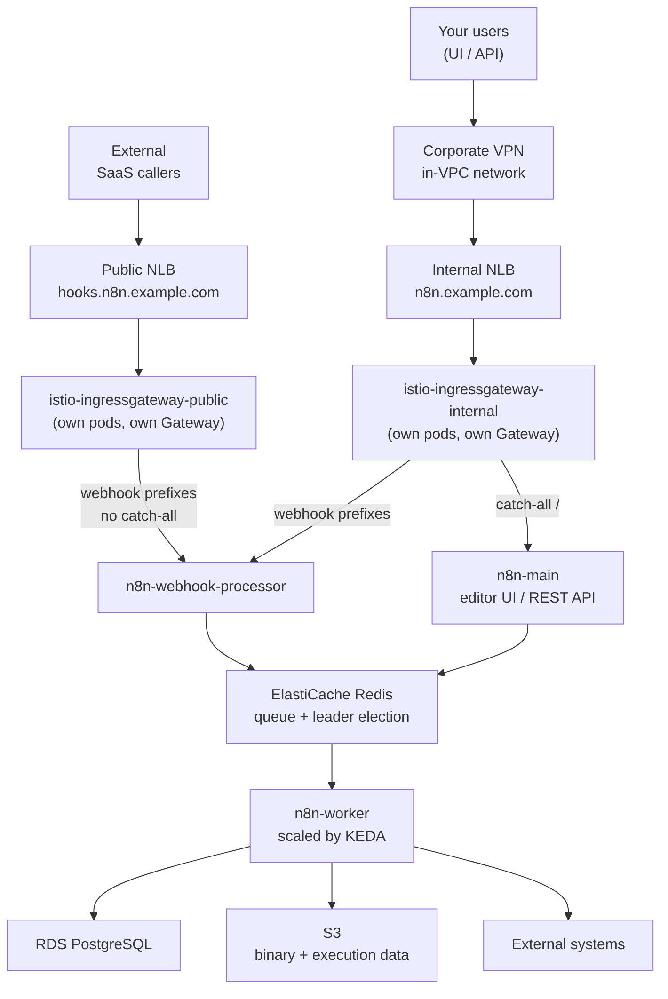

# Istio split-ingress example

An Istio-native equivalent of [`examples/split-ingress`](../split-ingress/README.md): two physically separate Istio ingress gateways, each behind its own Network Load Balancer, splitting public webhook traffic from an internal-only editor UI and REST API. Use this instead of `split-ingress` when your platform runs Istio as its ingress/service-mesh layer and you want `Gateway`/`VirtualService` as the routing surface rather than an ALB Ingress Controller.

The trust boundary comes from two **separate** Envoy deployments, not one gateway serving two hostnames: the public gateway's routing table has no route to the editor UI at all, the same way `split-ingress`'s public ALB carries no catch-all rule.



`n8n-main` and `n8n-webhook-processor` also talk to PostgreSQL; those edges are left off to keep the request path readable.

## What it creates

- VPC with public and private subnets across two AZs, NAT gateway, EKS/NLB subnet tags (via `terraform-aws-modules/vpc/aws`)
- One ACM certificate covering **both** hostnames, DNS-validated via Route53. Issued by the module, not by this example, exactly as in `split-ingress`
- Everything the `terraform-aws-n8n` module creates **except** its Ingress and alias record (`create_ingress = false`): EKS cluster, node group, RDS PostgreSQL, ElastiCache Redis, S3 bucket, AWS Load Balancer Controller, Cluster Autoscaler, metrics-server, KEDA, and the n8n Helm release
- The Istio control plane (`istio-base`, `istiod`), installed by this example, not the module
- Two Istio ingress gateway deployments (`istio-ingressgateway-public`, `istio-ingressgateway-internal`), each its own namespace, its own pods, its own NLB
- A local Helm chart (`charts/split-routes`) rendering one `Gateway` + `VirtualService` pair per gateway
- A security group restricting the internal NLB, and (in `gateway` TLS mode only) two `kubernetes_secret` TLS credentials
- Two Route53 alias A-records, one pair per NLB

## Prerequisites

- A Route53 hosted zone for the parent domain (e.g. `example.com` if `n8n_domain = n8n.example.com`). Note its zone ID.
- Network reachability into the VPC for admins: VPN, Direct Connect, a peered VPC, or a bastion. **Without this you cannot reach the editor UI at all**, which is the point of the example but does mean you should have the path in place before you apply.
- Familiarity with Istio's `Gateway`/`VirtualService` model. This example assumes you already run Istio elsewhere and know its routing semantics; it does not explain them from scratch.

## Apply

```bash
cp terraform.tfvars.example terraform.tfvars
# Edit terraform.tfvars and set n8n_domain, route53_zone_id, n8n_license_key

terraform init
terraform apply
```

One apply provisions the VPC, issues and validates the certificate, stands up EKS and everything on top, installs Istio, creates both ingress gateways and both NLBs, and writes both alias records. Allow a few minutes after apply for the NLBs to become reachable and for DNS to propagate.

## Two hostnames, not one

Same reasoning as `split-ingress`: a DNS record can alias exactly one load balancer, so the split needs two names.

| Name | NLB | Serves | Reachable from |
| --- | --- | --- | --- |
| `n8n.example.com` | internal | Editor UI, REST API | Inside the VPC / VPN only |
| `hooks.n8n.example.com` | internet-facing | Webhooks, forms, waiting resumptions, MCP | Anywhere |

Change the webhook label with `webhook_subdomain` (default `hooks`).

The example passes `n8n_webhook_url = "https://hooks.n8n.example.com"` to the module, so n8n hands out webhook URLs on the public host rather than the admin host. See `split-ingress`'s README for why this matters; unchanged here.

## Which paths go where

Both gateways route the prefixes n8n disables on the main pods, read from `module.n8n.n8n_webhook_path_prefixes` (`charts/split-routes/values.yaml`'s default, overridden by `routes.tf`):

`/webhook` · `/webhook-waiting` · `/form` · `/form-waiting` · `/mcp`

| | Public gateway | Internal gateway |
| --- | --- | --- |
| Webhook prefixes | webhook processors | webhook processors |
| Everything else | **404, no catch-all** | main pods (editor UI, REST API) |

The public gateway's `VirtualService` (`charts/split-routes/templates/public.yaml`) has exactly one `http` entry, matching only the five prefixes above. There is no second, catch-all entry: a request outside those prefixes matches nothing, and Envoy returns its own 404. This isn't a firewall rule sitting in front of a route that exists, the route to the editor simply isn't in this gateway's config.

The internal gateway's `VirtualService` (`charts/split-routes/templates/internal.yaml`) needs the webhook prefixes for the same non-obvious reason `split-ingress`'s internal ALB does: without them, the catch-all would hand `/webhook` to the main pods, which run with production webhooks disabled, so the request falls through to the editor's SPA handler and returns **200 with an HTML body**. An internal system delivering a webhook would read that as success while nothing executed. The webhook-prefix `http` entry is declared before the catch-all `http` entry for exactly this reason: Istio evaluates a `VirtualService`'s `http` list in order, and the first entry with a matching `match` wins.

## TLS termination modes

Selectable via `istio_tls_mode`:

| Mode | Where TLS terminates | Certificate source |
| --- | --- | --- |
| `nlb` (default) | The NLB, using an AWS-managed TLS listener | `module.n8n.certificate_arn` (the module's Route53-issued, DNS-validated ACM cert). Envoy receives plain HTTP. Closest mirror of `split-ingress`'s ALB behavior. |
| `gateway` | Envoy itself (Istio SIMPLE mode) | BYO PEM cert/key pairs (`gateway_tls_public_cert_pem` / `_key_pem`, `gateway_tls_internal_cert_pem` / `_key_pem`), stored as `kubernetes_secret` TLS credentials. Needed because an ACM **public** certificate's private key cannot be exported, so this mode cannot reuse `module.n8n.certificate_arn`. |

Both modes still depend on `route53_zone_id`: the module always issues the certificate regardless of who terminates TLS with it, and `gateway` mode's BYO certs are independent, additional material, not a replacement for it.

## The WAF gap

**AWS WAFv2 web ACLs do not attach to Network Load Balancers.** `split-ingress`'s `waf_acl_arn` attaches a WAFv2 ACL to its public ALB; that mechanism has no equivalent here, because this example's public load balancer is an NLB, not an ALB. `waf_acl_arn` is still accepted as an input, but its validation forces it to stay `null`, so a caller migrating from `split-ingress` gets a clear Terraform error instead of a setting that silently does nothing.

If WAF-equivalent protection matters for your deployment, options not implemented in this example include fronting the public NLB with CloudFront (which does support WAFv2), or migrating the public path to a Gateway API `HTTPRoute` behind an ALB. Both are real projects, not drop-in flags; treat this as a documented gap rather than something to route around casually.

## Hardening

| Input | Effect |
| --- | --- |
| `admin_allowed_cidr_blocks` | Builds a security group (`security.tf`) restricting which sources can reach the internal NLB on 443, attached via the AWS Load Balancer Controller's `aws-load-balancer-security-groups` annotation. The NLB is already private; narrow this to your VPN pool for defence in depth. |
| `nlb_ssl_negotiation_policy` | TLS policy on both NLBs' TLS listeners, only meaningful in `istio_tls_mode = "nlb"`. Defaults to TLS 1.3 with a 1.2 fallback. |
| `waf_acl_arn` | Not supported; see [The WAF gap](#the-waf-gap). |

## Verifying the split

```bash
# Webhooks answer publicly (404 is expected: no workflow registered at that path)
curl -o /dev/null -w '%{http_code}\n' https://hooks.n8n.example.com/webhook/test

# The editor must NOT answer from outside the VPC, so expect a timeout
curl --max-time 10 -o /dev/null -w '%{http_code}\n' https://n8n.example.com/

# From inside the VPC / on the VPN, it should return 200
curl -o /dev/null -w '%{http_code}\n' https://n8n.example.com/

# From inside the VPC, confirm the internal gateway routes /webhook to the
# webhook processor, not the editor SPA (this is the trap the ordering in
# charts/split-routes/templates/internal.yaml exists to avoid)
curl -o /dev/null -w '%{http_code}\n' https://n8n.example.com/webhook/test

# Both NLBs, their schemes, and the gateway pods
kubectl get svc -n istio-ingress-public -n istio-ingress-internal
aws elbv2 describe-load-balancers \
  --query 'LoadBalancers[].{Name:LoadBalancerName,Type:Type,Scheme:Scheme}' --output table
```

`../../tests/scripts/smoke-test.sh` skips its Ingress-routing section here (the module owns no Ingress) and prints the prefixes your own routes must cover.

## Post-deployment

See [../../docs/post-deployment.md](../../docs/post-deployment.md) for activating your n8n Enterprise license.

## Teardown

```bash
terraform destroy
```

## Production considerations

This example is a reference deployment optimized for clean `apply` / `destroy` cycles during evaluation. Review these before promoting it:

| Where | Setting | Current | Production |
| --- | --- | --- | --- |
| `main.tf` (VPC) | `single_nat_gateway` | `true` | `false` + `one_nat_gateway_per_az = true` |
| Module default | `db_deletion_protection` | provider default (`false`) | `true` |
| `variables.tf` | `admin_allowed_cidr_blocks` | `[]` | Your VPN or bastion range |
| `dns.tf` | `time_sleep` NLB wait | fixed 90s | Verify against your own LBC provisioning latency, or replace with a poll loop |
| Module default | `db_backup_retention_period` | `7` | Match your RPO |

See [../small/README.md](../small/README.md#production-considerations) for the full module-level list, which applies here too.

## Verified against a live cluster

This example has been applied against real EKS clusters in both `istio_tls_mode` settings. Findings so far:

- **`istio/gateway` chart versions 1.23.x-1.25.1 are broken**: the chart's own shipped `values.yaml` fails its own `values.schema.json` (`additional properties 'service', 'labels', '_internal_defaults_do_not_set' not allowed`), reproducible with zero overrides via a bare `helm template .`. Confirmed via direct `helm pull`/`helm lint` across 1.20.0 through 1.30.3: the regression spans roughly 1.23-1.25 and is fixed by 1.28.10 onward. `istio_chart_version` now defaults to `1.30.3`, the newest verified-working release as of this writing.

Still to verify:

1. The exact `service.beta.kubernetes.io/aws-load-balancer-*` annotation keys in `gateways.tf` against the AWS Load Balancer Controller version `helm_release.lbc` (module root `controllers.tf`) resolves to; these have shifted across LBC minor versions.
2. `istio_chart_version` against Istio's published Kubernetes support matrix for whatever `kubernetes_version` you deploy with, beyond the schema-validation check above.
3. Whether the 90-second `time_sleep` in `dns.tf` reliably outlasts NLB provisioning and tagging in your account/region.
5. The `service.k8s.aws/stack` tag key `dns.tf`'s `data.aws_lb` blocks assume LBC applies to Service-provisioned NLBs.

<!-- BEGIN_TF_DOCS -->
## Requirements

| Name | Version |
| ---- | ------- |
| <a name="requirement_terraform"></a> [terraform](#requirement\_terraform) | >= 1.11 |
| <a name="requirement_aws"></a> [aws](#requirement\_aws) | ~> 6.0 |
| <a name="requirement_helm"></a> [helm](#requirement\_helm) | ~> 3.0 |
| <a name="requirement_kubernetes"></a> [kubernetes](#requirement\_kubernetes) | ~> 2.0 |
| <a name="requirement_time"></a> [time](#requirement\_time) | ~> 0.12 |

## Providers

| Name | Version |
| ---- | ------- |
| <a name="provider_aws"></a> [aws](#provider\_aws) | ~> 6.0 |
| <a name="provider_helm"></a> [helm](#provider\_helm) | ~> 3.0 |
| <a name="provider_kubernetes"></a> [kubernetes](#provider\_kubernetes) | ~> 2.0 |
| <a name="provider_time"></a> [time](#provider\_time) | ~> 0.12 |

## Modules

| Name | Source | Version |
| ---- | ------ | ------- |
| <a name="module_n8n"></a> [n8n](#module\_n8n) | ../.. | n/a |
| <a name="module_vpc"></a> [vpc](#module\_vpc) | terraform-aws-modules/vpc/aws | ~> 5.0 |

## Resources

| Name | Type |
| ---- | ---- |
| [aws_route53_record.admin_internal](https://registry.terraform.io/providers/hashicorp/aws/latest/docs/resources/route53_record) | resource |
| [aws_route53_record.webhook_public](https://registry.terraform.io/providers/hashicorp/aws/latest/docs/resources/route53_record) | resource |
| [aws_security_group.internal_gateway](https://registry.terraform.io/providers/hashicorp/aws/latest/docs/resources/security_group) | resource |
| [aws_vpc_security_group_egress_rule.internal_gateway_egress_to_nodes](https://registry.terraform.io/providers/hashicorp/aws/latest/docs/resources/vpc_security_group_egress_rule) | resource |
| [aws_vpc_security_group_ingress_rule.internal_gateway_to_nodes](https://registry.terraform.io/providers/hashicorp/aws/latest/docs/resources/vpc_security_group_ingress_rule) | resource |
| [helm_release.istio_base](https://registry.terraform.io/providers/hashicorp/helm/latest/docs/resources/release) | resource |
| [helm_release.istio_ingress_internal](https://registry.terraform.io/providers/hashicorp/helm/latest/docs/resources/release) | resource |
| [helm_release.istio_ingress_public](https://registry.terraform.io/providers/hashicorp/helm/latest/docs/resources/release) | resource |
| [helm_release.istiod](https://registry.terraform.io/providers/hashicorp/helm/latest/docs/resources/release) | resource |
| [helm_release.split_routes](https://registry.terraform.io/providers/hashicorp/helm/latest/docs/resources/release) | resource |
| [kubernetes_secret.gateway_tls_internal](https://registry.terraform.io/providers/hashicorp/kubernetes/latest/docs/resources/secret) | resource |
| [kubernetes_secret.gateway_tls_public](https://registry.terraform.io/providers/hashicorp/kubernetes/latest/docs/resources/secret) | resource |
| [time_sleep.wait_for_nlb_internal](https://registry.terraform.io/providers/hashicorp/time/latest/docs/resources/sleep) | resource |
| [time_sleep.wait_for_nlb_public](https://registry.terraform.io/providers/hashicorp/time/latest/docs/resources/sleep) | resource |
| [aws_availability_zones.available](https://registry.terraform.io/providers/hashicorp/aws/latest/docs/data-sources/availability_zones) | data source |
| [aws_eks_cluster.n8n](https://registry.terraform.io/providers/hashicorp/aws/latest/docs/data-sources/eks_cluster) | data source |
| [aws_lb.admin_internal](https://registry.terraform.io/providers/hashicorp/aws/latest/docs/data-sources/lb) | data source |
| [aws_lb.webhook_public](https://registry.terraform.io/providers/hashicorp/aws/latest/docs/data-sources/lb) | data source |

## Inputs

| Name | Description | Type | Default | Required |
| ---- | ----------- | ---- | ------- | :------: |
| <a name="input_admin_allowed_cidr_blocks"></a> [admin\_allowed\_cidr\_blocks](#input\_admin\_allowed\_cidr\_blocks) | IPv4 CIDR blocks allowed to reach the internal NLB, enforced by aws\_security\_group.internal\_gateway (security.tf) rather than an Ingress annotation: NLBs have no inbound-cidrs-style annotation, so this example creates a real security group and attaches it to the internal gateway's Service via service.beta.kubernetes.io/aws-load-balancer-security-groups, the AWS Load Balancer Controller's documented BYO-security-group mechanism. The NLB is already private (internal scheme), so this is defence in depth: narrow it to your VPN pool or bastion range. Empty (the default) allows any source that can route to the private subnets, the same default-open-but-already-private posture as examples/split-ingress's equivalent input. | `list(string)` | `[]` | no |
| <a name="input_aws_region"></a> [aws\_region](#input\_aws\_region) | AWS region to deploy into (e.g. us-east-1, eu-west-1, ap-southeast-1). | `string` | `"us-east-1"` | no |
| <a name="input_cluster_name"></a> [cluster\_name](#input\_cluster\_name) | Name for the EKS cluster. Keep to 14 characters or fewer, because the module derives an ElastiCache cluster ID of `<cluster_name>-redis`, and AWS caps ElastiCache IDs at 20 chars. | `string` | `"n8n-cluster"` | no |
| <a name="input_gateway_tls_internal_cert_pem"></a> [gateway\_tls\_internal\_cert\_pem](#input\_gateway\_tls\_internal\_cert\_pem) | PEM-encoded certificate for the admin hostname, used only when istio\_tls\_mode = "gateway". See gateway\_tls\_public\_cert\_pem for why this cannot be sourced from module.n8n.certificate\_arn. | `string` | `null` | no |
| <a name="input_gateway_tls_internal_key_pem"></a> [gateway\_tls\_internal\_key\_pem](#input\_gateway\_tls\_internal\_key\_pem) | PEM-encoded private key matching gateway\_tls\_internal\_cert\_pem. Required when istio\_tls\_mode = "gateway", ignored otherwise. | `string` | `null` | no |
| <a name="input_gateway_tls_public_cert_pem"></a> [gateway\_tls\_public\_cert\_pem](#input\_gateway\_tls\_public\_cert\_pem) | PEM-encoded certificate (leaf plus any intermediate chain) for the public webhook hostname, used only when istio\_tls\_mode = "gateway". Independent of module.n8n.certificate\_arn: an ACM public certificate's private key cannot be exported, so Gateway-terminated TLS needs its own BYO cert, analogous to examples/cloudflare and examples/godaddy's BYO-cert precedent but as raw PEM material rather than an ACM ARN. Ignored when istio\_tls\_mode = "nlb". | `string` | `null` | no |
| <a name="input_gateway_tls_public_key_pem"></a> [gateway\_tls\_public\_key\_pem](#input\_gateway\_tls\_public\_key\_pem) | PEM-encoded private key matching gateway\_tls\_public\_cert\_pem. Required when istio\_tls\_mode = "gateway", ignored otherwise. | `string` | `null` | no |
| <a name="input_istio_chart_version"></a> [istio\_chart\_version](#input\_istio\_chart\_version) | Version pin for the istio/base, istio/istiod and istio/gateway Helm charts (all three must match). Versions 1.23.x through at least 1.25.1 of the gateway chart fail every install with "additional properties 'service', 'labels', '\_internal\_defaults\_do\_not\_set' not allowed": the chart's own shipped values.yaml does not validate against its own values.schema.json, which rejects even a bare `helm template` with zero overrides. Confirmed against 1.20.0 through 1.30.3 directly (helm lint / helm template): the regression spans roughly 1.23-1.25 and is fixed by 1.28.10; 1.30.3 is the newest verified-working release as of this writing and is the default here. Re-verify with `helm lint` before bumping, and separately verify against Istio's published Kubernetes support matrix (istio.io) and the AWS Load Balancer Controller version helm\_release.lbc (module root controllers.tf) resolves to, since this example relies on LBC's Service (NLB) reconciler. | `string` | `"1.30.3"` | no |
| <a name="input_istio_tls_mode"></a> [istio\_tls\_mode](#input\_istio\_tls\_mode) | Where TLS terminates for both Istio ingress gateways. "nlb" (the default) mirrors examples/split-ingress most closely: each Network Load Balancer terminates TLS using module.n8n.certificate\_arn (the module's Route53-validated ACM certificate), and Envoy receives plain HTTP, the same trust model as this module's ALB-to-pod hop. "gateway" instead has Envoy terminate TLS itself (Istio SIMPLE mode) from a Kubernetes Secret built from gateway\_tls\_*\_cert\_pem / gateway\_tls\_*\_key\_pem. Gateway mode exists because an ACM public certificate's private key cannot be exported, so it needs its own, independent BYO PEM certificate rather than reusing module.n8n.certificate\_arn. | `string` | `"nlb"` | no |
| <a name="input_n8n_custom_extensions_path"></a> [n8n\_custom\_extensions\_path](#input\_n8n\_custom\_extensions\_path) | Absolute path inside the n8n container that n8n scans for custom nodes at startup (e.g. "/opt/n8n-nodes"). See the module root's variables.tf for the full rationale; unchanged here. | `string` | `null` | no |
| <a name="input_n8n_domain"></a> [n8n\_domain](#input\_n8n\_domain) | Fully-qualified domain name for the n8n editor UI and REST API (e.g. n8n.example.com). Served by the internal Istio gateway's NLB, so it resolves to private addresses and is reachable only from inside the VPC or over VPN. The parent zone must be hosted in Route53. | `string` | n/a | yes |
| <a name="input_n8n_execution_data_storage_mode"></a> [n8n\_execution\_data\_storage\_mode](#input\_n8n\_execution\_data\_storage\_mode) | Where n8n stores the data of each new execution. Passed to the module's n8n\_execution\_data\_storage\_mode. See the module root's variables.tf for the full rationale; unchanged here. | `string` | `"database"` | no |
| <a name="input_n8n_image_pull_secrets"></a> [n8n\_image\_pull\_secrets](#input\_n8n\_image\_pull\_secrets) | Names of existing Kubernetes secrets of type kubernetes.io/dockerconfigjson, in the n8n namespace, that the pods authenticate to their image registry with. Leave empty (the default) unless n8n\_image\_repository points somewhere the node group's IAM role cannot already reach. See the module root's variables.tf for the full rationale; unchanged here. | `list(string)` | `[]` | no |
| <a name="input_n8n_image_repository"></a> [n8n\_image\_repository](#input\_n8n\_image\_repository) | Container image repository for the n8n application, without a tag (e.g. "123456789012.dkr.ecr.eu-west-1.amazonaws.com/n8n"). Leave null to use the Helm chart's own repository (docker.n8n.io/n8nio/n8n). Set this to run a custom image, for example one with community packages baked in so they are not reinstalled on every pod boot. The image must be pullable by the node group's IAM role (ECR in the same account is) or be public, otherwise name a dockerconfigjson secret in n8n\_image\_pull\_secrets, and n8n\_task\_runner\_image\_tag usually has to be set alongside it. | `string` | `null` | no |
| <a name="input_n8n_image_tag"></a> [n8n\_image\_tag](#input\_n8n\_image\_tag) | n8n application image tag to deploy (e.g. "2.27.4"). Leave null to use the Helm chart's floating `stable` tag. Pin a concrete version for reproducible upgrades and to avoid crossing major-version boundaries on an unplanned pod reschedule. | `string` | `null` | no |
| <a name="input_n8n_license_key"></a> [n8n\_license\_key](#input\_n8n\_license\_key) | n8n Enterprise license activation key. Get one at https://n8n.io/pricing | `string` | n/a | yes |
| <a name="input_n8n_task_runner_image_tag"></a> [n8n\_task\_runner\_image\_tag](#input\_n8n\_task\_runner\_image\_tag) | Image tag for the task runner sidecar (`n8nio/runners`). Leave null to inherit the n8n application image's tag. See the module root's variables.tf for the full rationale; unchanged here. | `string` | `null` | no |
| <a name="input_nlb_ssl_negotiation_policy"></a> [nlb\_ssl\_negotiation\_policy](#input\_nlb\_ssl\_negotiation\_policy) | TLS negotiation policy for both NLBs' TLS listeners, wired to service.beta.kubernetes.io/aws-load-balancer-ssl-negotiation-policy. Only meaningful when istio\_tls\_mode = "nlb" (ignored in "gateway" mode, where Envoy negotiates TLS itself). Defaults to a current, modern policy so the negotiated policy is explicit and pinned in Terraform rather than left to whatever the load balancer defaults to. This is the NLB equivalent of examples/split-ingress's ssl\_policy; the annotation name differs between the two load balancer types. | `string` | `"ELBSecurityPolicy-TLS13-1-2-2021-06"` | no |
| <a name="input_route53_zone_id"></a> [route53\_zone\_id](#input\_route53\_zone\_id) | Route53 hosted zone ID for the parent of n8n\_domain (e.g. the zone for example.com if n8n\_domain = n8n.example.com). Passed through to the module, which issues the ACM certificate covering both hostnames and writes its validation records here. This example writes both alias A-records in the same zone, since it owns the two load balancers. Consumed by gateways.tf only when istio\_tls\_mode = "nlb" (the default); still required in "gateway" mode because the module always issues this certificate regardless of who terminates TLS with it. | `string` | n/a | yes |
| <a name="input_tags"></a> [tags](#input\_tags) | Additional AWS tags to apply to every resource this example creates. | `map(string)` | `{}` | no |
| <a name="input_waf_acl_arn"></a> [waf\_acl\_arn](#input\_waf\_acl\_arn) | Not supported in this example. AWS WAFv2 web ACLs attach to Application Load Balancers, CloudFront, and API Gateway, but NOT to Network Load Balancers, which is what fronts both Istio ingress gateways here. examples/split-ingress accepts this input and attaches it to its public ALB; this variable exists here only so a caller migrating from that example gets a clear Terraform validation error instead of the setting silently doing nothing. Must be left null. See the README's "WAF gap" section for the CloudFront-in-front-of-the-public-NLB workaround, which this example does not implement. | `string` | `null` | no |
| <a name="input_webhook_subdomain"></a> [webhook\_subdomain](#input\_webhook\_subdomain) | Label prepended to n8n\_domain to form the public webhook hostname. With the default and n8n\_domain = n8n.example.com, webhooks are served from hooks.n8n.example.com by the internet-facing Istio gateway's NLB. A separate hostname is required because a DNS name can alias only one load balancer. | `string` | `"hooks"` | no |

## Outputs

| Name | Description |
| ---- | ----------- |
| <a name="output_admin_nlb_hostname"></a> [admin\_nlb\_hostname](#output\_admin\_nlb\_hostname) | Hostname of the internal Network Load Balancer fronting the internal Istio ingress gateway. |
| <a name="output_db_password"></a> [db\_password](#output\_db\_password) | RDS PostgreSQL password. Back this up in a password manager. |
| <a name="output_istio_tls_mode"></a> [istio\_tls\_mode](#output\_istio\_tls\_mode) | Which of the two TLS termination paths is live: "nlb" (both NLBs terminate TLS with module.n8n.certificate\_arn) or "gateway" (Envoy terminates TLS itself from the BYO PEM secrets in gateway-tls.tf). |
| <a name="output_kubectl_config_command"></a> [kubectl\_config\_command](#output\_kubectl\_config\_command) | Command to configure kubectl for this cluster. |
| <a name="output_n8n_encryption_key"></a> [n8n\_encryption\_key](#output\_n8n\_encryption\_key) | n8n encryption key. Back this up in a password manager. |
| <a name="output_n8n_url"></a> [n8n\_url](#output\_n8n\_url) | URL for the n8n editor UI. Resolves to the internal NLB, so it is reachable only from inside the VPC or over VPN. |
| <a name="output_namespace"></a> [namespace](#output\_namespace) | Kubernetes namespace n8n is deployed into. |
| <a name="output_webhook_base_url"></a> [webhook\_base\_url](#output\_webhook\_base\_url) | Public base URL for webhooks, forms and MCP. This is what n8n hands out in generated webhook URLs (passed to the module as n8n\_webhook\_url). |
| <a name="output_webhook_nlb_hostname"></a> [webhook\_nlb\_hostname](#output\_webhook\_nlb\_hostname) | Hostname of the internet-facing Network Load Balancer fronting the public Istio ingress gateway. |
| <a name="output_webhook_path_prefixes"></a> [webhook\_path\_prefixes](#output\_webhook\_path\_prefixes) | Path prefixes routed to the webhook processors on the public gateway. Sourced from the module so this example cannot drift from what n8n actually serves. |
<!-- END_TF_DOCS -->
