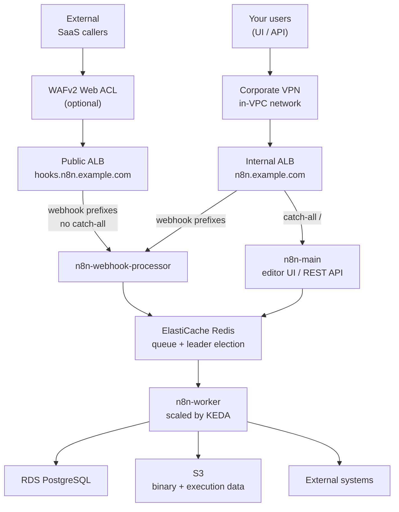

# Split-ingress example

Two load balancers instead of one: an internet-facing ALB serving only webhook traffic, and an internal ALB serving the editor UI and REST API. The admin surface never leaves the VPC.

Use this when the default single internet-facing ALB puts too much on the public internet: n8n's editor and API are reachable by anyone who can resolve the name, and only the login page stands between them and the instance. Splitting the ALBs means the only unauthenticated public endpoints are the ones that have to be public.



The public ALB has no catch-all, so anything outside the webhook prefixes gets
a 404 from the ALB itself and the editor is simply not routable from the
internet. The prefixes are listed in [Which paths go where](#which-paths-go-where).
`n8n-main` and `n8n-webhook-processor` also talk to PostgreSQL; those edges are
left off to keep the request path readable.

The split is **asymmetric on purpose**. The public ALB is narrowed to the webhook
prefixes so the smallest possible surface is exposed. The internal ALB serves the
full surface, because anything reaching it is already inside the trust boundary,
and in-VPC systems need to deliver webhooks without egressing to the internet.

## What it creates

- VPC with public and private subnets across two AZs, NAT gateway, EKS/ALB subnet tags (via `terraform-aws-modules/vpc/aws`)
- One ACM certificate covering **both** hostnames, DNS-validated via Route53. Issued by the module, not by this example: `route53_zone_id` plus `n8n_additional_domains` makes the module cover both names, and both Ingresses attach it through the module's `certificate_arn` output
- Everything the `terraform-aws-n8n` module creates **except** its Ingress and alias record (`create_ingress = false`): EKS cluster, node group, RDS PostgreSQL, ElastiCache Redis, S3 bucket, AWS Load Balancer Controller, Cluster Autoscaler, metrics-server, KEDA, and the n8n Helm release
- Two `kubernetes_ingress_v1` resources and two Route53 alias A-records, one pair per ALB

## Prerequisites

- A Route53 hosted zone for the parent domain (e.g. `example.com` if `n8n_domain = n8n.example.com`). Note its zone ID.
- Network reachability into the VPC for admins: VPN, Direct Connect, a peered VPC, or a bastion. **Without this you cannot reach the editor UI at all**, which is the point of the example but does mean you should have the path in place before you apply.

## Apply

```bash
cp terraform.tfvars.example terraform.tfvars
# Edit terraform.tfvars and set n8n_domain, route53_zone_id, n8n_license_key

terraform init
terraform apply
```

One apply provisions the VPC, issues and validates the certificate, stands up EKS and everything on top, creates both ALBs, and writes both alias records. Allow ~5 minutes after apply for the ALBs to become reachable.

## Two hostnames, not one

A DNS record can alias exactly one load balancer, so the split needs two names:

| Name | ALB | Serves | Reachable from |
| --- | --- | --- | --- |
| `n8n.example.com` | internal | Editor UI, REST API | Inside the VPC / VPN only |
| `hooks.n8n.example.com` | internet-facing | Webhooks, forms, waiting resumptions, MCP | Anywhere |

Change the webhook label with `webhook_subdomain` (default `hooks`).

The example passes `n8n_webhook_url = "https://hooks.n8n.example.com"` to the module. This matters more than it looks: it is what n8n embeds in the webhook URLs it generates and shows in the editor. Without it, n8n hands out URLs on the admin host, which resolves to the internal ALB, and every external delivery fails with no obvious cause.

The admin alias is a **public** Route53 record pointing at private addresses. Anyone can resolve the name; only clients that can route into the VPC can connect. If the hostname itself is sensitive, move that record into a private hosted zone attached to the VPC.

## Which paths go where

Both ALBs route the prefixes n8n disables on the main pods, read from `module.n8n.n8n_webhook_path_prefixes` rather than hardcoded, so this example cannot drift as n8n adds endpoints:

`/webhook` · `/webhook-waiting` · `/form` · `/form-waiting` · `/mcp`

| | Public ALB | Internal ALB |
| --- | --- | --- |
| Webhook prefixes | webhook processors | webhook processors |
| Everything else | **404, no catch-all** | main pods (editor UI, REST API) |

There is deliberately **no catch-all rule on the public ALB**. Anything else gets the ALB's default fixed-response 404 and never reaches the editor. A test asserts this, because adding a helpful-looking `/` rule later would quietly undo the entire example.

The internal ALB needs the webhook prefixes for a less obvious reason. Without them its catch-all hands `/webhook` to the main pods, which run with production webhooks disabled, so the request falls through to the editor's SPA handler and returns **200 with an HTML body**. An internal system delivering a webhook would read that as success while nothing executed. This was found by testing the live deployment, not by reading the config.

## Hardening

| Input | Effect |
| --- | --- |
| `waf_acl_arn` | Attaches a WAFv2 web ACL to the public ALB only. Rate limiting and managed rule groups apply to untrusted senders without touching the editor. This is the main payoff of the split. |
| `admin_allowed_cidr_blocks` | Adds `inbound-cidrs` to the internal ALB. It is already private; narrow it to your VPN pool for defence in depth. This example owns its Ingresses (`create_ingress = false`), so the module's `alb_inbound_cidrs` input does not apply here and this variable does the same job on the Ingress defined in `ingress.tf`. It inherits that input's guards (IPv4 only, network address only, no host bits). Unlike the module-managed Ingress, these Ingresses are exposed to the `IngressClassParams` override, because they are classified through `spec.ingressClassName` rather than the legacy class annotation. See [docs/troubleshooting.md](../../docs/troubleshooting.md#an-inbound-cidr-restriction-applies-cleanly-but-the-alb-still-answers-everyone). |
| `ssl_policy` | TLS policy on both listeners. Defaults to TLS 1.3 with a 1.2 fallback. |

## Verifying the split

```bash
# Webhooks answer publicly (404 is expected: no workflow registered at that path)
curl -o /dev/null -w '%{http_code}\n' https://hooks.n8n.example.com/webhook/test

# The editor must NOT answer from outside the VPC, so expect a timeout
curl --max-time 10 -o /dev/null -w '%{http_code}\n' https://n8n.example.com/

# From inside the VPC / on the VPN, it should return 200
curl -o /dev/null -w '%{http_code}\n' https://n8n.example.com/

# Both ALBs and their schemes
kubectl get ingress -n n8n
aws elbv2 describe-load-balancers \
  --query 'LoadBalancers[].{Name:LoadBalancerName,Scheme:Scheme}' --output table
```

`../../tests/scripts/smoke-test.sh` skips its Ingress-routing section here (the module owns no Ingress) and prints the prefixes your own Ingresses must cover.

## Post-deployment

See [../../docs/post-deployment.md](../../docs/post-deployment.md) for activating your n8n Enterprise license.

## Teardown

```bash
terraform destroy
```

## Production considerations

This example is a reference deployment optimized for clean `apply` / `destroy` cycles during evaluation. Review these before promoting it:

| Where | Setting | Current | Production |
| --- | --- | --- | --- |
| `main.tf` (VPC) | `single_nat_gateway` | `true` | `false` + `one_nat_gateway_per_az = true` |
| Module default | `db_deletion_protection` | provider default (`false`) | `true` |
| `variables.tf` | `admin_allowed_cidr_blocks` | `[]` | Your VPN or bastion range |
| `variables.tf` | `waf_acl_arn` | `null` | A regional WAFv2 ACL with rate limiting |
| Module default | `db_backup_retention_period` | `7` | Match your RPO |

See [../small/README.md](../small/README.md#production-considerations) for the full module-level list, which applies here too.

<!-- BEGIN_TF_DOCS -->
## Requirements

| Name | Version |
| ---- | ------- |
| <a name="requirement_terraform"></a> [terraform](#requirement\_terraform) | >= 1.9 |
| <a name="requirement_aws"></a> [aws](#requirement\_aws) | ~> 6.0 |
| <a name="requirement_helm"></a> [helm](#requirement\_helm) | ~> 3.0 |
| <a name="requirement_kubernetes"></a> [kubernetes](#requirement\_kubernetes) | ~> 2.0 |

## Providers

| Name | Version |
| ---- | ------- |
| <a name="provider_aws"></a> [aws](#provider\_aws) | ~> 6.0 |
| <a name="provider_kubernetes"></a> [kubernetes](#provider\_kubernetes) | ~> 2.0 |

## Modules

| Name | Source | Version |
| ---- | ------ | ------- |
| <a name="module_n8n"></a> [n8n](#module\_n8n) | ../.. | n/a |
| <a name="module_vpc"></a> [vpc](#module\_vpc) | terraform-aws-modules/vpc/aws | ~> 5.0 |

## Resources

| Name | Type |
| ---- | ---- |
| [aws_route53_record.admin_internal](https://registry.terraform.io/providers/hashicorp/aws/latest/docs/resources/route53_record) | resource |
| [aws_route53_record.webhook_public](https://registry.terraform.io/providers/hashicorp/aws/latest/docs/resources/route53_record) | resource |
| [kubernetes_ingress_v1.admin_internal](https://registry.terraform.io/providers/hashicorp/kubernetes/latest/docs/resources/ingress_v1) | resource |
| [kubernetes_ingress_v1.webhook_public](https://registry.terraform.io/providers/hashicorp/kubernetes/latest/docs/resources/ingress_v1) | resource |
| [aws_availability_zones.available](https://registry.terraform.io/providers/hashicorp/aws/latest/docs/data-sources/availability_zones) | data source |
| [aws_lb.admin_internal](https://registry.terraform.io/providers/hashicorp/aws/latest/docs/data-sources/lb) | data source |
| [aws_lb.webhook_public](https://registry.terraform.io/providers/hashicorp/aws/latest/docs/data-sources/lb) | data source |

## Inputs

| Name | Description | Type | Default | Required |
| ---- | ----------- | ---- | ------- | :------: |
| <a name="input_admin_allowed_cidr_blocks"></a> [admin\_allowed\_cidr\_blocks](#input\_admin\_allowed\_cidr\_blocks) | IPv4 CIDR blocks allowed to reach the internal admin ALB, applied as alb.ingress.kubernetes.io/inbound-cidrs. The ALB is already private, so this is defence in depth: narrow it to your VPN pool or bastion range. Empty (the default) allows any source that can route to the private subnets. This example owns its Ingresses, so the module's alb\_inbound\_cidrs input does not apply here; this variable is the equivalent for the Ingress in ingress.tf. It carries one caveat the module's input does not: an IngressClassParams that sets spec.inboundCIDRs replaces this annotation rather than merging with it, and the Ingresses here are classified through spec.ingressClassName, which is the path that loads it. The module-managed Ingress also carries the legacy kubernetes.io/ingress.class annotation and is matched on that instead, so it is immune; these are not. It takes an IngressClassParams that is both populated and referenced from the IngressClass through spec.parameters, neither of which the LBC chart sets up by default, and the object is cluster-scoped and invisible to Terraform. See docs/troubleshooting.md. | `list(string)` | `[]` | no |
| <a name="input_aws_region"></a> [aws\_region](#input\_aws\_region) | AWS region to deploy into (e.g. us-east-1, eu-west-1, ap-southeast-1). | `string` | `"us-east-1"` | no |
| <a name="input_cluster_name"></a> [cluster\_name](#input\_cluster\_name) | Name for the EKS cluster. Keep to 14 characters or fewer, because the module derives an ElastiCache cluster ID of `<cluster_name>-redis`, and AWS caps ElastiCache IDs at 20 chars. | `string` | `"n8n-cluster"` | no |
| <a name="input_n8n_custom_extensions_path"></a> [n8n\_custom\_extensions\_path](#input\_n8n\_custom\_extensions\_path) | Absolute path inside the n8n container that n8n scans for custom nodes at startup (e.g. "/opt/n8n-nodes"). Maps to N8N\_CUSTOM\_EXTENSIONS, and is set on main, worker and webhook processor pods alike. Set this alongside n8n\_image\_repository when the custom image bakes community packages in: since n8n 1.0 the loader no longer reads the image's global node\_modules, so a plain npm install into the image is never scanned and the packages ship but never load. Nodes found here register under the package name CUSTOM, so a node installed from npm as n8n-nodes-example.myNode becomes CUSTOM.myNode and existing workflows referencing the npm-qualified type will not resolve. Leave null (the default) to omit the env var. | `string` | `null` | no |
| <a name="input_n8n_domain"></a> [n8n\_domain](#input\_n8n\_domain) | Fully-qualified domain name for the n8n editor UI and REST API (e.g. n8n.example.com). Served by the internal ALB, so it resolves to private addresses and is reachable only from inside the VPC or over VPN. The parent zone must be hosted in Route53. | `string` | n/a | yes |
| <a name="input_n8n_execution_data_storage_mode"></a> [n8n\_execution\_data\_storage\_mode](#input\_n8n\_execution\_data\_storage\_mode) | Where n8n stores the data of each new execution. Passed to the module's n8n\_execution\_data\_storage\_mode. "database" keeps execution data in PostgreSQL; "s3" offloads it to the S3 bucket the module already creates for binary data. This example runs the module's default database (db.t3.small on 50 GB of gp2, a 150 IOPS baseline), which has the least room of any sizing this module ships to absorb execution-data growth, so reaching for this is often cheaper than resizing the database. Requires n8n >= 2.27 (pin n8n\_image\_tag accordingly) and an Enterprise license carrying the feat:executionDataS3 entitlement, which is not the same one binary data offload uses. There is no backfill: existing executions stay readable where they were written. Read the execution data section of the root README before enabling it, in particular the durability trade-off and the S3 lifecycle constraint. | `string` | `"database"` | no |
| <a name="input_n8n_image_repository"></a> [n8n\_image\_repository](#input\_n8n\_image\_repository) | Container image repository for the n8n application, without a tag (e.g. "123456789012.dkr.ecr.eu-west-1.amazonaws.com/n8n"). Leave null to use the Helm chart's own repository (docker.n8n.io/n8nio/n8n). Set this to run a custom image, for example one with community packages baked in so they are not reinstalled on every pod boot. The image must be pullable by the node group's IAM role (ECR in the same account is) or be public, and n8n\_task\_runner\_image\_tag usually has to be set alongside it. | `string` | `null` | no |
| <a name="input_n8n_image_tag"></a> [n8n\_image\_tag](#input\_n8n\_image\_tag) | n8n application image tag to deploy (e.g. "2.33.1"). Leave null to use the Helm chart's floating `stable` tag. Pin a concrete version when the n8n version is part of what you are testing. | `string` | `null` | no |
| <a name="input_n8n_license_key"></a> [n8n\_license\_key](#input\_n8n\_license\_key) | n8n Enterprise license activation key. Get one at https://n8n.io/pricing | `string` | n/a | yes |
| <a name="input_n8n_task_runner_image_tag"></a> [n8n\_task\_runner\_image\_tag](#input\_n8n\_task\_runner\_image\_tag) | Image tag for the task runner sidecar (`n8nio/runners`). Leave null to inherit the n8n application image's tag, which is correct as long as that tag is a published n8n version. Set it to the underlying n8n version when running a custom image whose tag is not one (e.g. n8n\_image\_tag = "2.27.4-mypackages" together with n8n\_task\_runner\_image\_tag = "2.27.4"); otherwise the sidecar image cannot be pulled and every main and worker pod stays in ImagePullBackOff. | `string` | `null` | no |
| <a name="input_route53_zone_id"></a> [route53\_zone\_id](#input\_route53\_zone\_id) | Route53 hosted zone ID for the parent of n8n\_domain (e.g. the zone for example.com if n8n\_domain = n8n.example.com). Passed through to the module, which issues the ACM certificate covering both hostnames and writes its validation records here. This example writes both alias A-records in the same zone, since it owns the two load balancers. | `string` | n/a | yes |
| <a name="input_ssl_policy"></a> [ssl\_policy](#input\_ssl\_policy) | TLS negotiation policy for both ALB HTTPS listeners. The default is TLS 1.3 with a 1.2 fallback, which AWS recommends for new deployments. Loosen it only if you must support clients that predate TLS 1.2. | `string` | `"ELBSecurityPolicy-TLS13-1-2-2021-06"` | no |
| <a name="input_tags"></a> [tags](#input\_tags) | Additional AWS tags to apply to every resource this example creates. | `map(string)` | `{}` | no |
| <a name="input_waf_acl_arn"></a> [waf\_acl\_arn](#input\_waf\_acl\_arn) | ARN of a WAFv2 web ACL to attach to the public webhook ALB. Isolating untrusted traffic on its own load balancer is what makes this practical: rate limiting and managed rule groups apply to webhook senders without touching the editor UI. Leave null to skip the association. The ACL must be regional (scope = REGIONAL) and in the same region as the ALB. | `string` | `null` | no |
| <a name="input_webhook_subdomain"></a> [webhook\_subdomain](#input\_webhook\_subdomain) | Label prepended to n8n\_domain to form the public webhook hostname. With the default and n8n\_domain = n8n.example.com, webhooks are served from hooks.n8n.example.com by the internet-facing ALB. A separate hostname is required because a DNS name can alias only one load balancer. | `string` | `"hooks"` | no |

## Outputs

| Name | Description |
| ---- | ----------- |
| <a name="output_admin_alb_hostname"></a> [admin\_alb\_hostname](#output\_admin\_alb\_hostname) | Hostname of the internal ALB serving the editor UI and REST API. |
| <a name="output_db_password"></a> [db\_password](#output\_db\_password) | RDS PostgreSQL password. Back this up in a password manager. |
| <a name="output_kubectl_config_command"></a> [kubectl\_config\_command](#output\_kubectl\_config\_command) | Command to configure kubectl for this cluster. |
| <a name="output_n8n_encryption_key"></a> [n8n\_encryption\_key](#output\_n8n\_encryption\_key) | n8n encryption key. Back this up in a password manager. |
| <a name="output_n8n_url"></a> [n8n\_url](#output\_n8n\_url) | URL for the n8n editor UI. Resolves to the internal ALB, so it is reachable only from inside the VPC or over VPN. |
| <a name="output_namespace"></a> [namespace](#output\_namespace) | Kubernetes namespace n8n is deployed into. Read by tests/scripts/smoke-test.sh. |
| <a name="output_webhook_alb_hostname"></a> [webhook\_alb\_hostname](#output\_webhook\_alb\_hostname) | Hostname of the internet-facing ALB serving the webhook prefixes. |
| <a name="output_webhook_base_url"></a> [webhook\_base\_url](#output\_webhook\_base\_url) | Public base URL for webhooks, forms and MCP. This is what n8n hands out in generated webhook URLs (passed to the module as n8n\_webhook\_url). |
| <a name="output_webhook_path_prefixes"></a> [webhook\_path\_prefixes](#output\_webhook\_path\_prefixes) | Path prefixes routed to the webhook processors on the public ALB. Sourced from the module so this example cannot drift from what n8n actually serves. |
<!-- END_TF_DOCS -->
